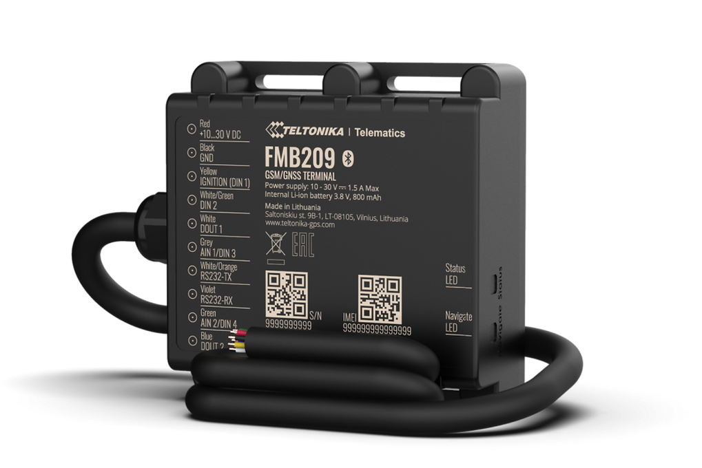

# Teltonika - FMB209

The Teltonika FMB209 is a compact, water resistant GPS tracker designed for reliable vehicle and asset monitoring in outdoor and demanding conditions. The device combines a rugged IP67 enclosure with an internal backup battery to maintain reporting during temporary power loss, and exposes a serial interface for external telemetry and fuel monitoring. These characteristics make the FMB209 suitable for trailer tracking, remote asset deployments, and other applications that need a small but durable tracking unit.

As a Plaspy compatible model, the FMB209 can forward position updates and telemetry into Plaspy for live monitoring, alerts, and historical reporting. Plaspy can ingest the tracker data to provide fleet level visibility and operational oversight, while the FMB209 hardware offers the environmental protection and sensor connectivity that make it practical for outdoor and unpowered assets.

## Key Highlights

- Compatible with Plaspy for real time tracking and telematics integration.
- IP67 rated housing for dust tight protection and water resistance in outdoor use.
- Serial RS232 interface enables connection of external telemetry and fuel monitoring modules.
- Internal 800 mAh backup battery provides continued reporting during temporary power loss.
- Regional variants and firmware options support local regulatory needs and deployment choices.
- Compact form factor suitable for trailers, equipment, and other constrained mounting locations.

## How It Works with Plaspy

When connected to Plaspy, the FMB209 supplies GPS positions, device status, and external sensor streams that Plaspy normalizes and presents in dashboards and reports. Fleet managers and operators use Plaspy to turn incoming telemetry into actionable insights and automated alerts for day to day operations.

- Live location updates feed Plaspy monitoring dashboards and map views.
- RS232 sensor data such as fuel level can be mapped into Plaspy reports and threshold alerts.
- Device online and backup battery events enable resilient monitoring of unpowered assets.
- Historical tracks and telemetry are stored for analysis and operational review.
- Regional firmware variants and preconfiguration options simplify provisioning prior to Plaspy onboarding.

## Typical Use Cases

- Fleet and trailer tracking where environmental protection and compact size are required.
- Fuel monitoring installations that use serial connected fuel modules to report levels.
- Autonomous asset tracking for equipment or trailers that may be offline from vehicle power.
- Telematics projects that require external sensor integration through a serial interface.
- Outdoor or harsh environment deployments that benefit from a rugged enclosure and backup power.

## Why Choose This Tracker with Plaspy

The FMB209 is a practical choice for organizations that need a small, rugged tracker with serial sensor connectivity and battery backed operation. Its feature set aligns with common fleet and asset scenarios where reliable location reporting and external telemetry are important, and Plaspy provides the platform to collect, visualize, and act on that data across a fleet.

Learn more about how Plaspy can use the FMB209 for fleet visibility and telematics on the Plaspy website https://www.plaspy.com. Product specifications, certifications, and availability can change over time, so verify current technical details and regional firmware options with the manufacturer at https://www.teltonika-gps.com/ before final deployment.
