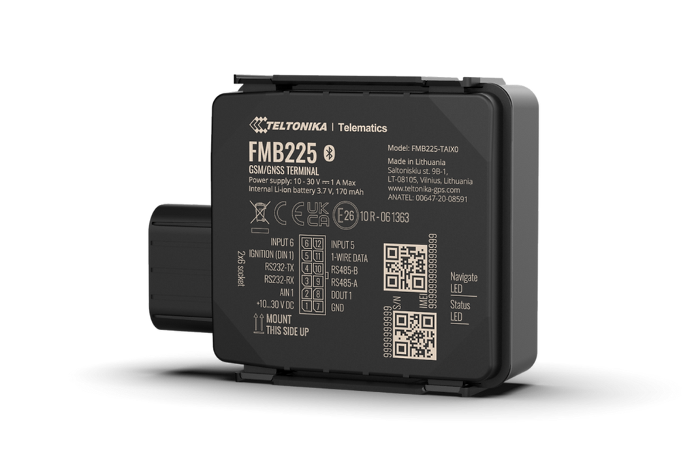

# Teltonika - FMB225

The Teltonika FMB225 is a rugged GPS tracker designed for demanding outdoor and industrial operations. Packaged in an IP67 rated housing, the unit is intended to provide dependable position tracking and telemetry in environments where dust and temporary water immersion are common, such as agriculture, construction and mining. The device supports external telemetry inputs suitable for monitoring fuel flow and other pulse based sensors, extending basic GPS data with actionable field measurements.

As a Plaspy compatible device, the FMB225 can stream its location and sensor data into Plaspy for unified visibility and operational oversight. Integration with Plaspy brings the tracker into a centralized platform for live maps, historical routes, alerting and reporting, making it straightforward to include rugged field equipment and fleet vehicles in broader monitoring and management workflows.

## Key Highlights

- Rugged IP67 rated housing built for outdoor and industrial conditions common in agriculture, construction and mining.
- Dual SIM support with quad band 2G connectivity to improve coverage continuity across wide areas.
- Serial interfaces RS232 and RS485 for connecting external field devices and telemetry instrumentation.
- Impulse input for pulse based fuel flow meters and other pulse sensors to support fuel monitoring and refill detection.
- Delivers continuous position tracking and external telemetry streams suitable for fleet and asset monitoring.
- Compatible with Teltonika remote management tools for streamlined device configuration and fleet maintenance when used alongside Plaspy.

## How It Works with Plaspy

When paired with Plaspy, the FMB225 delivers position updates and sensor events into a single fleet management environment so dispatchers and operators can monitor assets in real time and review historical activity. Plaspy ingests location, impulse events and serial telemetry to generate live maps, alerts and operational reports that support decision making and oversight.

- Real time location updates routed into Plaspy for live tracking and mapping of assets.
- Impulse input events mapped to fuel monitoring and refill alerts within Plaspy dashboards.
- Serial telemetry from RS232 and RS485 integrated into Plaspy reports and custom telemetry views.
- Dual SIM connectivity helps maintain continuity of data streams into Plaspy to reduce blind spots.
- Remote configuration and firmware management via Teltonika tools can be coordinated alongside Plaspy operations for efficient device upkeep.

## Typical Use Cases

- Fleet telematics for trucks, tractors and mobile machinery requiring durable field devices.
- Fuel consumption tracking and refill detection using impulse input with external flow meters.
- Industrial asset monitoring where serial telemetry from field instruments or PLCs is needed.
- Equipment tracking on construction and mining sites subject to dust and temporary water exposure.
- Anti theft and recovery workflows combining live location data and alerts through Plaspy.

## Why Choose This Tracker with Plaspy

The FMB225 is a practical choice for organizations that need a rugged tracker capable of capturing both location and external telemetry in harsh environments. Its physical protection and support for external sensor inputs make it suitable for workflows that extend beyond simple GPS tracking, and pairing it with Plaspy helps turn those raw streams into operational insights, alerts and historical reports.

To learn more about how Plaspy supports the Teltonika FMB225 and other compatible devices, visit https://www.plaspy.com. Product specifications and availability can change over time, so please verify current details and official documentation on the manufacturer site https://www.teltonika-gps.com/ before purchase or deployment.
