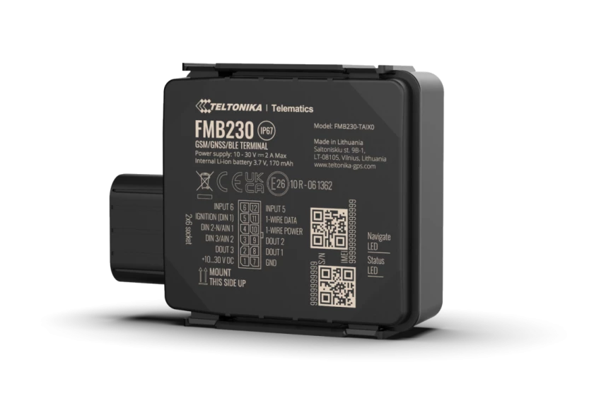

# Teltonika - FMB230

The Teltonika FMB230 is a compact, rugged GPS tracker designed for reliable vehicle tracking and asset monitoring. It supports both 2G and 4G network connectivity and includes GNSS positioning across multiple satellite systems, providing accurate location data. The device is built to withstand harsh conditions with an IP67 rated casing and offers flexible connection options for external peripherals and sensors via Bluetooth LE.

As a device compatible with Plaspy, the FMB230 can feed live location and status information into Plaspy's fleet management platform. Its support for wireless sensors and rugged design make it suitable for a wide range of monitoring scenarios, and Plaspy can use the tracker data to provide visibility, alerts, and reporting for operational oversight.

## Key Highlights

- Rugged IP67 rated housing for dust and water resistance
- Dual network support for broad cellular connectivity
- Integrated GNSS support across multiple satellite systems for precise positioning
- Bluetooth LE support for connecting external low energy beacons and sensors
- Flexible input options and different cable configurations for varied installations
- Low power consumption modes and internal backup battery for resilient operation

## How It Works with Plaspy

The FMB230 transmits location and basic sensor data that Plaspy ingests to present real time and historical tracking information. Plaspy can process the device feeds to give operators actionable insight into vehicle movements and conditions without requiring deep device specific configuration from the user.

- Live location tracking and visible vehicle positions on Plaspy maps
- Event and status monitoring such as ignition, movement, and custom sensor states
- Alerts and notifications in Plaspy for exceptions like overspeeding or unexpected stops
- Historical trip and route reporting for operational analysis and compliance
- Integration of Bluetooth LE sensor data into Plaspy dashboards for environmental monitoring

## Typical Use Cases

- Fleet vehicle tracking for logistics and delivery operations
- Asset monitoring where a waterproof enclosure is required
- Temperature or humidity monitoring using compatible wireless sensors
- Security and anti tamper monitoring for equipment and trailers
- Remote asset location and status tracking for rental or shared vehicles

## Why Choose This Tracker with Plaspy

The FMB230 combines rugged hardware with flexible sensor connectivity, making it a practical choice for organizations that need a durable tracker that also accepts wireless peripherals. When paired with Plaspy, the device can contribute to a comprehensive view of fleet activity, enabling timely decisions based on location and sensor data.

For teams seeking a balance between robust casing, multi network positioning, and the ability to extend monitoring with Bluetooth LE sensors, the FMB230 is a practical option to evaluate. Plaspy can integrate its data streams to support visibility, alerts, and reporting across a variety of operational contexts.

To learn more about how Plaspy works with devices like the FMB230 visit https://www.plaspy.com. Product specifications and availability can change over time, so please verify current details with the manufacturer at https://www.teltonika-gps.com/ for the most accurate information.
