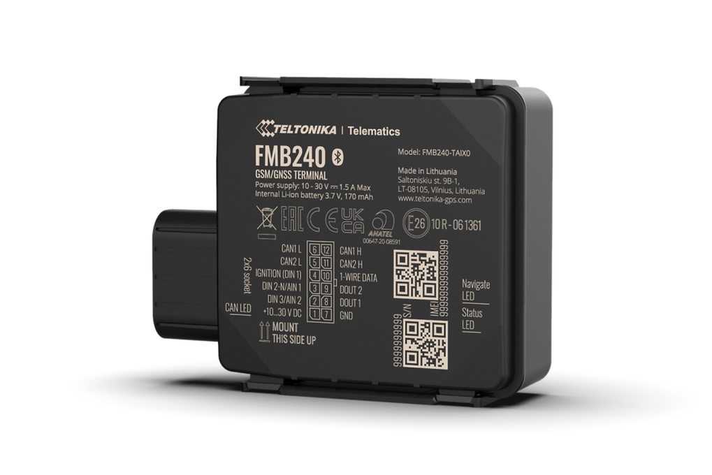

# Teltonika - FMB240

The FMB240 is a compact, Plaspy compatible GPS tracker designed for demanding vehicle and asset installations. Housed in a water-resistant IP67-rated casing, the FMB240 brings reliable CAN bus telemetry and environmental sensing to fleet management and asset monitoring workflows. Its built-in CAN chip and Bluetooth® LE support make it a versatile choice for integrators who want Plaspy-compatible hardware that reads vehicle diagnostics and pairs with wireless sensors.

Engineered for fleet and e-mobility use, the FMB240 reads CAN data from light and electric cars, trucks, buses and special machinery using LV-CAN200 or ALL-CAN300 options. The device supports global 2G GSM connectivity \(B2/B3/B5/B8\) and is available in multiple package and order-code variants. Note: the manufacturer indicates an End of Life \(EOL\) status on the product page — verify current availability and support before purchasing.

## Key Highlights

- Plaspy compatible GPS tracker profile for real-time tracking and fleet management integration.
- Robust IP67-rated housing with click-type two-phase closing for dust and water protection in harsh field deployments.
- Direct CAN bus data reading via built-in CAN chip \(LV-CAN200 or ALL-CAN300\) to capture vehicle diagnostics and telemetry.
- Global 2G GSM coverage on B2/B3/B5/B8 bands for broad cellular connectivity options.
- Bluetooth® LE for pairing external beacons and sensors \(temperature, humidity, movement, magnet detection\) to extend telemetry.
- Multiple standard and custom order codes and packaging options for deployment flexibility \(standard packages include multiple units and power cables\).
- Compact form factor suitable for vehicles, e-mobility platforms, utility machinery and other mobile assets.

## How It Works with Plaspy

When integrated with Plaspy, the FMB240 feeds vehicle location and CAN-derived telemetry into Plaspy’s real-time tracking dashboard and reporting engine. Plaspy normalizes CAN messages and sensor data so fleet managers can see vehicle diagnostics, generate alerts, and analyze operational metrics alongside GPS location. This creates a single-pane view for telemetry-driven decisions and anti-theft workflows.

- Real-time location and telemetry updates sent to Plaspy for live tracking and history playback.
- CAN-sourced ignition and status signals \(where available on the vehicle CAN network\) can be interpreted by Plaspy for trip detection and engine-state reporting.
- Fuel monitoring and other vehicle parameters available via CAN when supported by the vehicle’s network and mapped in Plaspy.
- Remote immobilizer or anti-theft workflows can be implemented via CAN-derived control channels where supported by the installation and vehicle — consult installer and Plaspy integration guides.
- Bluetooth sensors and beacons pair with the FMB240 to provide environmental telemetry \(temperature, humidity, movement, magnet detection\) that Plaspy can visualize and alert on.

## Technical Overview

| Connectivity | 2G GSM \(global\) — supported bands B2, B3, B5, B8 |
| --- | --- |
| Bands | B2 / B3 / B5 / B8 \(2G GSM\) |
| Power & Battery | Vehicle-powered; standard package contents include power supply cable \(0.9 m\). Verify backup battery options with the manufacturer. |
| Interfaces | Built-in CAN data reading chip \(LV-CAN200 or ALL-CAN300 options\). Inputs/outputs and additional I/O depend on package and installer wiring. |
| GNSS | Vehicle tracking capability \(GPS tracking per product class\). See manufacturer documentation for full GNSS details. |
| Bluetooth | Bluetooth® LE for external sensors and beacons \(temperature, humidity, movement, magnet detection\) |
| Remote Management | Firmware, downloads and support resources available via the manufacturer product support and knowledge base; confirm current support status due to EOL notice. |
| Form Factor | Compact, IP67-rated enclosure with click-type two-phase closing — designed for vehicle and rugged asset installations |
| Variants & Packaging | Multiple standard and custom order codes \(examples: FMB240BT2X01, FMB240YN2X01, FMB240BT2F01, FMB240YN2F01\). Standard box contents described by the manufacturer include 5 pcs per box, power cable and CAN module. |

## Use Cases

- Fleet management and route optimization — combine real-time tracking with CAN telemetry for efficient operations and downtime reduction.
- Anti-theft monitoring and recovery — Plaspy’s live tracking and CAN-based status can support alerting and immobilization workflows where supported.
- E-mobility and utility vehicle telemetry — read battery and vehicle-specific CAN data for electric cars and utility machinery via LV-CAN200 / ALL-CAN300 modules.
- Environmental monitoring with Bluetooth sensors — monitor temperature, humidity or vibration inside assets and visualize readings in Plaspy.
- Special machinery and asset tracking — rugged IP67 housing makes the device suitable for harsh environments and outdoor equipment.

## Why Choose This Tracker with Plaspy

The FMB240 is a practical choice when you need Plaspy compatible hardware that brings CAN-level telemetry, environmental sensing and rugged protection to your fleet or asset program. Its compact IP67 enclosure and Bluetooth LE support make it flexible for mixed deployments while the built-in CAN chip enables rich vehicle diagnostics without additional gateways. Paired with Plaspy, the FMB240 delivers consolidated real-time tracking, telemetry and alerting so operations teams can act on accurate vehicle and sensor data.

Before purchase, confirm current availability and long-term support: the product page lists the FMB240 as End of Life \(EOL\). If you need a Plaspy compatible solution today, consult Plaspy integration guides and the manufacturer's knowledge base for firmware, exact wiring diagrams, and recommended package variants.

