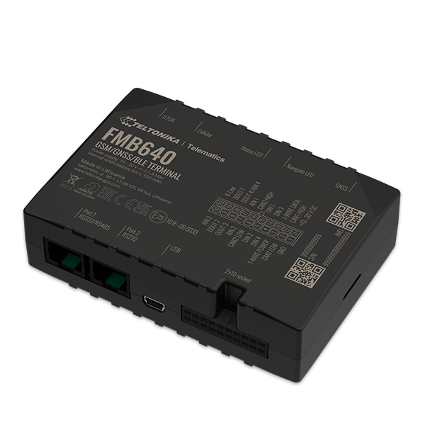

# Teltonika - FMB640-FMB641

The Teltonika FMB640 and its updated variant FMB641 are professional grade GPS trackers designed for complex fleet and asset monitoring applications. They combine vehicle location tracking with a wide range of vehicle and peripheral data capabilities, including support for FMS CAN data, fuel CAN data, tachograph live data and remote tachograph file download. Both models accept various third party RS232 or RS485 devices and support peripheral sensors such as RFID, iButton, temperature 1-Wire devices and Continental tire pressure sensors.

As devices compatible with Plaspy, the FMB640 and FMB641 can feed location, vehicle status and peripheral inputs into Plaspy for centralized fleet visibility and reporting. The FMB641 adds a more powerful processor, switchable CAN terminators for denser CAN networks, and USB power for easier configuration, making these units suitable for operations that require robust telemetry and flexible integration with existing vehicle systems.

## Key Highlights

- Professional GPS tracker family suited for complex fleet applications and mixed fleets
- Support for FMS CAN data and fuel CAN data for enhanced vehicle telemetry
- Tachograph live data support plus remote tachograph file download for driver hour oversight
- Compatibility with RS232 and RS485 third party devices and a range of peripherals
- Dual SIM or eSIM options and an onboard accelerometer for extended connectivity and event detection
- Multiple power saving sleep modes to help extend device endurance in remote or asset applications

## How It Works with Plaspy

When connected to Plaspy, the FMB640 and FMB641 transmit position and supported telemetry to Plaspy so fleet managers can monitor vehicles, review events and generate reports from a single platform. Plaspy ingests the device data and exposes it through dashboards, alerts and historical logs to support operational decisions.

- Live location and historical trip visualization within Plaspy dashboards
- Fleet level alerts for events such as overspeeding, excessive idling, towing, crash and jamming detection
- Tachograph metadata and downloadable DDD files available for driver hours monitoring and regulatory review
- Fuel, odometer and eco driving indicators presented for fuel use analysis and cost control
- Peripheral and sensor inputs visible in Plaspy for temperature monitoring, RFID identification and tire pressure insights
- Offline tracking and event buffering handled by the device for continuity when connectivity is intermittent

## Typical Use Cases

- International logistics and long haul fleets that require tachograph and CAN based vehicle data
- Refrigerated transport where temperature sensors and peripheral monitoring are needed
- Agriculture, construction and mining vehicles operating in mixed environments
- Security and emergency service vehicles that need reliable tracking and event alerts
- Asset tracking and rental fleets that benefit from immobilizer and tamper detection features

## Why Choose This Tracker with Plaspy

The FMB640 and FMB641 are appropriate choices when an organization needs more than basic location tracking. Their support for vehicle bus data, tachograph downloads and a variety of peripherals means they can be integrated into richer fleet workflows and compliance processes. For teams using Plaspy, these models provide the kinds of telemetry and event reporting that improve operational oversight without forcing a complete overhaul of existing on vehicle systems.

Because the FMB641 brings a stronger processor and additional configuration conveniences, it can be a better fit for use cases requiring higher data throughput or more complex CAN networks. Overall, pairing these Teltonika units with Plaspy helps combine robust field data collection with centralized monitoring, alerts and reporting.

To learn more about how Plaspy can work with Teltonika devices and to evaluate platform features visit https://www.plaspy.com. Product specifications, availability and manufacturer documentation can change over time, so please verify current technical details and confirmed capabilities on the official Teltonika site https://www.teltonika-gps.com/ before making deployment decisions.
