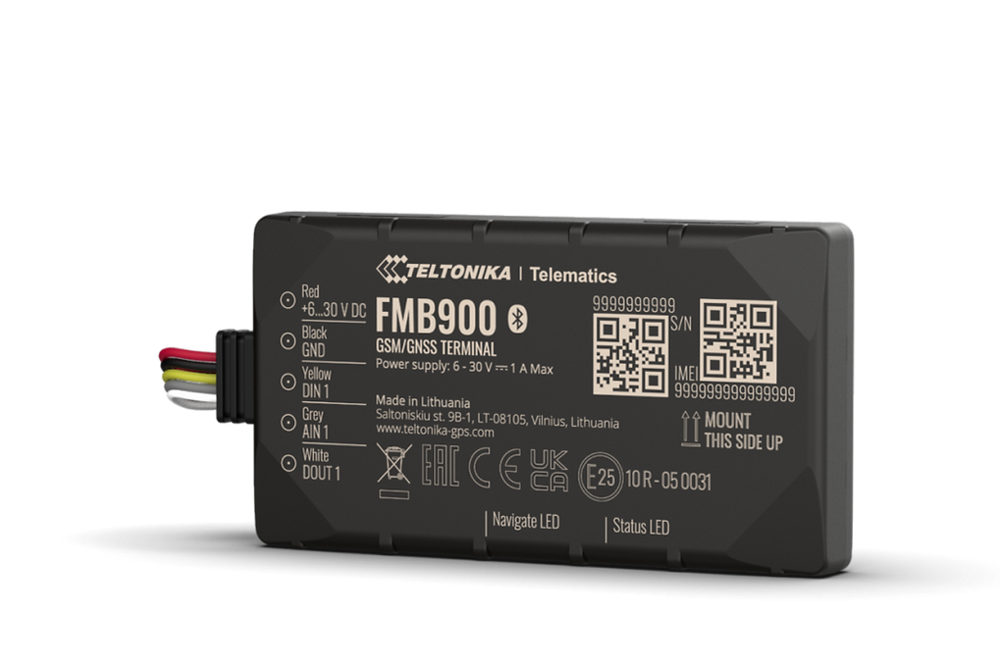

# Teltonika - FMB900

The Teltonika FMB900 is a compact, low-cost 2G vehicle tracker designed for straightforward vehicle tracking, basic telemetry and anti-theft applications. Its slim form factor and discreet install suitability make it a practical choice for fleets, trailers and small assets where space is limited but reliable real time location and basic control features are required. The model supports Bluetooth Low Energy attachments to extend monitoring with external beacons and sensors.

As a Plaspy compatible device, the FMB900 can stream core tracking and telemetry into Plaspy for live monitoring, reporting and alerting. Remote device management and simple provisioning workflows supported by the device make it an economical option for operators who want to add Plaspy visibility and basic fleet control without a large hardware footprint.

## Key Highlights

- Plaspy compatible device offering real time tracking and fleet integration.
- Slim, low profile design of approximately 12 mm height for hidden or tight installations.
- Bluetooth Low Energy support for EYE Beacon and EYE Sensor attachments to capture environmental and tamper signals.
- 2G cellular connectivity for basic telemetry across supported GSM bands.
- Remote engine blocking and ignition related control for anti-theft and vehicle security workflows.
- Remote device management via Teltonika FOTA WEB and configuration with Teltonika Configurator for scalable maintenance.
- Includes power cable in standard packages for straightforward commissioning.

## How It Works with Plaspy

When connected to Plaspy, the FMB900 provides the essential location and status information needed for operational oversight, and BLE sensor inputs extend Plaspy reports with environmental and tamper data. Plaspy uses the device feed to present vehicle positions on maps, generate alerts and compile fleet reports that support daily operations.

- Live location updates and route replay in Plaspy for active monitoring and historical review.
- Engine status reporting and remote engine blocking workflows to support anti-theft responses.
- BLE sensor data such as temperature, humidity, magnet and movement fed into Plaspy for cargo and tamper monitoring.
- Telematics inputs that support driving behavior and eco-driving analysis within Plaspy reporting.
- Remote firmware and configuration management compatibility to simplify fleet provisioning and maintenance.

## Typical Use Cases

- Fleet anti-theft and recovery workflows using discreet installation and remote engine blocking.
- Basic fleet management and eco-driving programs to improve fuel use and driver behavior.
- Monitoring temperature sensitive cargo or equipment when paired with BLE temperature sensors.
- Asset tracking for trailers, equipment and field devices where a compact tracker is needed.
- Tamper and movement alerts using BLE beacons and sensors routed into Plaspy notifications.

## Why Choose This Tracker with Plaspy

The FMB900 is a practical choice for organizations seeking an economical, compact tracker that integrates with Plaspy for core fleet visibility and basic control. Its small size and BLE capability allow operators to extend monitoring with external sensors without extensive wiring, while remote management tools help keep a dispersed fleet configured and updated.

For teams focused on straightforward vehicle tracking, anti-theft measures and occasional environmental monitoring, the FMB900 provides the essential features to get connected to Plaspy quickly and cost effectively. Learn more about how Plaspy works with compatible devices on https://www.plaspy.com and verify current product specifications and availability with the manufacturer at https://www.teltonika-gps.com/ since details and offerings can change over time.
