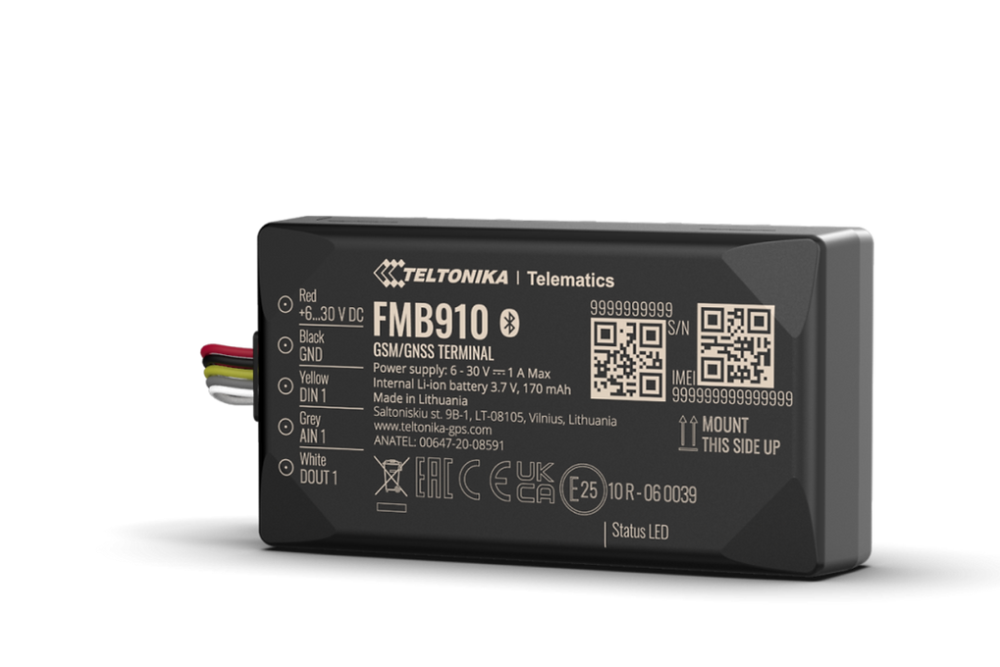

# Teltonika - FMB910

The Teltonika FMB910 is a compact 2G GPS tracker built for cost-conscious fleet management and vehicle protection that is Plaspy compatible. Designed for straightforward deployment, the FMB910 delivers reliable real-time tracking and basic telemetry data to help small and medium fleets improve route visibility, support anti-theft workflows, and accelerate stolen vehicle recovery where 2G networks remain available.

The unit includes a configurable 3-axis accelerometer for crash detection, Bluetooth Low Energy \(BLE\) for external sensors and beacons, and I/O-driven remote control options such as engine block and ignition monitoring. When paired with Plaspy, the FMB910 provides the location, event and sensor streams you need to power alerts, reports and remote immobilization workflows, while offering cost-effective ownership and easy integration.

## Key Highlights

- Plaspy compatible GPS tracker for dependable real-time tracking and location history.
- Compact 2G design \(B2/B3/B5/B8\) optimized for low-cost fleet deployments where 2G is available.
- Built-in 3-axis accelerometer with configurable crash detection for incident alerts and investigation.
- I/O-based remote control \(engine block, ignition inputs\) to support anti-theft and immobilizer workflows.
- Bluetooth Low Energy \(BLE\) support for external sensors and beacons — temperature, humidity, movement, magnet detection scenarios.
- Supports eco-driving telemetry to encourage fuel efficiency and safer driving behaviour.
- Remote firmware and configuration management via Teltonika FOTA WEB \(check product lifecycle status prior to deployment\).

## How It Works with Plaspy

The FMB910 sends GPS position, accelerometer events, I/O state changes and BLE sensor data to Plaspy in real time. Plaspy ingests those messages to provide live map views, alerts, telemetry dashboards and historical reports. Integrators can use Plaspy rules and workflows to translate FMB910 events into business actions — for example, notify operations on crash detections, log ignition cycles, or trigger immobilization procedures where remote control is configured and permitted.

- Real-time location and telemetry updates delivered to Plaspy for monitoring and reporting.
- Crash detection and accelerometer events for incident alerts and reconstruction.
- Ignition and engine block status via device I/O for anti-theft and immobilizer workflows.
- Eco-driving telemetry to help fleets reduce fuel consumption and improve safety metrics.
- Bluetooth sensors and beacons for extended asset/environment monitoring forwarded to Plaspy.

## Technical Overview

| Connectivity | 2G GSM \(vehicle-mounted cellular data\) |
| --- | --- |
| Bands | B2 / B3 / B5 / B8 \(2G GSM\) |
| Power & Battery | Vehicle-powered; backup battery not specified in the product description |
| Interfaces | Digital inputs/outputs, ignition input; supports engine block and other I/O-based remote control measures |
| GNSS | GPS — provides accurate location data and position reporting \(precision not specified\) |
| Bluetooth | Bluetooth Low Energy \(BLE\) for pairing with external sensors and beacons |
| Remote Management | Teltonika FOTA WEB for firmware and configuration updates \(remote device management\) |
| Form Factor | Compact vehicle tracker intended for basic fleet monitoring and anti-theft use |
| Ordering / Packaging | Standard and custom order codes: FMB91093IN01 \(standard package, Worldwide\) and FMB91093KN01 \(custom package, Worldwide\). Standard bulk package referenced as 20 pcs FMB910 units with 20 I/O power supply cables \(0.7 m\) and Teltonika-branded packaging; single-unit contents may differ—consult vendor. |
| Lifecycle Note | Product listed with End of Life \(EOL\) markers on the manufacturer page—verify long-term support and recommended successor models before large-scale deployment. |

## Use Cases

- Fleet management for small to medium vehicle fleets that require cost-efficient GPS tracker hardware and real-time position reporting.
- Anti-theft and stolen vehicle recovery workflows using I/O-triggered immobilization and location tracking.
- Incident and crash reporting with accelerometer-based detection to support investigations and driver safety programs.
- Asset and environment monitoring with Bluetooth sensors — temperature-sensitive cargo, movement detection, or magnet-based tamper alerts.
- Telematics and eco-driving programs to monitor driver behaviour and reduce fuel consumption through actionable telemetry.

## Why Choose This Tracker with Plaspy

When paired with Plaspy, the Teltonika FMB910 delivers an economical path to real-time tracking, telemetry and basic remote-control features for fleets operating where 2G remains available. Its compact design, crash detection and BLE sensor support make it a practical choice for anti-theft, stolen vehicle recovery and simple asset-monitoring projects. Plaspy adds value by aggregating FMB910 location and sensor streams into dashboards, alerts and automated workflows so teams can respond faster and run safer, more efficient operations.

Before purchase, verify regional 2G network availability and the FMB910 lifecycle status \(EOL\). For deployments requiring long-term support or 3G/4G coverage, consult the vendor or Teltonika for recommended successor models and ensure Plaspy integration plans align with your device lifecycle and management strategy.

