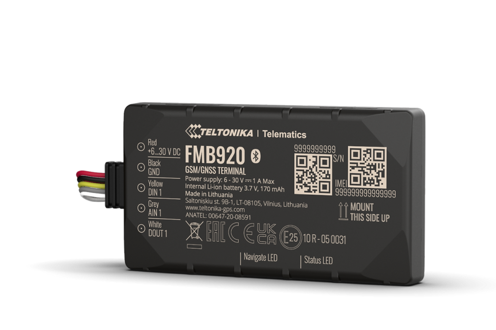

# Teltonika - FMB920

The Teltonika FMB920 is a compact GPS tracker designed for reliable vehicle tracking and anti theft protection. With a slim 12 mm height housing and a form factor suited to discreet installation, the FMB920 targets small vehicles and assets that require a low profile telematics solution while delivering continuous position and event reporting.

As a Plaspy compatible device, the FMB920 provides the core telemetry and security inputs that fleet operators expect. Its internal backup battery, remote immobilizer support and Bluetooth LE connectivity for external sensors and beacons make it a practical choice for Plaspy users who need consistent location, ignition and sensor data for monitoring, alerts and basic reporting.

## Key Highlights

- Plaspy compatible GPS tracker for real time vehicle and asset tracking.
- Ultra slim 12 mm form factor for discreet installation in tight spaces.
- Internal backup battery to maintain reporting during temporary power loss.
- Remote immobilizer support to assist anti theft workflows.
- Standard inputs for ignition door and alarm status useful for event driven alerts.
- Fuel monitoring capability to support basic fuel tracking and anomaly detection.
- Bluetooth LE connectivity for pairing with external beacons and sensors.

## How It Works with Plaspy

When connected to Plaspy the FMB920 forwards position updates, event notifications and sensor readings so fleet managers and operators can monitor assets in real time and review historical activity. Plaspy uses these streams of data to power live maps, alerts and operational reports that aid decision making and incident response.

- Real time location updates and historical playback available in Plaspy for tracking and route review.
- Ignition door and alarm status shown in Plaspy for event based monitoring and driver activity insights.
- Fuel monitoring data visible for basic consumption reports and theft detection alerts.
- Remote immobilizer status exposed through Plaspy to support anti theft response workflows.
- Bluetooth sensor and beacon data routed into Plaspy to extend monitoring to temperature humidity and movement scenarios.

## Typical Use Cases

- Fleet anti theft and immobilization workflows with remote response options.
- Basic fleet management and track and trace for small delivery vehicles and service fleets.
- Fuel monitoring and detection of unusual consumption or tampering.
- Extended asset monitoring using Bluetooth sensors for cargo or trailer conditions.
- Discreet protection of small vehicles scooters or high value equipment.

## Why Choose This Tracker with Plaspy

The FMB920 offers a balanced feature set for organizations that need dependable tracking and basic security features without unnecessary complexity. Its slim profile and internal backup battery make it well suited to discreet installations, while standard telemetry inputs and remote immobilizer support provide the practical controls fleet managers rely on for security and event monitoring.

Paired with Plaspy, the FMB920 supplies the location, status and sensor data needed for live oversight, alerts and operational reporting. For users seeking a compact, Plaspy compatible tracker for small vehicles or assets, the FMB920 is a sensible option to consider.

Learn more about Plaspy on our main website https://www.plaspy.com. Product specifications availability and manufacturer details can change over time so please verify current specifications on the official Teltonika site https://www.teltonika-gps.com/.
