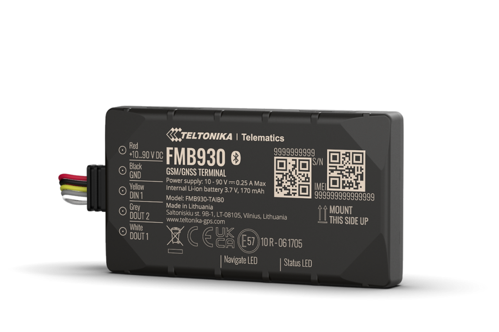

# Teltonika - FMB930

The FMB930 is a compact, low-power GPS tracker designed specifically for electric two‑wheelers and light electric vehicles. Plaspy compatible out of the box, the FMB930 delivers reliable location data and BLE-based telemetry that makes it an ideal choice for e-moped and e-motorcycle fleets where extended idle periods and tight power budgets are common.

Engineered around ultra-low power consumption, the FMB930 combines 2G GSM connectivity \(B2/B3/B5/B8\), an internal rechargeable 170 mAh battery, and Bluetooth Low Energy \(BLE\) support for external sensors. When paired with Plaspy, fleet managers gain real-time tracking, anti-theft monitoring, and scalable device management through supported remote management tools like FOTA WEB.

## Key Highlights

- Plaspy compatible GPS tracker tuned for electric two‑wheelers and light EVs.
- Ultra-low power "Power Off" sleep mode \(~1 mA\) for long autonomous standby.
- Internal rechargeable 170 mAh battery for extended off‑grid operation.
- 2G GSM connectivity on bands B2, B3, B5 and B8 for wide GSM coverage.
- Bluetooth Low Energy \(BLE\) for external sensors and beacon pairing \(temperature, humidity, magnet, movement\).
- Remote device management support \(FOTA WEB\) for firmware and configuration updates at scale.
- Compact form factor and simple wiring \(0.7 m power supply cable included in standard packages\).

## How It Works with Plaspy

Integrating the FMB930 with Plaspy is straightforward: the tracker transmits GNSS position and sensor telemetry over 2G to your telematics platform, where Plaspy processes the data for real-time tracking, alerts, and historical reporting. Plaspy compatible integration enables immediate visualization of vehicle locations, BLE sensor readings, and device status — allowing fleet managers to act on anti-theft alarms, movement events, and long-term uptime metrics.

- Real-time tracking: GNSS location updates delivered to Plaspy for live maps and route playback.
- BLE telemetry: Bluetooth sensors \(temperature, humidity, magnet detection, motion\) paired to the tracker and forwarded as telemetry to Plaspy.
- Power state and sleep mode alerts: Monitor Power Off sleep behavior and low-battery notifications remotely.
- Remote firmware & config: Use FOTA WEB compatibility to deploy firmware updates and configuration changes via Plaspy-managed workflows.
- Fleet management readiness: Data can be combined within Plaspy with ignition or immobilizer inputs from other integrations, and with fuel monitoring feeds when available, to create a complete fleet picture.

## Technical Overview

| Connectivity | 2G GSM \(GSM/GPRS\) |
| --- | --- |
| Bands | B2 / B3 / B5 / B8 |
| Power & Battery | Internal rechargeable 170 mAh battery; Power Off sleep mode ~1 mA for extended autonomy |
| Interfaces | Input/output power supply cable \(0.7 m\) included in standard packages; additional micro USB cable available in some kits |
| GNSS | GPS-based positioning \(compact GNSS module for vehicle tracking\) |
| Bluetooth | Bluetooth Low Energy \(BLE\) for external sensors and beacons |
| Remote Management | Compatible with remote device management platforms \(e.g., FOTA WEB\) for firmware and configuration updates |
| Form Factor | Compact tracker designed for electric two‑wheelers, e-rickshaws, and light electric vehicles |
| Ordering / Product Codes | Examples: FMB930XR3C01, FMB930XR4C01, FMB930XRUB01 \(standard and custom packages available\) |

## Use Cases

- Anti-theft monitoring for e-mopeds and e-motorcycles — detect unauthorized movement and send alerts via Plaspy.
- Basic track-and-trace for urban delivery scooters and last-mile e-vehicles with long idle intervals.
- E-mobility fleet management where low standby consumption preserves battery life during long parking periods.
- Environmental monitoring using BLE sensors — temperature, humidity, and movement telemetry for sensitive cargo on light EVs.
- Compact asset tracking for shared micro-mobility fleets and rentable e-vehicles.

## Why Choose This Tracker with Plaspy

The FMB930 is a focused GPS tracker built for environments where power efficiency and compact form matter. When deployed with Plaspy, it becomes a cost-effective building block for real-time tracking, anti-theft protection, and BLE-enabled telemetry across lightweight electric vehicles. Plaspy's platform takes the FMB930's low-power GNSS and BLE data and combines it with fleet management workflows — enabling alerts, historical reports, and remote device maintenance.

For operations that also require ignition or immobilizer control, or advanced fuel monitoring, Plaspy can ingest and correlate those signals from complementary devices or vehicle integrations alongside FMB930 data. This makes the FMB930 a practical, Plaspy compatible tracker for mixed fleets where some assets need a compact, ultra-low-power tracker and others require broader I/O or CAN-based telemetry.

