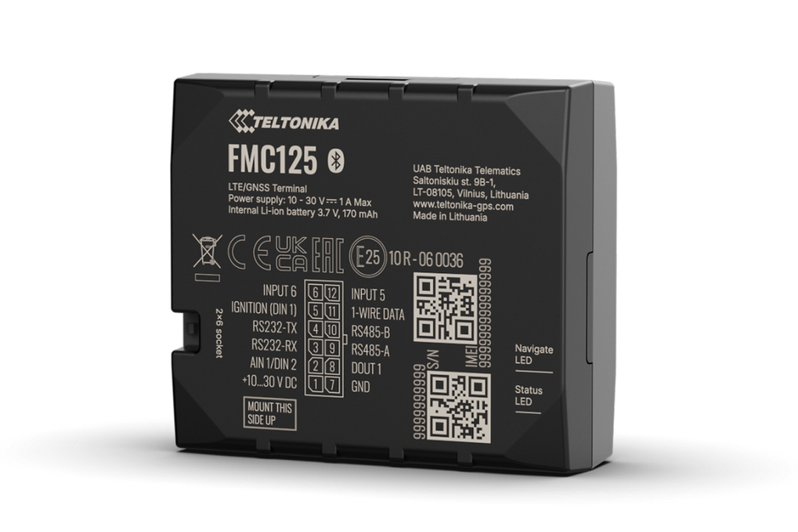

# Teltonika - FMC125

The FMC125 is a professional-grade GPS tracker designed for fleet management and advanced vehicle telemetry. Plaspy compatible out of the box, the FMC125 brings reliable 4G LTE Cat 1 connectivity with 2G fallback, Dual SIM resilience and rugged serial interfaces to deliver precise real-time tracking and fuel monitoring for logistics, trucking and service fleets.

Built for integration, the FMC125 supports RS232 and RS485 serial links for external data reading, impulse inputs for fuel flow meters, and driver/asset identification via RFID and 1-wire sensors. When paired with Plaspy, this tracker converts vehicle telemetry into actionable dashboards, alerts and reports that support anti-theft workflows, fuel analytics, and operational optimization.

## Key Highlights

- Plaspy compatible GPS tracker for dependable real-time tracking and fleet management.
- 4G LTE Cat 1 connectivity with 2G fallback and Dual SIM to reduce roaming risk and maintain uptime.
- Serial data acquisition via RS232 and RS485 for integrating fuel flow meters, telematics and cameras.
- Impulse input plus support for RFID and 1-wire sensors enables accurate fuel monitoring and driver identification.
- Teltonika video telematics support \(DualCam & Dashcam\) over RS232 for event capture and evidence collection.
- Multiple regional modules and order codes available to cover different frequency bands and markets.
- Packaged for professional deployments with standard and customizable bulk ordering options.

## How It Works with Plaspy

The FMC125 streams GNSS position and serial telemetry to Plaspy using its cellular uplink. Plaspy ingests location, impulse pulses, RFID/1-wire events and serial data from connected peripherals to provide live maps, historical traces, alerts and fuel consumption reports. This integrated approach delivers real-time tracking and richer telemetry for fleet operators.

- Real-time location and telemetry updates transmitted over LTE Cat 1 \(with 2G fallback\) to Plaspy.
- Fuel monitoring via impulse input: pulse counts from fuel flow meters are parsed and reported to Plaspy for consumption analytics.
- Driver and asset identification using RFID and 1-wire sensors, enabling driver-based reporting and security workflows.
- Serial integration \(RS232/RS485\) for telemetry, external sensors and Teltonika DualCam / Dashcam video telematics.
- Dual SIM operation to maintain connectivity across networks and regions for uninterrupted tracking and anti-theft alerting.
- Supports workflows that can include ignition status monitoring and immobilizer actions when integrated into vehicle wiring and Plaspy automation rules.
- Compatibility with Bluetooth sensors can be achieved through Plaspy integrations or external gateways within the connected telematics ecosystem.

## Technical Overview

| Connectivity | 4G LTE Cat 1 with fallback to 2G; Dual SIM support |
| --- | --- |
| Bands / Variants | Multiple regional modules and order codes \(examples: FMC125TLXW01 for EU/MEA, FMC12547XW01 for APAC/LATAM\) |
| Power & Battery | Vehicle-powered; typically supplied with power/input-output cable. No internal battery specified in the provided description. |
| Interfaces | RS232, RS485 serial ports; impulse input for fuel flow meters; RFID and 1-wire sensor support; standard power/I/O cable included in many packages |
| GNSS | GPS-based location reporting for real-time tracking and historical telemetry \(accuracy depends on signal & environment\) |
| Bluetooth | Not specified as built-in. Integration with Bluetooth sensors is achievable via Plaspy integrations or external gateways when required. |
| Video Telematics | Supports Teltonika DualCam & Dashcam via RS232 for paired camera event capture |
| Remote Management | Orderable in standard and custom packages; remote management features not detailed in the description |
| Form Factor | Vehicle-mounted tracker intended for fleet and asset use; standard and bulk packaging options available |

## Use Cases

- Fleet telematics and dispatch: live GPS tracker data routed to Plaspy for route oversight, ETA calculations and performance reporting.
- Fuel monitoring and analytics: use impulse inputs with fuel flow meters to produce accurate consumption reports and detect fuel loss or theft.
- Driver identification and compliance: RFID and 1-wire sensors allow driver-based logging, access control and behavior attribution.
- Video event capture: pair with supported Teltonika DualCam/Dashcam units over RS232 to record incidents and correlate video with telemetry.
- Asset control and anti-theft: Dual SIM connectivity and Plaspy alarm workflows support theft detection, immobilizer workflows and recovery processes when integrated into vehicle systems.

## Why Choose This Tracker with Plaspy

The FMC125 is positioned for operators who need a reliable, integration-ready GPS tracker for professional fleet management and telemetry. Its combination of LTE Cat 1 connectivity with 2G fallback and Dual SIM resilience reduces connectivity risk across regions. Serial interfaces \(RS232/RS485\), impulse inputs and sensor support make it straightforward to capture fuel monitoring data, driver IDs and third-party telematics streams. When paired with Plaspy, the FMC125 turns raw vehicle data into practical real-time tracking, fuel monitoring and anti-theft capabilities — enabling better operational control, lower fuel costs and faster incident response.

For fleets and logistics providers seeking a Plaspy compatible unit that handles serial data acquisition, camera integration and precise fuel analytics, the FMC125 presents a scalable option with regional modules and bulk packaging to support larger rollouts. Its strengths lie in reliable connectivity, extensible telemetry inputs and straightforward integration into Plaspy’s dashboards and automation rules.

