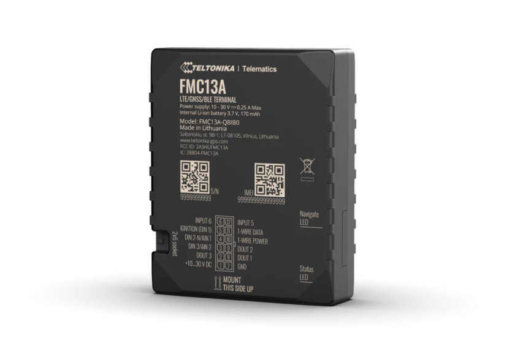

# Teltonika - FMC13A

The Teltonika FMC13A is an advanced 4G LTE Cat 1 tracker designed specifically for North America. With reliable 4G LTE Cat 1 network coverage, this tracker offers guaranteed future-proof network support for your fleet. It is equipped with extensive remote monitoring capabilities, allowing you to remotely block the engine and implement various fleet control measures. 

One of the standout features of the FMC13A is its CAN adapter support, which enables you to read fuel, odometer, RPM, engine temperature, and other data from light and electric vehicles, trucks, buses, and special machinery. This tracker also offers accurate fuel usage control with its impulse input for fuel flow meters data reading, ensuring precise monitoring of fuel consumption. 

In terms of specifications, the FMC13A features LTE \(CAT1\) / UMTS / GNSS / Bluetooth technology. It supports various GNSS systems including GPS, GLONASS, GALILEO, BEIDOU, QZSS, and AGPS, providing accurate positioning and tracking. The tracker has a compact design with dimensions of 77 x 62 x 20 mm \(L x W x H\) and weighs 71.5 g. It operates within a wide temperature range of -20 °C to +40 °C and has an ingress protection rating of IP41. 

With its flexible inputs, advanced network support, and extensive remote monitoring capabilities, the Teltonika FMC13A is an ideal choice for fleet management in North America. Whether you need to track vehicles, monitor fuel usage, or implement fleet control measures, this tracker offers the features and reliability you need.

