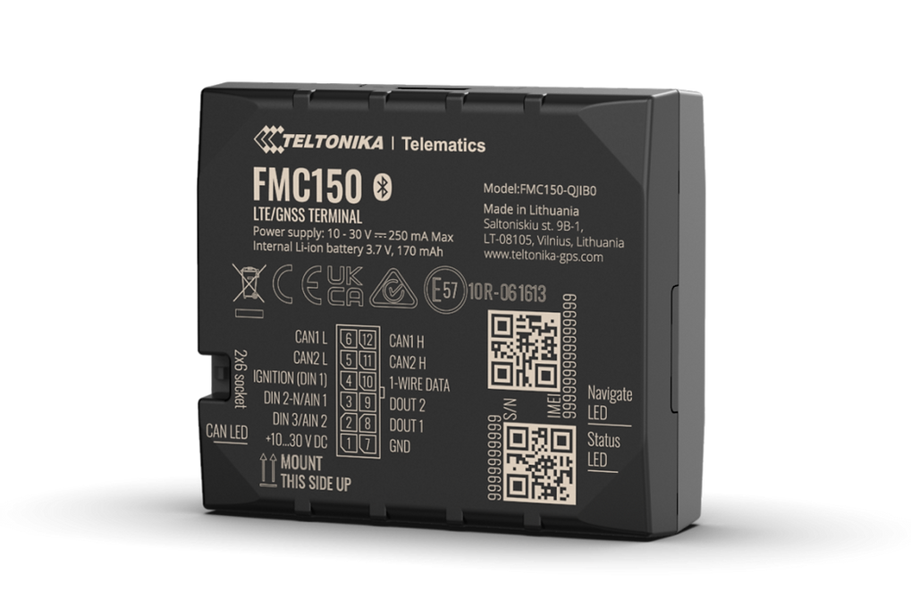

# Teltonika - FMC150

# Teltonika FMC150 — Plaspy compatible vehicle GPS tracker

The Teltonika FMC150 is a professional-grade vehicle GPS tracker engineered for fleet management and advanced telemetry. Designed with a built-in CAN bus data processor and contactless CAN adapter compatibility, the FMC150 delivers deep vehicle insight — from engine and battery status to fuel consumption and EV-specific metrics. As a Plaspy compatible device, it feeds high-value CAN telemetry and real-time GPS location into Plaspy for centralized fleet control, predictive maintenance, and anti-theft workflows.

Fleet operators, rental services, and logistics teams benefit from FMC150’s 4G LTE Cat 1 connectivity \(with quad-band 2G fallback where applicable\) and multi-region module options. The unit is purpose-built for mixed fleets and electric vehicles, supports more than 100 CAN parameters, and pairs with Bluetooth sensors and Teltonika accessories to extend telemetry and asset identification capabilities.

## Key Highlights

- Plaspy compatible: streams GPS and CAN-derived telemetry into Plaspy for real-time tracking, alerts, and reporting.
- Built-in CAN processor: direct CAN bus reading with support for 100+ CAN parameters for engine, battery, charging and diagnostic data.
- 4G LTE Cat 1 with 2G fallback: consistent connectivity across regional SKUs to enable uninterrupted telematics and remote data delivery.
- EV-ready CAN packages: configured for electric vehicles with Standard or Extended parameter packages to capture EV-specific metrics.
- Accessory ecosystem: works with ECAN02 contactless CAN adapters, EYE Beacon and EYE Sensor Bluetooth devices, RFID readers, temperature sensors and iButton solutions.
- Order flexibility: multiple hardware modules and regional variants \(LATAM, EU/MEA/APAC examples\) and OEM/multi-piece packaging options for scale.
- Remote management support: compatible with Teltonika FOTA WEB and configurator tools for firmware updates and device configuration.

## How It Works with Plaspy

When integrated with Plaspy, the FMC150 delivers a continuous stream of location and CAN-derived telemetry that Plaspy uses for real-time tracking, historical reporting, and automated alerts. Plaspy ingests the device’s messages \(GNSS position plus CAN parameter payloads\) and maps them to dashboards, geofences, maintenance schedules and driver scorecards. The combination of FMC150 and Plaspy supports detailed fleet management workflows — from fuel monitoring to preventive maintenance planning.

- Real-time location and telemetry updates sent to Plaspy via 4G/2G connectivity.
- CAN-derived engine, battery and charging status for live diagnostics and predictive maintenance.
- Fuel monitoring and consumption metrics extracted from supported CAN parameters.
- EV telemetry delivered to Plaspy when configured with EV-specific parameter packages.
- Bluetooth sensors and beacons \(EYE Beacon, EYE Sensor\) for proximity, temperature or accessory identification reported into Plaspy.

## Technical Overview

| Connectivity | 4G LTE Cat 1 module with fallback to quad-band 2G GSM \(module/variant dependent\) |
| --- | --- |
| Bands / Regions | Multiple SKUs and frequency variants available to suit LATAM, EU/MEA/APAC and other regional networks \(see ordering codes\) |
| CAN & Telemetry | Built-in CAN bus chip and internal CAN data processor; supports over 100 CAN parameters; Standard and Extended CAN parameter packages |
| Power & Accessories | Vehicle-powered tracker; standard package includes input/output power supply cable; special/custom order codes available for additional accessories |
| GNSS | GPS-based location tracking suitable for real-time positioning and historical routes |
| Bluetooth | Compatibility with Bluetooth beacons and sensors such as EYE Beacon and EYE Sensor for asset and environmental telemetry |
| Interfaces | Contactless CAN adapter compatibility \(e.g., ECAN02\); supports accessory integration including RFID and temperature sensors |
| Remote Management | Supported by Teltonika FOTA WEB and configurator tools for firmware updates and provisioning |
| Form Factor | Rugged vehicle-mounted tracker designed for cars, trucks, buses, special machinery and EV fleets |

## Use Cases

- Fleet management and logistics: combine GPS tracking and CAN telemetry in Plaspy for route optimization, fuel monitoring and driver performance.
- Anti-theft and recovery: real-time location and historical movement in Plaspy assist recovery efforts and support immobilization workflows when integrated with vehicle systems or third-party controllers.
- Electric vehicle telemetry: EV-specific CAN reading helps monitor battery charge, charging events and EV performance across mixed fleets.
- Preventive maintenance and diagnostics: schedule service based on CAN-derived engine and battery metrics to reduce downtime and extend asset life.
- Sensor-enabled asset monitoring: pair with Bluetooth beacons and temperature sensors to track trailers, cargo conditions and equipment status within Plaspy dashboards.

## Why Choose This Tracker with Plaspy

The FMC150 is an ideal Plaspy compatible tracker for operators who need more than basic GPS: it brings CAN-level visibility to routine fleet tasks, fuel monitoring and EV management while maintaining robust 4G connectivity and global SKU options. Its built-in CAN processor and support for extended parameter packages deliver telemetry depth required for predictive maintenance and performance optimization. Combined with Plaspy’s real-time platform, FMC150 enables reliable anti-theft alerts, precise fleet management, and the ability to incorporate Bluetooth sensors for expanded asset intelligence. For deployments requiring scalable ordering options, regional cellular compatibility and remote device management via Teltonika tooling, the FMC150 provides a straightforward path to advanced telematics and measurable operational value.

