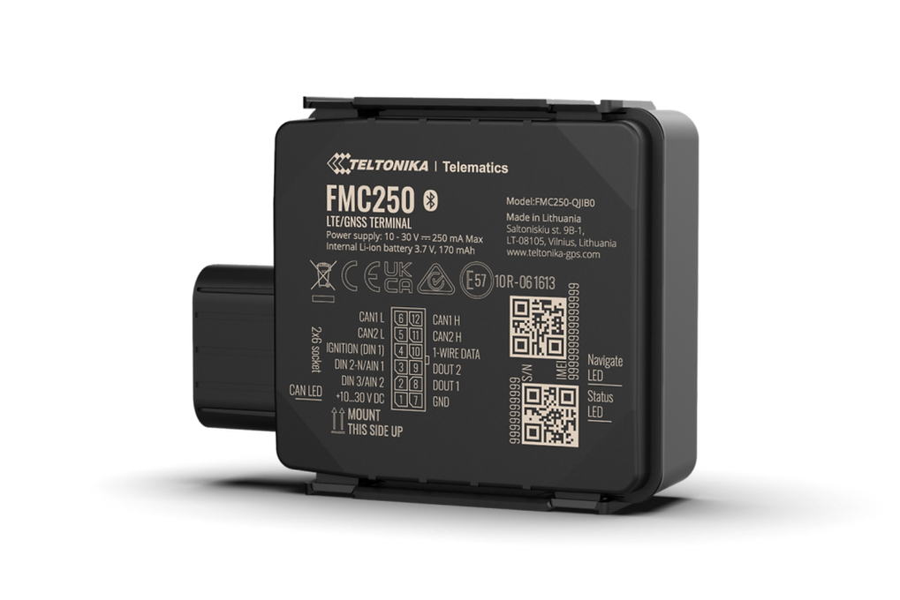

# Teltonika - FMC250

The FMC250 is a rugged vehicle GPS tracker engineered for demanding telematics deployments. Built for on vehicle use across cars, trucks, buses and special machinery, the FMC250 combines GNSS location tracking with a water resistant IP67 enclosure and cellular connectivity to provide reliable real time visibility and extended data collection for fleet operations.

As a Plaspy compatible device, the FMC250 brings rich vehicle telemetry into the Plaspy platform. Its integrated CAN data processor can read over 100 CAN parameters and the unit supports Bluetooth and identification accessories, enabling Plaspy to ingest engine and sensor metrics alongside position data for diagnostics, fuel monitoring and scheduled maintenance workflows.

## Key Highlights

- Plaspy compatible GPS tracker designed for vehicle telematics and continuous fleet monitoring
- Integrated CAN data processor capable of reading more than 100 vehicle parameters for deeper telemetry
- LTE Cat 1 cellular connectivity with 2G fallback for stable data transmission in mixed coverage areas
- IP67 water resistant casing suitable for outdoor vehicle installations and harsh environments
- Support for Bluetooth accessories and iButton or 1 Wire RFID for driver and asset identification
- Offered in multiple SKUs and Standard or Extended CAN parameter packages to match reporting needs

## How It Works with Plaspy

When paired with Plaspy, the FMC250 streams location and CAN derived telemetry so operators can combine positional awareness with engine and sensor insights. Plaspy normalizes incoming parameters into dashboards, alerts and maintenance triggers to support operational decision making.

- Real time location and telemetry updates sent to Plaspy for continuous situational awareness
- CAN engine, drivetrain and sensor data available in Plaspy for diagnostics and fuel monitoring
- Derived performance and fuel metrics help drive preventative maintenance workflows and reporting
- Driver and asset identification through iButton and RFID plus proximity sensing with Bluetooth accessories
- Event and alert generation in Plaspy based on telemetry thresholds and vehicle status for timely interventions

## Typical Use Cases

- Fleet management that combines GPS with CAN telemetry for route oversight and utilization tracking
- Scheduled maintenance and diagnostics driven by extensive vehicle parameter data to reduce downtime
- Logistics and asset tracking in wet or remote conditions where IP67 protection and fallback connectivity matter
- Heavy duty and emergency vehicle monitoring to capture drivetrain and sensor data for uptime optimization
- Secure driver or asset access and cargo condition monitoring via RFID and Bluetooth sensor integrations

## Why Choose This Tracker with Plaspy

The FMC250 is a suitable choice for organizations that need both rugged hardware and diagnostics grade vehicle data in their telematics stack. Its ability to provide broad CAN parameter visibility complements Plaspy dashboards and reporting, allowing teams to move beyond simple location tracking toward fuel analysis, fault awareness and maintenance planning.

For fleets requiring scalable deployments, the FMC250 offers configurable parameter packages and accessory options to align with operational needs. When combined with Plaspy monitoring, alerts and reporting, the tracker helps teams improve oversight, reduce operational risk and better manage vehicle health.

To learn more about how Plaspy can leverage trackers like the FMC250 visit https://www.plaspy.com. Product specifications and availability can change over time, so please verify current details on the manufacturer site https://www.teltonika-gps.com/ before purchase or deployment.
