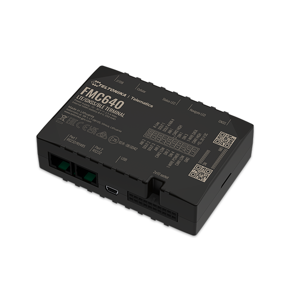

# Teltonika - FMC640

The Teltonika FMC640 is a professional grade GPS tracker designed to maximize fleet efficiency and provide comprehensive tracking capabilities. It combines cellular connectivity, positioning modules, and support for vehicle data and external peripherals to deliver continuous location and status information for a wide range of vehicles and equipment. The FMC640 is described as suitable for demanding applications including international logistics, refrigerated transport, agriculture, construction and security services.

As a device compatible with Plaspy, the FMC640 can feed its location, motion events, and vehicle data into a centralized fleet management platform. That compatibility makes it a practical choice for organizations that want to consolidate telemetry and operational oversight in Plaspy, using the platform to visualize routes, monitor alerts, and generate reports from tracker data.

## Key Highlights

- Multi generation cellular coverage with fallback to maintain connectivity across regions
- GNSS positioning and onboard communication modules for reliable location reporting
- Support for vehicle bus and tachograph interfaces to capture vehicle and driver related data
- Peripheral compatibility including common sensors and identification devices for flexible deployments
- Movement detection and accelerometer based events for motion and driver behavior monitoring
- Built in geofencing and trip detection features to support automated event generation
- Device management features such as remote configuration and firmware update options supported by the manufacturer

## How It Works with Plaspy

When integrated with Plaspy, the FMC640 supplies location and status messages that Plaspy ingests to provide real time visibility and historical reporting. Data and events from the tracker become actionable items inside the Plaspy platform so fleet managers can monitor assets, respond to alerts, and analyze performance.

- Real time location and movement updates displayed on Plaspy maps and dashboards
- Geofence, trip, and overspeed events forwarded to Plaspy for alerting and workflow triggers
- Vehicle and tachograph related data available for reporting and operational analysis where the device provides those streams
- Peripheral sensor and input state changes visible within Plaspy for temperature monitoring, access control, and similar use cases
- Device connectivity status and redundancy features help maintain continuity of data seen in Plaspy

## Typical Use Cases

- International logistics and long haul fleets that require broad cellular coverage and redundancy
- Refrigerated transport where perimeter and environmental sensor data are monitored alongside position
- Construction and agricultural fleets needing asset tracking across dispersed sites
- Security and emergency service vehicles that benefit from rapid location updates and tamper alerts
- Fleet efficiency programs that use trip detection, eco driving scenarios, and odometer data for reporting

## Why Choose This Tracker with Plaspy

The FMC640 is positioned as a robust, feature rich tracker suited to organizations that need dependable connectivity and expanded vehicle data. Its support for vehicle interfaces, peripheral devices, and event detection makes it versatile for mixed fleets and varied operational requirements. Paired with Plaspy, the device can become a core data source for centralized fleet monitoring, alerting, and analytics.

Because the FMC640 provides both positional and vehicle related information, it can help Plaspy customers unify tracking and operational metrics in a single platform. If you need a capable tracker for complex fleet environments, the FMC640 is a reasonable option to consider for integration with Plaspy, while keeping in mind specific feature availability depends on the chosen device configuration.

To learn more about how Plaspy works with compatible trackers, visit https://www.plaspy.com. Product specifications, availability, and manufacturer details can change over time, so please verify current technical information and the latest documentation at the manufacturer site https://www.teltonika-gps.com/.
