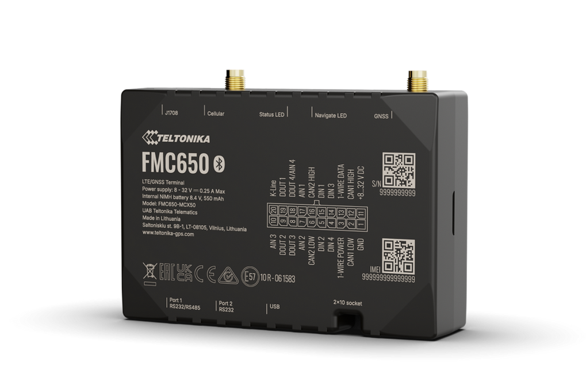

# Teltonika - FMC650

The FMC650 is a professional 4G LTE Cat 1 GPS tracker designed for demanding vehicle telematics and fleet management deployments. Built as a successor to the FMC640, the FMC650 delivers dependable LTE Cat 1 connectivity with 2G \(GSM\) fallback for broad global coverage, a separate dual‑channel GNSS module \(L1 + L5\) for improved positioning reliability and accuracy, and a rugged I/O set tailored to heavy fleet, trailer and specialized machinery use. As a Plaspy compatible GPS tracker, the FMC650 brings robust real‑time tracking, telemetry and diagnostics into your Plaspy fleet dashboard for more precise operations and faster decision making.

The FMC650 is available in regional variants and ship‑ready packages that include vehicle power cabling and external 4G/GNSS antennas, making integration straightforward. With multiple CAN interfaces \(including J1939/FMS\), RS232/RS485 ports for thermographs and ancillary sensors, and tachograph live data and remote file download capabilities, the FMC650 is engineered to feed the Plaspy platform with the vehicle and trailer data fleet managers need for route control, anti‑theft monitoring and proactive maintenance.

## Key Highlights

- 4G LTE Cat 1 cellular connectivity with 2G \(GSM\) fallback to keep devices online in mixed‑coverage areas.
- Separate GNSS module with dual‑channel L1 + L5 support for improved satellite lock and positioning reliability.
- Multiple CAN interfaces with J1939/FMS support for rich vehicle telemetry, engine parameters and DTC access.
- 2x RS232 and 1x RS485 serial ports to connect thermographs, RFID readers and other peripherals directly.
- Tachograph live data access and remote tachograph file download via K‑Line, Tacho CAN or FMS connections.
- Includes 4G/GSM and GNSS external antennas \(3.0 m\) and a 0.9 m input/output power cable in the standard package.
- Regional variants \(examples: FMC6508TFE01 for Latin America, FMC6501TFE01 for EMEA\) to match local LTE/2G bands.

## How It Works with Plaspy

When integrated with Plaspy, the FMC650 streams GNSS position fixes and vehicle telemetry over its cellular link to the Plaspy backend for real‑time tracking, alerts and reports. Plaspy ingests location, telematics and tachograph data to populate maps, timelines and maintenance dashboards. The device’s serial and CAN interfaces allow Plaspy to collect sensor readings and diagnostic trouble codes \(DTCs\) for remote fault detection and remediation planning.

- Real‑time location and telemetry updates to Plaspy via LTE Cat 1 with 2G fallback.
- Tachograph live data and remote file download \(K‑Line, Tacho CAN, FMS\) for compliance and driver hours monitoring.
- Remote diagnostics: DTC reading and engine telemetry through CAN/J1939 for proactive maintenance.
- Trailer‑truck pairing and advanced fleet management using multiple CAN channels and Plaspy pairing workflows.
- Serial peripheral integration \(RS232/RS485\) for thermographs, RFID readers and external sensors feeding Plaspy reports.
- Enables fuel monitoring and ignition status reporting where vehicle CAN/J1939 exposes those signals to the tracker.

## Technical Overview

| Connectivity | 4G LTE Cat 1 with 2G \(GSM\) fallback |
| --- | --- |
| Bands | Multiple regional variants supporting ranges of LTE FDD/TDD and 2G bands \(examples: FMC6508TFE01 LATAM, FMC6501TFE01 EMEA\) |
| Power & Battery | Designed for vehicle power with extended backup power support noted; standard package includes 0.9 m input/output power cable \(battery capacity not specified\) |
| Interfaces | 2x RS232, 1x RS485, multiple CAN interfaces \(J1939/FMS and raw J1939\), tachograph interfaces \(K‑Line, Tacho CAN, FMS\) |
| GNSS | Separate GNSS module, dual‑channel L1 + L5 for improved positioning performance |
| Bluetooth | Not specified in description; integration with external Bluetooth devices may require gateways or accessory adapters |
| Remote Management | Remote diagnostics, tachograph file download and back‑end integration supported via platform connectivity; specific FOTA/management features depend on firmware/vendor tools |
| Form Factor | Vehicle‑grade tracker for heavy fleet, trailers and specialized machinery; standard package includes external 4G/GNSS antennas and branded packaging |

## Use Cases

- Fleet management and real‑time tracking for heavy vehicles where reliable LTE with 2G fallback is required.
- Trailer tracking and trailer‑truck pairing for logistics operations using CAN and serial integration.
- Proactive maintenance and remote diagnostics — read DTCs and telemetry to reduce downtime and plan service windows.
- Cold‑chain monitoring: attach thermographs via RS232/RS485 to report temperature data into Plaspy for compliance and alerts.
- Video telematics integration in driver safety solutions when combined with compatible video accessories.

## Why Choose This Tracker with Plaspy

The FMC650 is purpose‑built for operators who need reliable, Plaspy compatible GPS tracking with professional telematics interfaces. Its LTE Cat 1 plus 2G fallback provides continuous connectivity across varied coverage areas, while dual‑channel GNSS enhances positional accuracy for precise real‑time tracking. Multiple CAN channels, serial ports and tachograph support mean you can centralize vehicle telemetry, fuel monitoring and DTCs in Plaspy, enabling faster maintenance decisions and better fleet performance.

Choosing the FMC650 for your Plaspy deployment delivers a scalable solution for large fleets, trailers and specialized machinery. The device’s external antenna support and included cabling ease installation, and regional variants let you match cellular bands to local markets. For anti‑theft workflows, Plaspy can leverage FMC650 real‑time location and telemetry; immobilizer actions or other remote control features can be implemented where vehicle CAN/I/O exposes the required signals. Contact your Plaspy representative or the device vendor to confirm the right FMC650 variant and accessory set for your fleet and to plan an integration that includes telematics, tachograph and video workflows.

