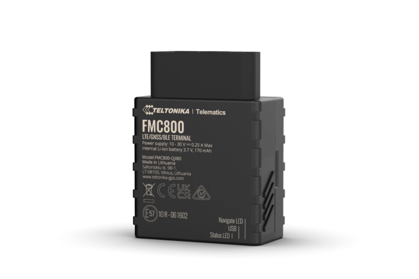

# Teltonika - FMC800

The Teltonika FMC800 is a compact plug and play GPS tracker designed for fleet management and vehicle tracking. Intended for easy installation into a vehicle OBD II port, the FMC800 provides continuous positioning via modern cellular connectivity and multi GNSS support. It is built to deliver accurate location data and detailed crash trace information, while remaining unobtrusive in size and operation.

As a device compatible with Plaspy, the FMC800 can be integrated into fleet monitoring workflows to provide real time visibility and event data alongside other assets. Its crash detection, internal backup power, and Bluetooth LE support for auxiliary sensors extend the kinds of operational insights available in Plaspy without requiring complex hardware integration.

## Key Highlights

- Plug and play installation using the vehicle diagnostic port for rapid deployment
- 4G LTE Cat 1 connectivity with fallback for broader network coverage and future readiness
- Built in 3 axis accelerometer providing configurable crash trace and impact detection
- Bluetooth LE based expansion for external beacons and environmental sensors
- Multi GNSS positioning for improved location accuracy and reliability
- Compact form factor with internal backup battery for uninterrupted tracking
- Built in event features such as geofence triggers towing detection and idle alerts

## How It Works with Plaspy

When connected to Plaspy, the FMC800 streams location and event information into the platform so you can monitor vehicles, respond to incidents, and analyze fleet performance. Plaspy collects and presents the tracker data alongside other fleet inputs to give operators unified visibility and historical reporting.

- Real time location and status updates visualized on Plaspy maps and dashboards
- Crash and impact traces forwarded to Plaspy for incident review and response workflows
- Bluetooth LE sensor data available in Plaspy for monitoring temperature movement or other external inputs
- Geofence and trip events generated by the device appear as alerts and timeline entries in Plaspy
- Historical routes and activity logs used for reporting and operational analysis
- Notifications and rules in Plaspy allow automated responses to key events reported by the tracker

## Typical Use Cases

- Commercial fleet vehicle tracking for route oversight and driver accountability
- Incident detection and post event analysis using crash trace data for safety reviews
- Asset condition monitoring with Bluetooth LE sensors for temperature or movement alerts
- Rental or lease vehicle management where plug and play installation speeds deployment
- Urban delivery and service vehicle monitoring requiring compact unobtrusive devices

## Why Choose This Tracker with Plaspy

The FMC800 is a practical choice for organizations that need a straightforward tracker with modern cellular connectivity and advanced event reporting. Its plug and play design reduces deployment time, while configurable crash detection and sensor expansion offer richer telematics data for safety and operational workflows. Using the FMC800 with Plaspy helps consolidate vehicle position, event history, and sensor inputs into a single operational view.

If you are evaluating hardware for fleet tracking on Plaspy the FMC800 is a good fit when you want compact installation, crash trace capability, and the option to add external wireless sensors. For complete product specifications features and the latest firmware information please consult the manufacturer documentation. To learn more about how Plaspy integrates with devices like the FMC800 visit https://www.plaspy.com and verify current product details on the official Teltonika site https://www.teltonika-gps.com/ since specifications and availability can change over time.
