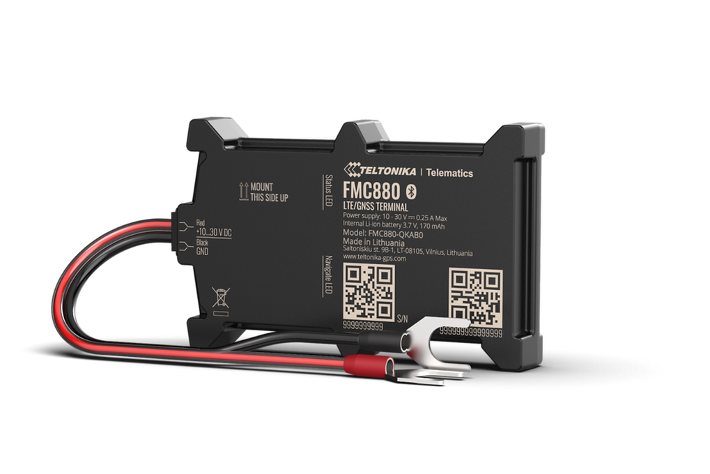

# Teltonika - FMC880

The Teltonika FMC880 is a rugged, battery mounted GPS tracker designed for demanding fleet management and remote asset tracking. Built with dual band GNSS for improved positioning, cellular connectivity with regional fallback, and Bluetooth Low Energy support for external sensors, the FMC880 targets logistics, rental and car sharing, and deployed asset monitoring where durability and reliable telemetry matter.

As a Plaspy compatible device out of the box, the FMC880 can forward position fixes and sensor telemetry directly into Plaspy for live visualization, history playback, alerts, and reporting. Its weather resistant enclosure and quick battery mounting make it suitable for fast redeployment, while regional variants and optional hardware configurations allow fleet operators to match device capabilities to their operational needs and Plaspy workflows.

## Key Highlights

- Plaspy compatible GPS tracker optimized for fleet and asset management across varied environments.
- 4G cellular connectivity with 2G fallback for broad regional telemetry coverage and resilience.
- Dual band GNSS receiver for improved positioning accuracy and faster location fixes.
- IP65 rated enclosure with a battery mounted form factor and U type cable connector for quick fitment.
- Bluetooth Low Energy support for attaching external sensors and beacons to extend monitoring.
- Regional variants and optional gyro or accessory kits to match coverage and motion detection needs.

## How It Works with Plaspy

When integrated with Plaspy, the FMC880 streams location and sensor data to the platform so operators can monitor assets, view trip history, and act on telemetry driven events. Plaspy uses that incoming data to power geofence alerts, reporting, and fleet level visibility without requiring complex custom integration for standard telemetry flows.

- Real time location and telemetry updates delivered to Plaspy via the device cellular connection with regional fallback.
- Dual band GNSS data used in Plaspy for more accurate routing, stop detection, and map based replay.
- BLE sensor and beacon readings forwarded to Plaspy to monitor cargo conditions and proximity events.
- Motion and gyro based events (where fitted) available in Plaspy for tamper and anti theft alerting workflows.
- Regional device variants ensure consistent reporting across EU MEA APAC and LATAM markets when paired with Plaspy.

## Typical Use Cases

- Fleet telematics for continuous vehicle tracking, route replay, and operational oversight.
- Logistics and last mile delivery with cargo condition monitoring via BLE sensors.
- Car sharing and rental fleets that need fast installation and usage reporting.
- Remote asset monitoring for equipment that requires weather resistant tracking and periodic redeployment.
- Anti theft workflows combining motion events and live location updates for rapid response.

## Why Choose This Tracker with Plaspy

The FMC880 is a practical option for organizations that need a rugged, easy to mount tracker that integrates smoothly with a fleet management platform like Plaspy. Its combination of dual band GNSS, cellular connectivity with fallback, and BLE sensor support allows teams to gain better positional accuracy and expand telemetry without extensive wiring or complex sensor networks.

If you need resilient tracking for vehicles or portable assets and want those feeds centralized in Plaspy for alerts, reports, and operational insight, the FMC880 is a solid candidate. Learn more about Plaspy on the main website https://www.plaspy.com. Product specifications and availability can change over time, so please verify current details and regional variants on the manufacturer's official website https://www.teltonika-gps.com/.
