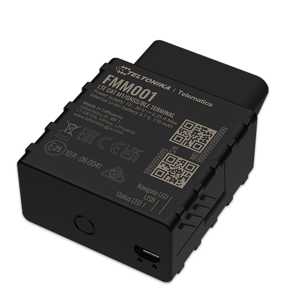

# Teltonika - FMM001

The Teltonika FMM001 is a compact plug and track GPS tracker designed for vehicle telematics applications. It combines GNSS positioning with cellular LTE CAT M1 connectivity, OBD II data reading, Bluetooth Low Energy support, and accelerometer reporting to deliver vehicle location, movement, and basic onboard diagnostics. The device targets fleet management, car rental and leasing, insurance telematics, driver log books, and other vehicle monitoring scenarios where both location and vehicle parameters are useful.

As a Plaspy compatible device, the FMM001 can feed positioning, movement and OBD derived data into the Plaspy fleet platform for monitoring and reporting. That compatibility makes it straightforward to use the device as part of a broader telemetry setup in Plaspy for live visibility, event alerts, trip histories, and operational oversight across a mixed fleet.

## Key Highlights

- Plug and Track form factor with LTE CAT M1 connectivity and GNSS positioning for continuous vehicle location.
- OBD II parameter reading for access to vehicle performance and fuel related information.
- Built in accelerometer enables event detection such as towing, crash indications, and motion based alerts.
- Bluetooth Low Energy support for external sensors and beacons to extend monitoring capabilities.
- Multiple sleep modes and power management options to reduce power draw when the vehicle is inactive.
- Remote configuration and firmware update options through device management tools and FOTA utilities.

## How It Works with Plaspy

When used with Plaspy, the FMM001 provides live and historical vehicle data that Plaspy can present for fleet managers, dispatch teams, and operations staff. Plaspy ingests location and event streams, then uses that data to power maps, alerts, and reports that help manage vehicles and drivers.

- Live location tracking and map visualization for individual vehicles and fleets.
- Event driven alerts for overspeed, unplug, towing, excessive idling, and crash indications.
- Trip and driver log reporting to analyze route history and operational patterns.
- Fleet level monitoring dashboards that combine location, movement, and OBD derived metrics.
- Integration of Bluetooth sensor signals and beacon data into Plaspy views where applicable.
- Support for remote device management workflows such as configuration updates and firmware deployment through standard device management channels.

## Typical Use Cases

- Fleet management for small to medium commercial vehicle operations requiring location and vehicle data.
- Car rental and leasing operations that need plug and track installation and trip history.
- Insurance telematics programs focused on driver behavior and event based monitoring.
- Fuel efficiency initiatives using OBD II data and idling detection to analyze consumption.
- Theft detection and vehicle security use cases using unplug and towing detection alerts.

## Why Choose This Tracker with Plaspy

The FMM001 pairs a compact plug and track design with a sensible set of telematics features that align well with Plaspy usage scenarios. Its combination of GNSS positioning, OBD II access, accelerometer event detection, and Bluetooth sensor support provides versatile inputs that Plaspy can use to produce meaningful operational insights and alerts.

For organizations that want a straightforward device capable of delivering location, basic vehicle parameters, and event signals, the FMM001 is a practical choice to integrate into Plaspy. Its remote configuration and firmware update capabilities also help keep devices manageable at scale when managed through Plaspy aligned workflows.

To learn more about how the FMM001 can work with Plaspy visit https://www.plaspy.com. Product specifications, availability, and manufacturer details can change over time, so please verify current technical information and compatibility on the manufacturer site https://www.teltonika-gps.com/.
