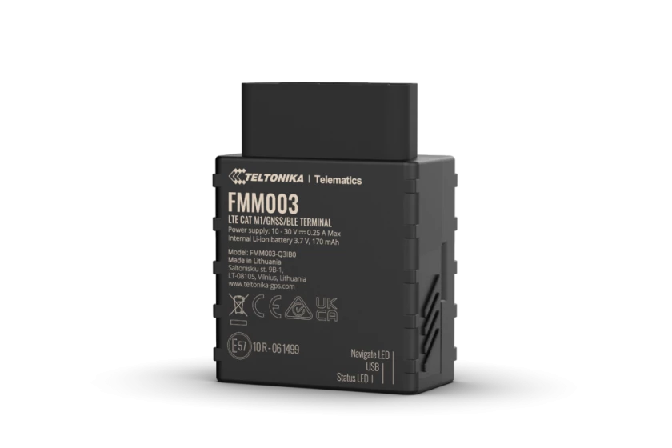

# Teltonika - FMM003

The Teltonika FMM003 is a 4G LTE Cat M1 tracker with OBD OEM data reading, designed to provide reliable global coverage for fleet management needs. With LTE Cat M1 and NB IoT connectivity support, as well as fall-back to 2G, this tracker ensures wide-ranging coverage no matter where your vehicles are located. 

One of the standout features of the FMM003 is its ability to read OBD OEM parameters, allowing you to access real-time odometer and fuel level data. This information can be invaluable for monitoring vehicle performance and fuel consumption. Additionally, the FMM003 provides a supported vehicle list with all available manufacturer models and parameters, making it easy to determine compatibility and access the data you need.

Installation of the FMM003 is effortless thanks to its plug-and-play design. Simply plug the device into the OBD-II port of your vehicle and start tracking. The FMM003 is equipped with a Quectel BG95-M3 module and Teltonika TM2500 technology, offering LTE Cat M1/NB-IoT/GSM/GPRS/GNSS/BLUETOOTH connectivity. It supports various GNSS systems including GPS, GLONASS, GALILEO, BEIDOU, SBAS, QZSS, DGPS, and AGPS for accurate positioning. The tracker also features a 128MB internal flash memory and supports a micro-SIM card for cellular connectivity.

With its compact size and durable construction, the Teltonika FMM003 is built to withstand harsh operating environments. It has an ingress protection rating of IP41 and can operate in temperatures ranging from -40 °C to +85 °C. The FMM003 also offers a range of features including accelerometer sensors, green driving, over speeding detection, jamming detection, GNSS fuel counter, excessive idling detection, unplug detection, towing detection, crash detection, auto geofence, manual geofence, and trip scenarios. It supports various sleep modes for power optimization and can be configured and updated via FOTA WEB, FOTA, Teltonika Configurator, or the FMBT mobile application.

