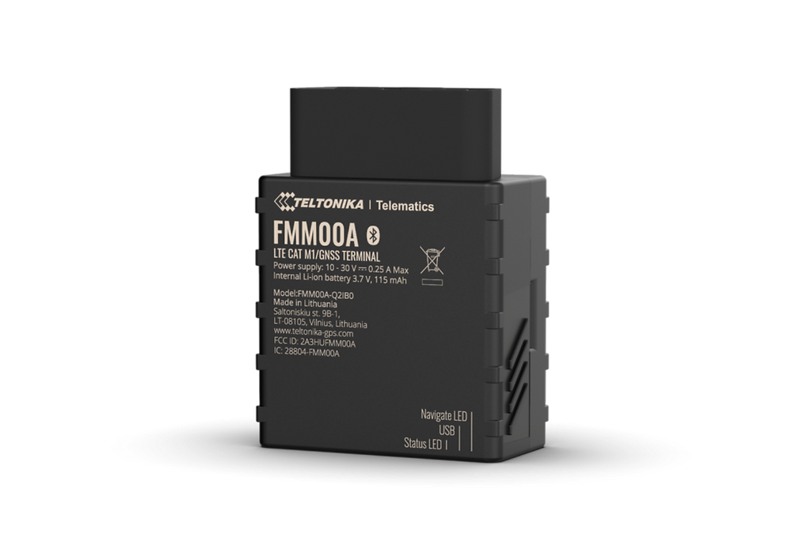

# Teltonika - FMM00A

The Teltonika FMM00A is a plug-and-play OBD-II GPS tracker engineered for North American fleets, rental and sharing services, and mixed vehicle deployments. It combines GNSS positioning, cellular connectivity and Bluetooth to provide continuous location and vehicle telemetry without complex wiring. The device is designed for quick installation by plugging into a vehicle OBD-II port, enabling immediate streaming of location, odometer and fuel related parameters where supported.

As a Plaspy compatible device out of the box, the FMM00A streams vehicle telemetry and diagnostic parameters directly into Plaspy for real time tracking, alerts and reporting. That compatibility makes the model a practical choice for fleet managers and rental operators who need rapid rollout, richer telematics data and seamless integration with existing Plaspy dashboards and operational workflows.

## Key Highlights

- Plug and play OBD-II form factor for fast installation and minimal vehicle downtime.
- Plaspy compatible by default for immediate integration with tracking dashboards and reports.
- Cellular connectivity designed for broad coverage and efficient data use in telematics deployments.
- Access to OBD II and OEM diagnostic parameters for odometer and fuel level monitoring where supported by the vehicle.
- Built in motion sensing and Bluetooth support to extend monitoring and local configuration options.
- Designed for mass provisioning and remote management to simplify fleet scale deployments.

## How It Works with Plaspy

When installed, the FMM00A collects GNSS position and vehicle diagnostic information from the OBD-II interface and sends telemetry to Plaspy where the platform normalizes the data and presents it as live location, events and historical reports. Plaspy converts the incoming streams into actionable insights for operations, maintenance planning and safety monitoring.

- Live location updates and history playback for continuous fleet visibility.
- Vehicle parameter reporting such as odometer and fuel level to support maintenance scheduling and cost tracking.
- Event generation from ignition and motion data to power trips, geofencing and exception alerts.
- Motion and driving behaviour indicators to inform safety reviews and route optimisation.
- Bluetooth linked sensors and beacons can be surfaced in Plaspy for auxiliary asset monitoring and environmental data.

## Typical Use Cases

- Fleet management and route optimisation where accurate odometer and fuel readings improve efficiency.
- Car rental and sharing services that need quick device deployment and verified vehicle usage data.
- Delivery and logistics operations requiring real time tracking and driving behaviour insights to improve ETA accuracy.
- Mixed vehicle fleets that benefit from an OBD II solution for consolidated telemetry across vehicle types.
- Supplemental monitoring of trailers or auxiliary equipment using Bluetooth sensors integrated into the platform.

## Why Choose This Tracker with Plaspy

The FMM00A offers a straightforward path to richer vehicle telemetry without complex installation, making it a good match for organizations that need to scale tracking quickly. Its OBD II integration allows Plaspy to receive useful OEM level parameters that enhance reporting and operational oversight compared with location only devices.

If you want to learn more about how Plaspy handles devices like the FMM00A and how it can fit into your fleet workflows, visit the main Plaspy website https://www.plaspy.com. Product specifications and availability can change over time, so please verify current technical details and regional variants on the manufacturer's official site https://www.teltonika-gps.com/ before purchase.
