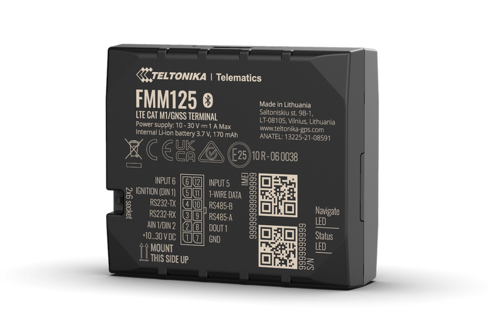

# Teltonika - FMM125

The FMM125 by Teltonika is a professional vehicle GPS tracker designed for modern fleet management and telematics workflows. Plaspy compatible out of the box, FMM125 delivers robust connectivity with LTE Cat M1 and NB‑IoT cellular options, dual‑SIM support and optional 2G fallback where applicable — making it an ideal choice for real-time tracking, fuel monitoring and reliable telemetry across mixed network environments.

Built for integrators and fleet operators who need precise fuel data and extensive external device interfacing, the FMM125 supports RS232 and RS485 serial connections, impulse inputs for fuel flow meters and CAN adapter integration. When combined with Plaspy, this tracker enables continuous location visibility, detailed fuel analytics and scalable fleet provisioning — even in remote regions when paired with satellite modems like Iridium Edge®.

## Key Highlights

- Plaspy compatible GPS tracker for real-time tracking and fleet management with LTE Cat M1 and NB‑IoT connectivity.
- Dual‑SIM design reduces roaming costs and increases availability across international routes.
- Direct RS232 and RS485 serial interfaces plus impulse input support for accurate fuel monitoring and industrial telemetry reading.
- Connects to Iridium Edge® satellite modem via RS232 for extended coverage in off‑grid or remote logistics operations.
- Seamless integration with Teltonika device management tools \(FOTA WEB, Teltonika Configurator\) for remote firmware updates and provisioning.
- Supports CAN adapters and a wide range of accessories \(RFID readers, temperature sensors, Bluetooth beacons\) for expanded telemetry and anti‑theft workflows.
- Packaged for vehicle installation with power cable included and multiple SKU options for global frequency support.

## How It Works with Plaspy

FMM125 streams location and telemetry data into Plaspy using its cellular link \(LTE Cat M1 / NB‑IoT or 2G fallback\). Plaspy ingests GPS position updates and a wide set of external telemetry fields delivered over serial or CAN adapters, allowing configuration of real-time alerts, historical reports and fuel consumption dashboards. Dual‑SIM and satellite modem support ensure data continuity and reliable reporting even when vehicles move between coverage zones.

- Real-time location and telemetry updates delivered to Plaspy for live tracking and mapping.
- Fuel monitoring via impulse inputs and serial fuel sensor reads for precise fuel usage and theft detection alerts.
- Serial telemetry \(RS232 / RS485\) for direct reading of industrial meters, external sensors and satellite modems.
- CAN bus integration to obtain vehicle signals such as ignition status and other vehicle telemetry where a CAN adapter is used.
- Satellite fallback \(Iridium Edge® connected over RS232\) to maintain tracking outside cellular coverage.
- Accessory support \(Bluetooth beacons, temperature sensors, RFID\) to enrich Plaspy telemetry and asset context.

## Technical Overview

| Connectivity | LTE Cat M1 and NB‑IoT \(with dual‑SIM support\); backward compatibility with 2G where applicable |
| --- | --- |
| Bands | Supports multiple LTE‑FDD Cat M1 and NB2 bands for global markets; common 2G GSM bands for fallback |
| Power & Battery | Vehicle‑powered telematics unit; standard package includes input/output power supply cable \(0.9 m\). Backup battery not specified in product description. |
| Interfaces | RS232 and RS485 serial ports; impulse input support for fuel flow meters; supports Teltonika CAN adapters and connection to external satellite modem \(Iridium Edge®\) via RS232 |
| GNSS | Not specified in product description |
| Bluetooth | Device Bluetooth capability not specified; Bluetooth beacons and sensors are listed as compatible accessories |
| Remote Management | FOTA WEB and Teltonika Configurator support for remote firmware updates and device provisioning |
| Form Factor | Professional vehicle tracker for installation in cars, trucks and specialty vehicles; standard packaging includes unit and power cable |

## Use Cases

- Fleet fuel monitoring and optimization — accurate fuel flow and impulse input reads for reducing loss and improving MPG calculations.
- Remote logistics and field operations — satellite modem connection via RS232 ensures continuous tracking in off‑grid regions.
- Asset protection and anti‑theft monitoring — continuous telemetry and configurable alerts through Plaspy help detect unauthorized movement.
- Specialty vehicle telematics — integrate industrial meters, CAN bus data and external sensors for detailed vehicle diagnostics and telemetry.
- Industrial meter reading and peripheral integration — RS485/RS232 interfaces allow direct data collection from fuel sensors and other devices.

## Why Choose This Tracker with Plaspy

FMM125 is a purpose‑built GPS tracker for organizations that need dependable real-time tracking, advanced fuel monitoring and flexible telemetry integration. When paired with Plaspy, the FMM125 delivers actionable fleet management data: continuous location, fuel analytics, and vehicle signals \(such as ignition status via CAN adapters\) consolidated into dashboards and automated reports. Dual‑SIM capabilities lower roaming costs while satellite modem support guarantees tracking beyond cellular reach — a strong combination for scalable fleet deployments and specialty vehicle applications.

Choose the FMM125 with Plaspy for a reliable, extensible telematics solution that supports telemetry, fuel monitoring, fleet management and enhanced anti‑theft workflows. With Teltonika device management tools \(FOTA WEB and Teltonika Configurator\) included in the ecosystem, administrators can remotely manage firmware and provisioning, keeping large fleets updated and operational with minimal downtime.

