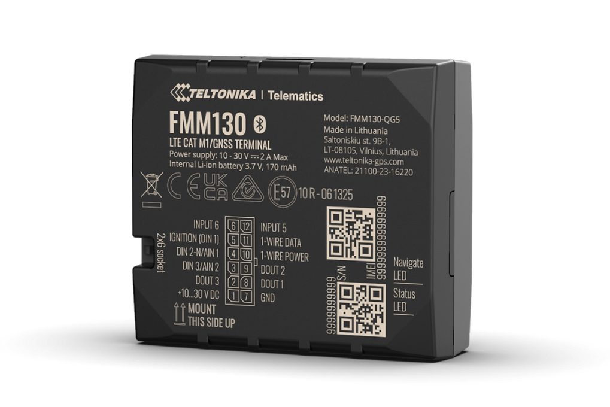

# Teltonika - FMM130

The Teltonika FMM130 is a compact GPS tracker designed for professional fleet management and asset security. It combines modern low power cellular connectivity with support for Bluetooth sensors, CAN bus integration, multiple inputs and outputs, and a built in backup battery to provide dependable position and telemetry reporting for vehicles and sensitive cargo. The device is presented in a vehicle friendly form factor suitable for a range of light and heavy duty applications.

As a Plaspy compatible device, the FMM130 streams location and telemetry into the Plaspy platform so operators can monitor vehicles, review historical routes, and combine CAN and sensor data with Plaspy reporting and alerts. Its support for fuel monitoring, remote actions and Bluetooth environmental sensors makes the FMM130 a practical telematics endpoint for organizations using Plaspy for centralized fleet oversight.

## Key Highlights

- Compact vehicle and asset tracker built for professional telematics and fleet use.
- Cellular connectivity optimized for low power wide area coverage with fallback for wider deployments.
- Support for CAN bus derived vehicle parameters for enriched fleet diagnostics and reporting.
- Bluetooth sensor compatibility for environmental monitoring such as temperature and movement.
- Multiple inputs and outputs plus backup battery to maintain telemetry during power interruptions.
- Remote device management features for firmware updates and configuration changes.
- Practical for fleet operations, fuel monitoring, and cargo security workflows.

## How It Works with Plaspy

When connected to Plaspy, the FMM130 sends GNSS location fixes and telemetry so Plaspy can visualize live vehicle positions, trigger alerts, and build historical reports. Plaspy ingests telemetry from the tracker and presents it alongside route history and event data to support operational decision making and compliance workflows.

- Real time location updates and route playback available in Plaspy dashboards for live monitoring.
- CAN bus parameters and vehicle status appear in Plaspy reports and diagnostics for maintenance insight.
- Fuel monitoring and impulse input data feed Plaspy analytics for consumption tracking and anomaly detection.
- Environmental telemetry from Bluetooth sensors is shown in Plaspy for cold chain and cargo condition monitoring.
- Remote actions such as immobilization commands can be coordinated from Plaspy using the tracker outputs.
- Alerts, geofences and scheduled reports use tracker data to notify teams and keep historical records.

## Typical Use Cases

- Fleet management for cars, vans, trucks and buses with live tracking and route analysis.
- Fuel usage monitoring and anti theft workflows combining impulse data and remote immobilization.
- Cold chain and sensitive cargo monitoring using Bluetooth sensors for temperature and humidity visibility.
- Remote telemetry for special machinery and equipment using CAN integration for engine and service data.
- Asset security where backup reporting and sensor alerts maintain situational awareness if main power is cut.

## Why Choose This Tracker with Plaspy

The FMM130 is a versatile option for organizations that need a compact, vehicle focused tracker that feeds rich telemetry into a centralized platform. Its combination of cellular connectivity, CAN compatibility, sensor inputs, and backup power makes it well suited to mixed fleets and operations that require both location tracking and environmental or fuel monitoring.

Paired with Plaspy, the FMM130 becomes part of a managed telematics workflow where live visualization, alerts, and historical reports help teams improve operations and respond faster to incidents. To learn more about Plaspy visit https://www.plaspy.com. Product specifications, availability, and manufacturer details can change over time so please verify current technical information on the official Teltonika site https://www.teltonika-gps.com/.
