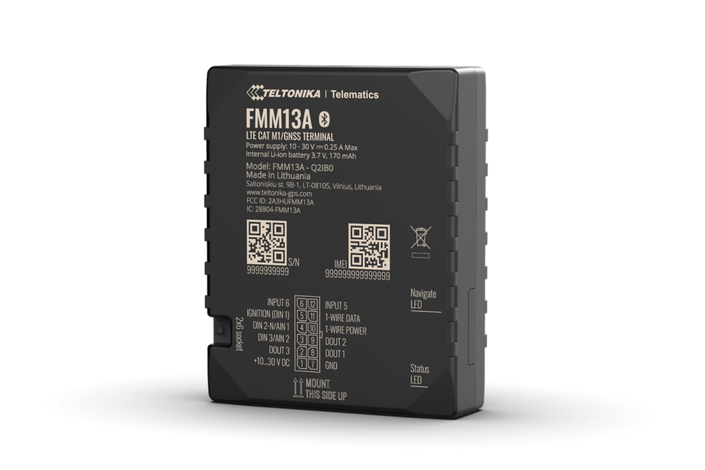

# Teltonika - FMM13A

The Teltonika FMM13A is a professional 4G LTE Cat M1 GPS tracker engineered for North American vehicle and asset deployments. Designed as a compact real-time tracking terminal, the FMM13A combines reliable LTE-FDD connectivity, a BG95-M1 communications module \(standard in orders\), and a built-in backup battery to keep telemetry and location reporting active during power interruptions. As a Plaspy compatible tracker, it integrates cleanly with Plaspy’s fleet management and monitoring platform for immediate operational visibility.

The FMM13A is well suited for fleet management, logistics, and anti-theft applications where continuous tracking, fuel monitoring and remote control are required. With flexible input/output configuration, impulse input for fuel flow meters, and CAN-bus adapter support for vehicle data \(fuel level, odometer, RPM, engine temperature\), this tracker delivers the telemetry and control functions fleet operators expect — now available as a Plaspy compatible endpoint for streamlined deployment and management.

## Key Highlights

- Plaspy compatible GPS tracker for seamless integration with Plaspy’s real-time tracking and reporting tools.
- 4G LTE Cat M1 connectivity via BG95-M1 module optimized for North American LTE-FDD bands.
- Internal backup battery to continue reporting during main power loss — critical for anti-theft and incident logging.
- Flexible inputs/outputs and impulse input support for accurate fuel monitoring and telemetry.
- CAN adapter compatibility to read vehicle telematics: fuel level, odometer, RPM, and engine temperature.
- Remote engine blocking / immobilizer capability for fleet control and theft mitigation.
- Certifications for North America \(FCC, PTCRB, IC, AT&T approvals\) for straightforward regulatory compliance.

## How It Works with Plaspy

Connecting the FMM13A to Plaspy provides a robust pipeline of location and vehicle telemetry for real-time tracking, alerts, and historical reporting. Data flows from the device’s LTE Cat M1 modem via the configured APN to Plaspy’s servers, where location, sensor readings and events are normalized and presented through Plaspy dashboards, maps and APIs. Plaspy can ingest the FMM13A’s telemetry to power route monitoring, remote commands, and scheduled reports.

- Real-time location and telemetry updates delivered over LTE Cat M1 for continuous fleet visibility.
- Ignition and engine-blocking/immobilizer status for anti-theft and remote fleet control.
- Impulse input fuel monitoring to support accurate fuel consumption and theft detection workflows.
- Remote immobilizer and remote control commands for secure fleet operations.
- Bluetooth Low Energy \(BLE\) support for ID beacons and sensor pairing in trailer tracking or cold-chain workflows.

## Technical Overview

| Connectivity | 4G LTE Cat M1 \(LTE-FDD\) |
| --- | --- |
| Module | Quectel BG95‑M1 module \(listed in standard orders\) |
| Bands | B1/B2/B3/B4/B5/B8/B12/B13/B18/B19/B20/B25/B26/B27/B28/B66/B85 \(LTE-FDD North America\) |
| Power & Battery | Primary vehicle power with internal backup battery for continued operation during power interruptions |
| Interfaces / I/O | Flexible input/output configuration; impulse input for fuel flow meter readings; digital I/O for ignition and events; engine blocking \(remote immobilizer\) support |
| CAN Support | Compatible with CAN adapters to read vehicle data \(fuel level, odometer, RPM, engine temperature\) |
| GNSS | Integrated GNSS positioning \(device description did not specify GNSS systems or accuracy\) |
| Bluetooth | Bluetooth Low Energy \(BLE\) for ID beacons and sensor integration \(used in trailer and sensor workflows\) |
| Remote Management | Supports Teltonika remote device management workflows \(e.g., FOTA WEB\) and common cable/CAN accessories |
| Form Factor & Packaging | Compact vehicle terminal; packaging options include bulk boxes \(10 pcs. per box with power and I/O cables\) and single-unit packages depending on order code. Example order codes: FMM13A6ZXW01, FMM13A6ZU801, FMM13A6Z5R01 |
| Certifications | North America: FCC, PTCRB, IC and AT&T approvals |

## Use Cases

- Fleet telematics and delivery services — real-time tracking, route compliance and driver monitoring for improved operations.
- Trailer tracking with BLE ID beacons — attach beacons to trailers for quick identification and paired telemetry.
- Cold chain monitoring for pharmaceuticals and perishables when paired with temperature sensors — integrates sensor readings into Plaspy reports.
- Fuel monitoring and anti-theft — impulse input fuel-meter integration plus remote engine blocking to reduce fuel loss and unauthorized use.
- General asset and workforce tracking — compact form factor for installation on a wide range of passenger cars, light commercial vehicles, trucks, buses and special machinery.

## Why Choose This Tracker with Plaspy

Integrating the Teltonika FMM13A with Plaspy gives fleets and asset managers a dependable, Plaspy compatible GPS tracker that balances connectivity, telemetry and remote-control features. The device’s LTE Cat M1 radio and North American band support ensure consistent real-time tracking, while the internal backup battery and flexible I/O address anti-theft and operational continuity needs. CAN compatibility and impulse input for fuel monitoring deliver richer telemetry for smarter fleet management and fuel optimization. Combined with Teltonika’s remote management tools \(such as FOTA WEB\) and Plaspy’s dashboards, the FMM13A becomes a scalable endpoint for secure, real-time fleet control — supporting ignition events, immobilizer actions, telemetry ingestion and Bluetooth sensor workflows for comprehensive vehicle and asset monitoring.

