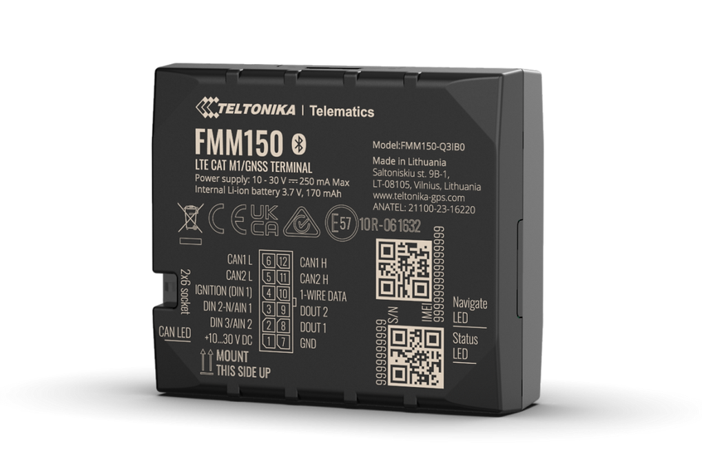

# Teltonika - FMM150

The Teltonika FMM150 is a compact vehicle tracker designed for modern fleet management and advanced vehicle telemetry. It combines wide area cellular connectivity with CAN bus data processing to deliver continuous location tracking and deep vehicle signals. The FMM150 can read a large set of CAN parameters including odometer, fuel level and consumption, and EV battery metrics, making it suitable for light vehicles, electric vehicles, trucks, buses and specialized machinery.

As a Plaspy compatible device, the FMM150 streams location and vehicle telemetry into the Plaspy platform so fleet managers and maintenance teams can visualise real time position, historical trips and contextual diagnostics. Its integrated CAN processing and accessory support help Plaspy users consolidate vehicle signals and location data in one interface for reporting, alerts and operational oversight.

## Key Highlights

- Plaspy compatible GPS tracker with wide area cellular connectivity including LTE Cat M1 and NB IoT plus 2G fallback for broader coverage.
- Integrated CAN bus data processor that extracts more than 100 vehicle parameters for richer fleet telemetry.
- Practical for mixed fleets including ICE vehicles and EVs thanks to EV battery and power related signals.
- Designed to support fleet workflows such as fuel monitoring, preventive maintenance and driver behaviour analysis.
- Accessory friendly, with compatibility for CAN adapters, RFID readers and BLE beacons to extend identification and sensor reach.
- Supported by Teltonika remote management tools to simplify configuration and firmware updates.

## How It Works with Plaspy

When connected to Plaspy, the FMM150 delivers combined GPS and CAN derived data so teams gain visibility into both location and vehicle condition. Plaspy ingests the tracker data to enable real time monitoring, event alerts and operational reporting that help reduce downtime and improve routing efficiency.

- Real time location and history playback inside Plaspy for tracking trips and route compliance.
- CAN based odometer and fuel readings for more accurate consumption reports and fuel management.
- Engine and runtime related signals available where exposed by the vehicle ECU to support driver behaviour and runtime analysis.
- EV battery metrics integrated into fleet dashboards to monitor charge trends and maintenance triggers.
- Accessory inputs such as BLE beacons and RFID readers enhance identification and proximity workflows within Plaspy.

## Typical Use Cases

- Fleet management for mixed vehicle fleets requiring unified location and telemetry in Plaspy.
- Fuel monitoring and consumption analysis using CAN sourced fuel level and usage parameters.
- Electric vehicle fleet oversight with EV battery monitoring and charge trend visibility.
- Car rental, car sharing and fleet access control when combined with RFID or BLE accessories.
- Heavy machinery and commercial vehicle maintenance planning using engine and component signals.

## Why Choose This Tracker with Plaspy

The FMM150 is a practical choice for organisations that need a balance of reliable cellular connectivity and extensive vehicle telemetry. Its ability to surface CAN parameters into Plaspy reduces the need for additional telematics hardware while enabling richer analytics, preventive maintenance workflows and fuel optimisation. Global band variants and fallback options make it suitable for wider deployments, and Teltonika remote management tools simplify device configuration and updates.

If you want to see how the FMM150 can fit into your Plaspy deployment, learn more about Plaspy on the main website https://www.plaspy.com. Product specifications, availability and manufacturer details can change over time, so verify current specifications and order codes with the manufacturer at https://www.teltonika-gps.com/ before purchasing.
