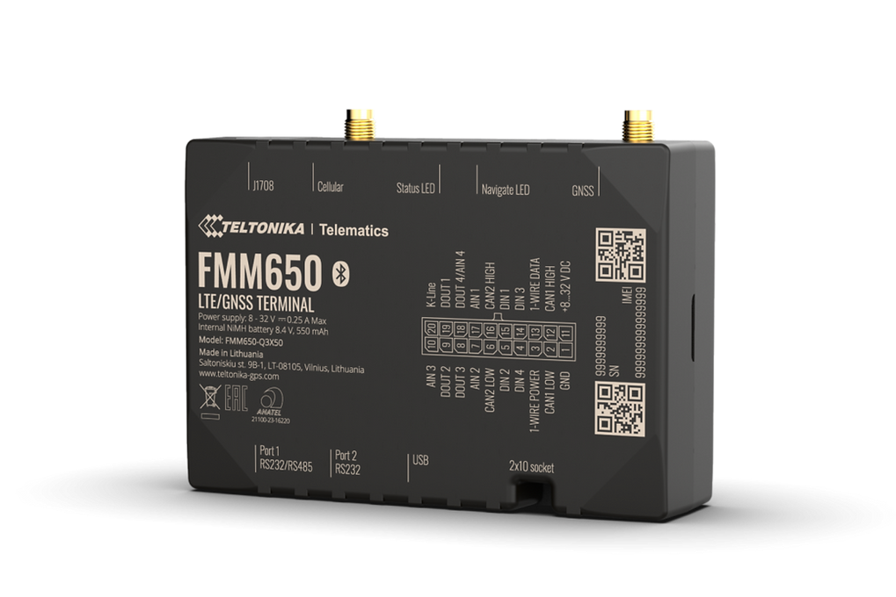

# Teltonika - FMM650

The Teltonika FMM650 is a professional 4G LTE Cat M1 tracker designed for advanced telematics and heavy duty fleet management. It combines high accuracy GNSS positioning with broad cellular coverage and a high capacity backup battery in a compact, rugged package intended for trucks, trailers and specialist machinery. The device also collects vehicle telemetry and supports serial and CAN interfaces for a deeper view of vehicle systems.

As a Plaspy compatible tracker out of the box, the FMM650 can feed real time location and vehicle telemetry directly into Plaspy dashboards and reports. This makes it a practical option for fleet operators who want continuous position visibility, remote tachograph monitoring and consolidated operational data inside the Plaspy platform.

## Key Highlights

- Plaspy compatible for immediate integration into fleet monitoring and reporting workflows.
- Dual channel GNSS design for improved positioning accuracy in challenging environments.
- LTE Cat M1 and NB‑IoT primary cellular connectivity with 2G fallback for broad regional coverage.
- High capacity backup battery that preserves tracking and alerts during main power loss.
- Multiple vehicle interfaces including CAN and J1939 plus serial ports for flexible telemetry collection.
- Built for heavy duty fleet use with external antennas and accessory compatibility for trailers and specialist vehicles.

## How It Works with Plaspy

When used with Plaspy the FMM650 brings continuous location updates and vehicle context into a single fleet management view. Plaspy ingests GNSS positions, telemetry from vehicle interfaces, and device status to provide situational awareness, reporting and operational alerts that help manage uptime and compliance.

- Real time location tracking and improved GNSS accuracy for route visibility and geofencing.
- Remote tachograph data and live streams visible inside Plaspy to support driver hours monitoring.
- Vehicle telemetry from CAN and serial connections surfaced in Plaspy reports for maintenance planning.
- Continued reporting during power loss using the built in backup battery to aid recovery and investigations.
- Integration of accessory sensor data for temperature, RFID or other on board equipment into Plaspy analytics.
- Device status and telemetry alerts pushed to Plaspy for operational oversight and response.

## Typical Use Cases

- Continuous fleet tracking and anti theft workflows for trucks and trailers.
- Remote tachograph monitoring and driver hours oversight for compliance workflows.
- Heavy fleet maintenance and remote diagnostics using CAN and J1939 telemetry.
- Trailer position and EBS telemetry monitoring for safer, compliant transport operations.
- Combined asset and driver management with GPS, telemetry and accessory sensors for operational reporting.

## Why Choose This Tracker with Plaspy

The FMM650 is well suited to organizations that require resilient communications, accurate positioning and deep vehicle telemetry for heavy duty operations. Its combination of GNSS accuracy, broad cellular support and a backup battery makes it practical for fleets that need uninterrupted visibility and actionable vehicle data inside a management platform like Plaspy.

If you want to learn more about how the FMM650 can work with Plaspy, visit the Plaspy website to explore platform capabilities and contact options: https://www.plaspy.com. Product specifications, regional variants and accessory compatibility can change over time, so please verify current technical details and availability on the manufacturer site: https://www.teltonika-gps.com/
