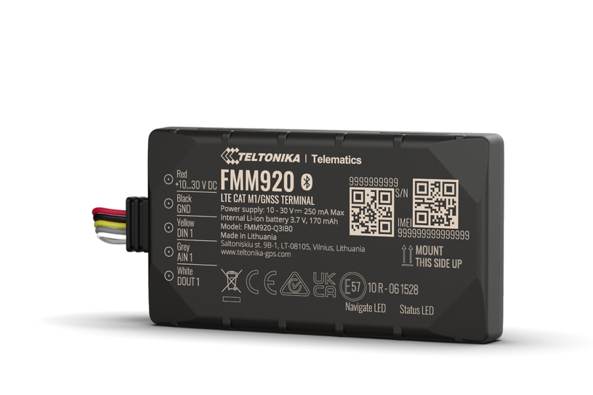

# Teltonika - FMM920

The Teltonika FMM920 is a compact, high performance GPS tracker designed for continuous position reporting and telemetry in fleet and asset tracking deployments. It combines cellular connectivity with a slim 12 mm profile, built in backup battery and Bluetooth Low Energy support to enable discreet installation while maintaining essential tracking and recovery capabilities.

As a Plaspy compatible device, the FMM920 can stream location, sensor telemetry and device state into Plaspy for centralized monitoring and alerts. Its combination of low bandwidth cellular options, backup power reporting and remote control features make it a practical choice for operators who want straightforward integration with Plaspy for live tracking, historical reporting and basic remote actions.

## Key Highlights

- Plaspy compatible GPS tracker for real time tracking and centralized fleet management.
- 4G LTE Cat M1 and NB IoT primary connectivity with quad band 2G fallback for broad regional coverage.
- Built in backup battery to continue telemetry and location reporting during main power loss.
- Bluetooth Low Energy support for pairing external sensors and beacons to report temperature and movement data.
- Remote immobilizer and engine block actions for anti theft and fleet control workflows.
- Over the air firmware and configuration management via Teltonika FOTA WEB to simplify maintenance.
- Slim 12 mm form factor for discreet installation in tight vehicle and asset locations.

## How It Works with Plaspy

When connected to Plaspy, the FMM920 delivers GNSS positions and telemetry into the Plaspy platform so fleet managers can monitor vehicles and assets in real time and review historical activity. Plaspy consolidates location, BLE sensor inputs and device state changes to produce alerts, reports and operational visibility for dispatch and security teams.

- Real time location updates and historical trip replay available in Plaspy for live monitoring and review.
- BLE sensor telemetry such as temperature and movement forwarded to Plaspy as events for condition monitoring.
- Remote immobilizer and engine block commands usable from Plaspy workflows for theft response and control.
- Power loss and backup battery status reported into Plaspy to trigger alerts and continuity checks.
- Over the air firmware and configuration updates through Teltonika FOTA WEB help keep devices consistent in Plaspy managed fleets.

## Typical Use Cases

- Fleet anti theft and recovery using continuous tracking, backup battery reporting and remote immobilizer controls.
- Rental and vehicle sharing operations needing discreet installation and centralized monitoring.
- Light commercial logistics and route management requiring reliable position reporting and historical trips.
- Temperature sensitive cargo monitoring with BLE sensors forwarding condition data into Plaspy.
- Asset protection for trailers, containers and auxiliary equipment where compact form factor is important.

## Why Choose This Tracker with Plaspy

The FMM920 pairs a compact physical design with flexible connectivity and sensor support, making it a practical option for fleets and asset operators who need dependable position reporting and simple sensor integration. Its backup battery and remote control features support anti theft and recovery workflows, while over the air management reduces field maintenance overhead for scaled deployments.

Used with Plaspy, the FMM920 becomes part of a centralized monitoring solution that provides visibility, alerts and reporting needed for daily fleet operations and security programs. For teams evaluating trackers that fit tight spaces and integrate with a managed tracking platform, the FMM920 is a balanced, deployable choice.

Learn more about Plaspy and how compatible devices like the FMM920 work with the platform at https://www.plaspy.com. Product specifications and availability can change over time, so verify current details and regional variants on the manufacturer site https://www.teltonika-gps.com/ before purchase.
