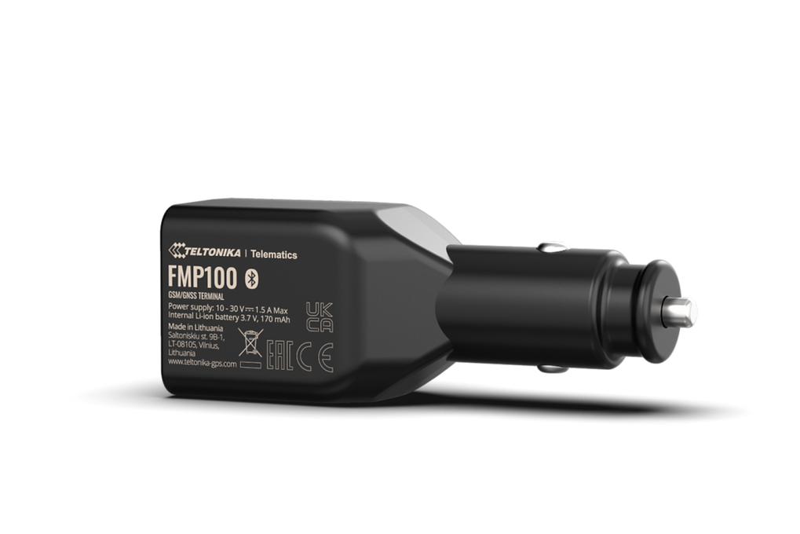

# Teltonika - FMP100

The Teltonika FMP100 is a compact plug and play GPS tracker engineered for rapid deployment in vehicles. Designed to run from a vehicle cigarette lighter socket, the FMP100 provides immediate location tracking and driver interaction features without requiring hardwiring. Its lightweight form factor and simple installation make it well suited to temporary installs, short term rentals, and pilot deployments where speed and flexibility matter.

As a Plaspy compatible device, the FMP100 pairs native GPS positioning with Bluetooth Low Energy sensor support and event signaling such as a built in button, RGB LED and buzzer. That combination delivers practical telematics data into Plaspy for mapping, alerts and reporting. Remote configuration and firmware workflows available from the vendor help keep devices manageable when integrated into Plaspy powered fleet operations.

## Key Highlights

- Plug and play installation via vehicle cigarette lighter for fast provisioning across many vehicles.
- Compatible with Plaspy for live tracking, alerts and centralized fleet management.
- Bluetooth Low Energy support for paired sensor telemetry such as temperature and movement.
- Built in user button with audible buzzer and RGB LED for local driver feedback and event signaling.
- Integrated charger output to power or charge small accessories while tracking.
- Remote configuration and firmware update workflows supported through Teltonika tools and documentation.

## How It Works with Plaspy

The FMP100 transmits positioning and event data that Plaspy consumes for live monitoring and historical reporting. Once the device is installed and any compatible BLE accessories are paired, Plaspy displays vehicle locations, logs button events and ingests sensor telemetry so operators can act on alerts and analyze usage trends.

- Real time location updates displayed on Plaspy maps for fleet visibility.
- Button triggered events relayed into Plaspy as alerts for driver assistance or security monitoring.
- BLE sensor data such as temperature, humidity or movement delivered to Plaspy when paired with supported accessories.
- Device status and local feedback from LED and buzzer captured in event logs for operational context.
- Remote configuration and firmware workflows coordinated with vendor tools and reflected in Plaspy device management records.

## Typical Use Cases

- Rapid fleet deployment where vehicles need immediate tracking without workshop installation.
- Car sharing and rental operations that require temporary trackers and simple provisioning.
- Short term or seasonal fleets used for events, pilots or temporary service expansion.
- Temperature sensitive cargo monitoring when paired with compatible BLE environmental sensors.
- Asset security and tamper detection using button events and movement or magnet sensors.

## Why Choose This Tracker with Plaspy

The FMP100 is a practical choice when speed of deployment and flexibility are priorities. Its plug and play design reduces installation overhead and enables organizations to provision tracking across many vehicles quickly. BLE accessory support extends telemetry beyond location, enabling environmental monitoring and simple security use cases that integrate into Plaspy dashboards and alerting workflows.

To learn more about Plaspy and how compatible trackers like the FMP100 can fit your operations visit https://www.plaspy.com. Product specifications and availability can change over time, so verify current technical details and documentation on the manufacturer site https://www.teltonika-gps.com/ before purchase or large scale deployment.
