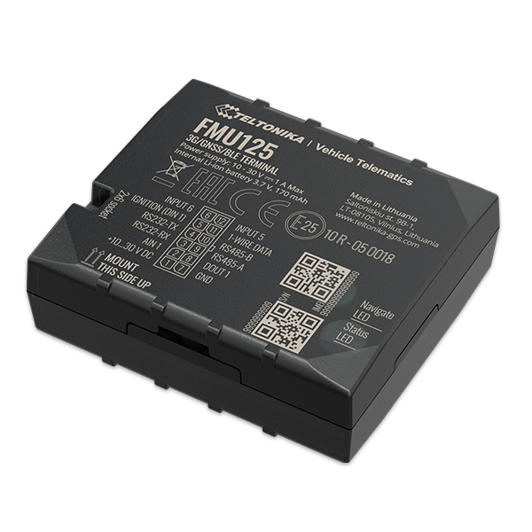

# Teltonika - FMU125

The Teltonika FMU125 is a compact professional real time tracking terminal designed for reliable location monitoring of vehicles and other mobile assets. It combines GNSS positioning with 3G GSM connectivity and includes built in GNSS and 3G antennas plus an accelerometer to support movement and event detection. The device also provides a data interface for connecting third party external devices to extend monitoring capabilities.

As a Plaspy compatible device, the FMU125 can feed position updates and event information into the Plaspy platform for fleet visibility and operational oversight. Its built in sensors and support for external devices make it a practical option for organizations that need continuous tracking, basic driving event detection, and remote configuration and updates alongside Plaspy management tools.

## Key Highlights

- Small form factor suited to vehicle and asset deployment while offering professional tracking capabilities
- GNSS positioning combined with 3G GSM connectivity for continuous location reporting
- Built in accelerometer for movement and impact related event detection
- RS485 and RS232 data interface to connect external devices and add telemetry sources
- Suite of event and monitoring features including geofencing, towing and unplug detection, immobilizer support, and driving related alerts
- Support for remote configuration and firmware updates to ease device management

## How It Works with Plaspy

When paired with Plaspy, the FMU125 supplies location and event data that Plaspy ingests to provide map based visibility, alerts, and operational reporting. Plaspy organizes incoming data into dashboards and notifications that help fleets and asset owners monitor activity and respond to incidents.

- Real time location tracking displayed on Plaspy maps for live fleet visibility
- Event and alert forwarding for overspeed, excessive idling, crash or towing detections
- Aggregated reporting on routes, activity patterns, and driving related events to support operational decisions
- Geofence management and notifications using the device's auto and manual geofence capabilities
- Integration of data from connected external devices via the device data interface for expanded telemetry
- Device configuration and update coordination alongside Plaspy deployment workflows

## Typical Use Cases

- Fleet management for light vehicles and small commercial fleets
- Car rental and vehicle sharing operations requiring location and status monitoring
- Taxi and ride services needing reliable real time positioning
- Public transport and logistics companies tracking routes and vehicle activity
- Personal car tracking for theft recovery and basic driver monitoring

## Why Choose This Tracker with Plaspy

The FMU125 is a practical choice for organizations looking for a compact tracker that offers reliable GNSS positioning, cellular connectivity, and a range of event detection features. Its support for external device connections gives operators flexibility to expand telemetry collection without replacing the primary tracking unit.

Combined with Plaspy, the FMU125 becomes part of an operational monitoring solution that emphasizes visibility, alerting, and reporting. Plaspy can consolidate location and event streams from FMU125 devices across a fleet, helping teams maintain oversight, optimize routes, and respond to incidents more quickly.

To learn more about Plaspy and how it can work with devices like the Teltonika FMU125 visit https://www.plaspy.com. Product specifications and availability can change over time so please verify current technical details and manufacturer information on the official Teltonika website https://www.teltonika-gps.com/
