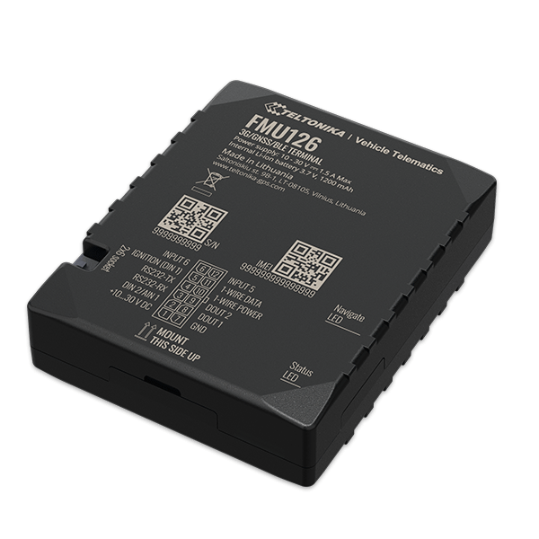

# Teltonika - FMU126

The Teltonika FMU126 is a cutting-edge GPS tracker designed to provide real-time tracking capabilities with 3G network coverage and fallback to 2G. This device is equipped with GNSS/Bluetooth and 3G modules, as well as internal GNSS and 3G antennas. It has been specifically designed to meet the requirements of the Department of Land Transport \(DLT\) and offers high-end features that add value to GPS telematics solution providers.

One of the standout features of the FMU126 is its versatility. It is equipped with an RS232 interface that allows for the connection of a magnetic card reader and various third-party external devices. Additionally, it has a +5V output, which saves time during integration. The inclusion of a buzzer on the PCB also helps to reduce installation costs.

The FMU126 offers expanded business opportunities with its support for BLE sensors and beacons. It has a long battery life of over 6 hours, allowing for continuous record collection every second. The device also supports CAN adapters, making it compatible with capturing CAN data from any kind of transport.

With a range of outstanding features, including sensors, scenarios, sleep modes, configuration and firmware update options, SMS and GPRS command capabilities, time synchronization, fuel monitoring, ignition detection, and various RS232 modes, the Teltonika FMU126 is a powerful and versatile GPS tracker that is ideal for a wide range of applications.

