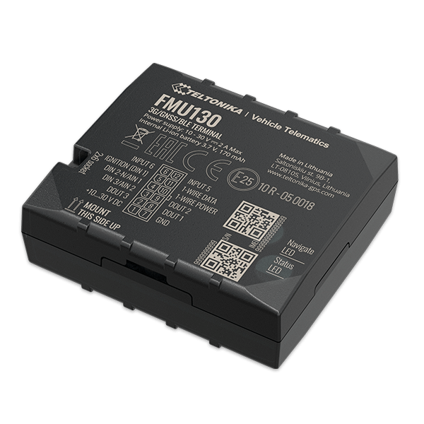

# Teltonika - FMU130

The Teltonika FMU130 is a compact professional real time tracking terminal designed for vehicle and asset monitoring. It offers GNSS positioning and 3G GSM connectivity, a backup battery for continuity, internal antennas, and a range of configurable inputs and outputs that make it suitable for continuous location acquisition and event monitoring across many vehicle types.

As a device compatible with Plaspy, the FMU130 can feed location, motion, and event data into the Plaspy platform for fleet oversight and reporting. Its set of onboard sensors and predefined scenarios — such as overspeeding, towing, crash detection, and idling — make it a useful data source for Plaspy users seeking richer visibility and operational alerts without excessive hardware complexity.

## Key Highlights

- Small professional form factor suitable for vehicle and asset installations.
- Real time GNSS location with 3G cellular connectivity and a backup battery for continuity.
- Configurable digital and analog inputs plus multiple output options for flexible event handling.
- Built in accelerometer and a suite of scenarios including overspeeding, towing, crash, and idling detection.
- Multiple power saving sleep modes to optimize battery life and operational uptime.
- Remote configuration and firmware update options to simplify device management.

## How It Works with Plaspy

The FMU130 delivers location and event telemetry that Plaspy can present on maps, dashboards, and in reports to support fleet operations. When connected to Plaspy, the device's position updates and configured scenarios translate into actionable insights and alerts for dispatchers and fleet managers.

- Real time location updates displayed on Plaspy maps for vehicle tracking and route visibility.
- Event forwarding for scenarios such as overspeeding, towing, excessive idling, and crash detection to trigger alerts and notifications.
- Status and input changes from the device available in Plaspy for monitoring auxiliary equipment and vehicle state.
- Historical trips and activity data used by Plaspy reporting tools for analysis and compliance tracking.
- Support for remote management workflows using the device's update and configuration methods alongside Plaspy operational controls.

## Typical Use Cases

- Fleet management for light commercial vehicles and delivery fleets requiring live tracking and event alerts.
- Car rental and sharing platforms that need to monitor vehicle location, usage, and key events.
- Taxi and ride services seeking location visibility and simple telematics scenarios.
- Public transport and shuttle operators monitoring vehicle movement and idling behavior.
- Logistics companies tracking assets and triggering alerts on exceptional events.

## Why Choose This Tracker with Plaspy

The FMU130 is a practical choice for organizations that need a compact tracker with a balanced set of sensors and configurable inputs. Its predefined scenarios and motion sensing make it well suited to common fleet monitoring tasks, while sleep modes and a backup battery help maintain reporting continuity across different operational conditions.

When paired with Plaspy, the FMU130 can become a straightforward source of reliable location and event data for operational visibility, alerting, and reporting. For users evaluating options, the FMU130 offers a combination of features that match many standard fleet and asset tracking requirements while keeping deployment and management options flexible.

Learn more about how Plaspy can work with devices like the FMU130 on the Plaspy website https://www.plaspy.com. Product specifications and availability can change over time, so please verify current technical details and options on the manufacturer site https://www.teltonika-gps.com/ before making procurement decisions.
