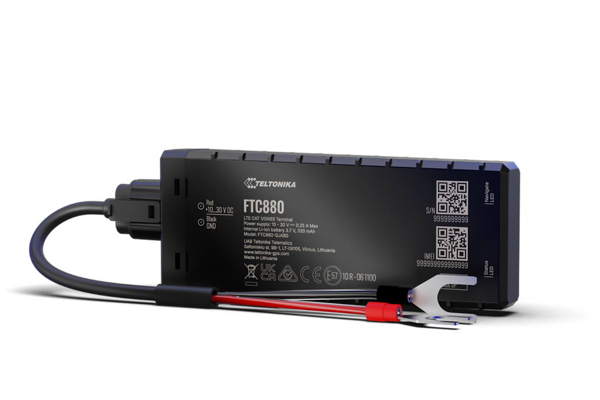

# Teltonika - FTC880

The Teltonika FTC880 is a battery-mounted GPS tracker built for demanding vehicle and asset tracking deployments. It combines rugged hardware, multi-constellation GNSS positioning and remote device management capabilities to deliver dependable position updates and event reporting for fleet, logistics and heavy equipment use. The FTC880 is designed for long-term battery operation and harsh environments where durability and consistent telemetry are required.

As a Plaspy compatible device out of the box, the FTC880 can feed location and device telemetry into Plaspy’s tracking dashboards and reporting workflows. Its rugged enclosure, extended GNSS visibility and remote management features make it a practical choice for organizations that need reliable, managed tracking across mixed fleets and off-grid assets while keeping device lifecycle tasks streamlined.

## Key Highlights

- Plaspy compatible out of the box for real-time tracking and telemetry integration.
- Battery-mounted design optimized for long-term deployments and low power operation.
- Rugged IP69K rated housing for protection against dust and high pressure washdown.
- Multi constellation GNSS with visibility up to 41 satellites for improved positioning.
- LTE Cat 1 cellular connectivity with fallback to 2G for broad coverage and reliable reporting.
- Remote device management via Teltonika FOTA WEB and support tools for updates and configuration.
- Configurable reporting intervals and power modes to balance visibility and battery life.

## How It Works with Plaspy

When connected to Plaspy, the FTC880 streams GNSS positions and device status into Plaspy’s monitoring and reporting environment so operators can maintain situational awareness of assets and vehicles. Plaspy ingests the tracker’s location and event data to support live tracking, geofencing, alerts and historical reporting while device management workflows help keep trackers updated and configured.

- Real time location and telemetry updates from FTC880 appear in Plaspy dashboards for live monitoring.
- Event reporting such as movement and connectivity events is available in Plaspy for alerts and audit logs.
- Remote firmware and configuration workflows are supported alongside Teltonika FOTA WEB to simplify device lifecycle tasks.
- Battery operated reporting can be tuned with configurable intervals to extend deployment duration while preserving visibility.
- Data from the FTC880 can be combined with Plaspy workflows to support operational alerts, reporting and integration with peripheral inputs.

## Typical Use Cases

- Mixed fleet telematics where durable, battery powered installation is preferred.
- Logistics and asset tracking for trailers, containers and high value items in transit.
- Heavy machinery monitoring in agriculture, construction and mining environments.
- Remote or seasonal equipment deployments that require extended off grid operation.

## Why Choose This Tracker with Plaspy

The FTC880 is a sensible choice for organizations using Plaspy when they need a rugged, battery mounted tracker that balances durability with managed device operations. Its robust enclosure and GNSS performance support use on vehicles and assets exposed to dust and washdown conditions, while remote management tools reduce the need for hands on maintenance across distributed fleets.

For fleet managers and integrators, pairing the FTC880 with Plaspy provides a workflow oriented approach to location visibility, alerting and reporting while simplifying remote updates and configuration. If you need dependable tracking for harsh environments and long term battery operation, the FTC880 and Plaspy together offer a practical foundation for operational oversight and asset management.

Learn more about Plaspy on the main website https://www.plaspy.com. Product specifications, availability and manufacturer details can change over time, so verify current specifications and official documentation on the Teltonika site https://www.teltonika-gps.com/ before procurement.
