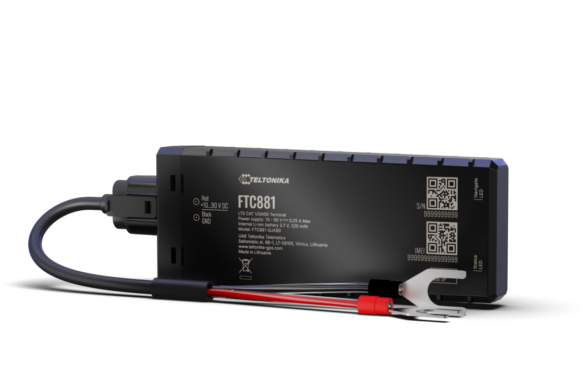

# Teltonika - FTC881

The Teltonika FTC881 is a rugged, battery mounted GPS tracker designed for demanding vehicle and asset tracking. Built to withstand harsh conditions with an IP69K rated enclosure and optimized for low power operation, the FTC881 offers precise GNSS positioning and cellular connectivity to support continuous monitoring of vehicles and equipment.

As a Plaspy compatible device, the FTC881 can feed real time location and telemetry into Plaspy’s fleet management platform. Its combination of durable hardware, remote device management capabilities, and energy efficient behaviour makes it a practical choice for organizations that use Plaspy to monitor mixed fleets, heavy machinery, and battery mounted assets.

## Key Highlights

- Plaspy compatible for seamless integration into tracking dashboards and fleet workflows.
- Rugged IP69K rated housing suitable for dusty, wet, and high pressure wash environments.
- Enhanced GNSS reception for improved location quality in low speed and obstructed conditions.
- Cellular connectivity with regional fallback to help maintain data transmission across coverage areas.
- Optimised sleep modes and battery mounting design to reduce vehicle power draw during long deployments.
- Remote device management support to streamline updates and large scale configuration.

## How It Works with Plaspy

When connected to Plaspy, the FTC881 transmits location and event data to provide live visibility, historical routes, and status reporting. Plaspy ingests the tracker data to power maps, alerts, and reports that operators use to manage operations and respond to incidents.

- Live location updates in Plaspy for real time fleet visibility and dispatch support.
- Historical route playback and reporting for operational review and compliance needs.
- Event and status logging to trigger alerts and workflows within Plaspy based on movement or configured inputs.
- Remote management compatibility to keep devices configured and updated during large deployments.
- Data compatibility with Plaspy reporting and export tools to support analytics and integrations.

## Typical Use Cases

- Fleet telematics for vans, trucks, and mixed commercial fleets needing reliable positioning.
- Heavy machinery and construction assets operating in harsh environments that require rugged tracking hardware.
- E mobility and battery mounted vehicles where power efficient tracking is important.
- Basic track and trace and anti theft monitoring to support location based response procedures.

## Why Choose This Tracker with Plaspy

The FTC881 is a practical option for organizations using Plaspy because it combines robust environmental protection with reliable positioning and power efficient operation. Those managing fleets or remote assets benefit from the tracker’s focus on durability and remote management, which can reduce field service needs and simplify large rollouts.

For teams running Plaspy, the FTC881 provides a balance between rugged hardware and operational flexibility that supports real world fleet and asset tracking scenarios. Learn more about Plaspy on the main website https://www.plaspy.com. Product specifications and availability can change over time, so verify the current technical details and certifications on the manufacturer site https://www.teltonika-gps.com/ before procurement.
