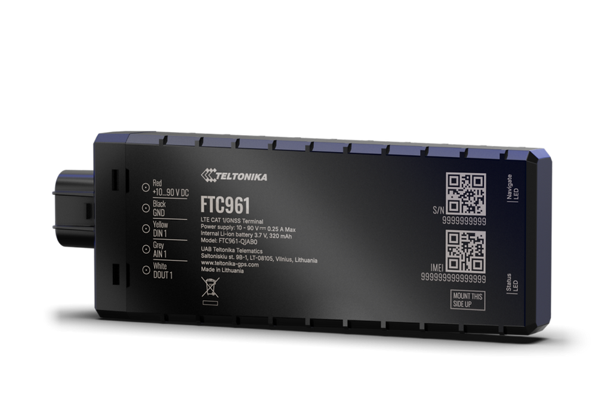

# Teltonika - FTC961

# FTC961

The FTC961 by Teltonika is a next‑generation, heavy‑duty 4G LTE Cat 1 GPS tracker designed for demanding mobile and off‑road applications. Plaspy compatible and optimized for fleet telematics, this rugged tracker delivers enhanced GNSS precision, robust cellular connectivity and remote management via FOTA WEB and the Teltonika FT platform — making it a solid choice when you need accurate real‑time tracking in harsh environments.

Built to withstand high‑pressure washing and extreme dust \(IP69K\) and engineered for high‑voltage vehicle installations, the FTC961 supports advanced telemetry workflows for fleet management, e‑mobility, agriculture, construction and mining. Its digital inputs/outputs, high‑voltage input and power‑saving sleep modes minimize vehicle battery drain while enabling ignition monitoring and remote control integrations through Plaspy.

## Key Highlights

- Plaspy compatible device: integrates with Plaspy for real‑time tracking and fleet management workflows.
- High‑precision GNSS: supports up to 41 visible satellites for improved positioning, including better low‑speed accuracy.
- Rugged IP69K enclosure: rated for high‑pressure water, steam and dust — suited for off‑road and industrial use.
- 4G LTE Cat 1 with 2G fallback: reliable cellular connectivity across listed LTE and GSM bands for broad regional coverage.
- Optimized power management: advanced sleep modes and high‑voltage input for heavy machinery and industrial vehicles.
- Remote device management: FOTA WEB and FT platform support for firmware updates, configuration and grouping at scale.
- Standard telematics I/O: digital inputs/outputs for ignition monitoring, event signals and external device control.

## How It Works with Plaspy

The FTC961 streams GNSS position and telematics data to Plaspy using standard TCP/UDP reporting or telemetry protocols supported by Teltonika devices. Once paired, Plaspy receives real‑time tracking updates, event notifications and device status so fleet managers can monitor vehicles, trigger alerts and run automated reports.

- Real‑time location and telemetry updates delivered to Plaspy for live monitoring and historical playback.
- Ignition and event monitoring via digital inputs for driver behavior, engine state and door/alarm events.
- Telemetry-ready: transmit vehicle status and diagnostics to Plaspy for integration with fleet management dashboards.
- Remote control capability: digital outputs can be used to implement remote immobilizer or other external control functions when configured through Plaspy and device tools.
- Scalable remote management: FOTA WEB and FT platform support allow mass firmware and configuration updates, ensuring fleets stay up to date and secure.

## Technical Overview

| Connectivity | 4G LTE Cat 1 \(LTE‑FDD\) with 2G GSM fallback |
| --- | --- |
| Bands | 4G \(LTE‑FDD\): B1, B3, B7, B8, B20, B28; 2G \(GSM\): B2, B3, B5, B8 |
| Power & Battery | High‑voltage input suitable for heavy machinery; optimized power management with advanced sleep modes to minimise vehicle battery drain |
| Interfaces | Digital inputs/outputs for ignition and event monitoring; standard I/O power supply cables included in package |
| GNSS | Enhanced GNSS precision supporting up to 41 visible satellites for improved positioning and low‑speed tracking quality |
| Bluetooth | Not specified in product description — verify BLE support if integration with Bluetooth sensors is required |
| Remote Management | FOTA WEB, Teltonika FT platform and Teltonika configuration tools for remote firmware, configuration and grouping |
| Form Factor | Rugged, IP69K‑rated enclosure for vehicle/asset installations; standard product code FTC961M8PIL1 \(EU, MEA, APAC\) |

## Use Cases

- Fleet management and real‑time GPS tracker reporting for commercial trucks and service fleets requiring robust telemetry and uptime.
- Heavy equipment and mining vehicles where high‑voltage inputs and IP69K protection are essential for reliability on site.
- Construction and agriculture fleets needing precise low‑speed positioning and durable hardware for harsh environments.
- E‑mobility and industrial vehicle monitoring where remote updates \(FOTA WEB\) and grouped configuration simplify fleet operations.

## Why Choose This Tracker with Plaspy

Choosing the FTC961 for a Plaspy compatible deployment delivers a balance of rugged hardware, accurate GNSS positioning and scale‑ready remote management. The device’s IP69K protection and high‑voltage design reduce downtime in harsh conditions, while digital inputs/outputs make it straightforward to monitor ignition and implement remote control workflows such as immobilizer functions. With LTE Cat 1 connectivity and 2G fallback across the listed bands, you get reliable coverage and real‑time tracking for telemetry and fleet management.

For teams focused on operational resilience and simplified device lifecycle management, FTC961’s FOTA WEB and FT platform integration enable efficient firmware distribution, smart grouping and scheduled configuration tasks — all accessible through Plaspy’s platform. If you require Bluetooth sensors, fuel monitoring or specific peripheral integrations, confirm those requirements against the FTC961 feature set and Teltonika tools to ensure seamless telemetry and sensor data flow into Plaspy.

**Package & ordering:** Standard product code FTC961M8PIL1 \(EU, MEA, APAC\). Standard package includes 1 x FTC961 tracker, 1 x input/output power supply cables \(0.7m\) and Teltonika branded packaging box. For deployment planning, verify cellular band availability for your region and consult Teltonika configuration tools for Plaspy integration steps.

