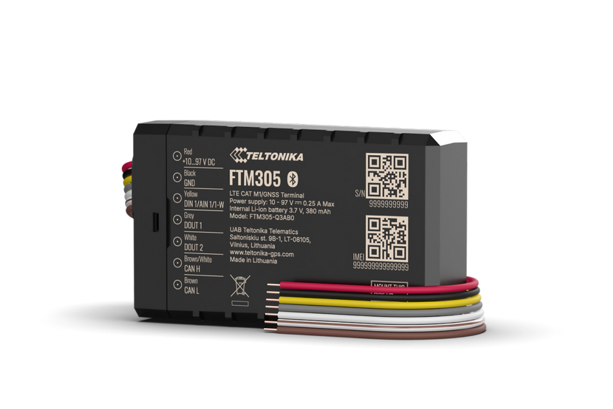

# Teltonika - FTM305

The Teltonika FTM305 is a compact 4G LTE Cat M1 e‑mobility GPS tracker built for demanding vehicle and equipment monitoring and is Plaspy compatible for seamless backend integration. Designed for electrified transport and industrial environments, the FTM305 pairs robust environmental protection \(IP67\) with vehicle-grade interfaces to deliver reliable real-time tracking and telemetry for e‑bikes, forklifts, shuttle cars, utility machinery and other electric equipment.

With multi-constellation GNSS performance and CAN bus data acquisition, the FTM305 brings precise positioning and actionable vehicle data to Plaspy-powered fleet management dashboards. Its wide electrical input range, region-specific cellular variants and support for Teltonika remote management tools make it a practical choice for scalable deployments that require accurate location, telemetry and resilient communications across urban and industrial sites.

## Key Highlights

- Plaspy compatible GPS tracker: integrates GNSS coordinates and telemetry into Plaspy for real-time tracking and reporting.
- Rugged IP67 enclosure: dust-tight and water-resistant for outdoor and industrial mounting on e‑mobility assets.
- Wide input voltage: 10–97 V support enables use with low-voltage micro-mobility and high-voltage industrial vehicle systems.
- LTE Cat M1 connectivity with NB2 fallback and 2G support where applicable: optimized for IoT power efficiency and broad coverage.
- Enhanced GNSS receiver tracking up to 41 visible satellites for improved positioning accuracy and reliability.
- CAN bus data reading: capture vehicle telemetry, battery management system \(BMS\) parameters and custom CAN signals for predictive maintenance.
- Compact, lightweight form factor: flexible mounting on e-bikes, forklifts, battery swap units and other constrained spaces.
- Managed with Teltonika remote tools: remote configuration and device monitoring for efficient fleet management.

## How It Works with Plaspy

The FTM305 streams GNSS coordinates and CAN-derived telemetry to Plaspy for immediate visualization, geofencing, alerts and historical reports. Plaspy ingest routines can parse location updates and telemetry payloads sent over LTE Cat M1 \(or fallback networks\) so you get near real-time tracking and asset status. Where CAN data exposes ignition, battery state or alarm signals, Plaspy can convert those inputs into operational events and automated workflows.

- Real-time location and telemetry updates delivered to Plaspy for live map tracking and route analysis.
- CAN bus telemetry \(battery, voltage, custom sensors\) mapped into Plaspy dashboards and alerts.
- Ignition/door/alarm status and other vehicle signals available if provided via CAN or vehicle interfaces—used by Plaspy to trigger rules and notifications.
- Remote immobilizer or anti-theft workflows achievable through Plaspy when external control circuits or vehicle interfaces support them.
- Regional cellular variants ensure consistent connectivity for telemetry and GNSS reporting across networks and geographies.

## Technical Overview

| Model | FTM305 |
| --- | --- |
| Manufacturer | Teltonika \(device management compatibility with Teltonika remote tools\) |
| Connectivity | LTE Cat M1 \(NB2 fallback depending on module variant\); 2G GSM support where applicable |
| Cellular Module Family | BG95 family \(module variants reflect region-specific support\) |
| Bands / Regional Variants | Region-specific LTE/2G bands. Example product codes: FTM305BPPIL1 \(EU/MEA\), FTM305PBPIL1 \(APAC\), FTM305CPAA01 \(North America\) |
| Power | Wide input voltage: 10–97 V DC |
| GNSS | Enhanced GNSS receiver, multi-constellation support with up to 41 visible satellites for improved accuracy |
| Interfaces | CAN bus data acquisition; supplied with a 7-pin main cable for vehicle connections |
| Enclosure | IP67-rated compact housing suitable for outdoor and industrial mounting |
| Remote Management | Compatible with Teltonika device management solutions for configuration and monitoring |
| Form Factor | Compact, lightweight tracker optimized for e‑mobility and industrial equipment |

## Use Cases

- Fleet telematics for urban micro-mobility: track e-bike and scooter fleets, optimize routing and battery swap schedules with real-time location and telemetry.
- Battery management system \(BMS\) monitoring: read CAN bus data to monitor battery health, state of charge and thermal conditions in electric vehicles and equipment.
- Battery swapping logistics: manage locations and movements of swap stations and swapping operations to improve turnaround and availability.
- Industrial asset tracking: mount on forklifts, shuttle cars and utility machinery to monitor usage, position and operational hours in warehouses and yards.
- Outdoor equipment monitoring: rugged IP67 protection supports tracking of field equipment exposed to dust, rain and harsh conditions.

## Why Choose This Tracker with Plaspy

Pairing the FTM305 with Plaspy delivers a practical, resilient solution for companies that need precise GPS tracker data together with rich vehicle telemetry. The combination supports fleet management objectives such as improved uptime, predictive maintenance, and anti-theft workflows. Because the FTM305 reads CAN bus parameters, Plaspy can surface vehicle-specific insights—battery state, voltage trends and custom telemetry—without extra sensor wiring when the vehicle provides that data over CAN.

Operational benefits include consistent real-time tracking over LTE Cat M1 networks with NB2 and 2G fallbacks, a durable IP67 enclosure suited to outdoor use, and a wide input range that fits both low-voltage micro-mobility and higher-voltage industrial platforms. Remote device management via Teltonika tools simplifies deployment and ongoing maintenance, while Plaspy’s rules, geofences and reporting convert raw GNSS and CAN signals into actionable fleet intelligence. For teams focused on reliable tracking, telemetry-driven maintenance and scalable fleet management, the FTM305 is a Plaspy compatible GPS tracker that balances environmental resilience, connectivity efficiency and integration flexibility.

