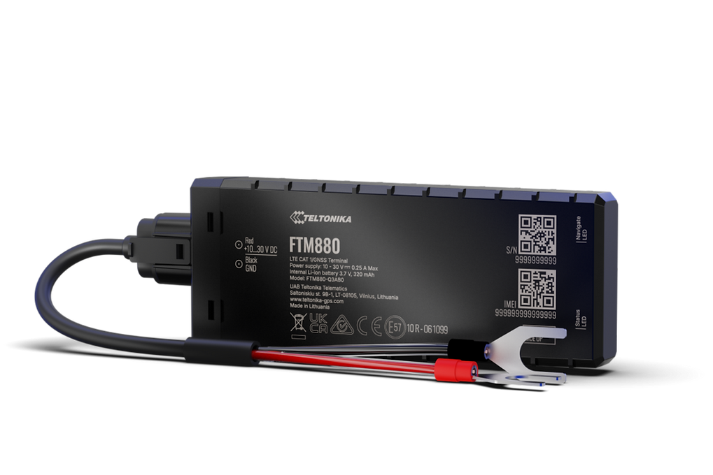

# Teltonika - FTM880

The Teltonika FTM880 is a battery mounted GPS tracker built for demanding fleet telematics and heavy duty asset tracking. Designed for long term, maintenance free deployments, the FTM880 combines a rugged IP69K enclosure with enhanced multi constellation GNSS performance and cellular connectivity options to deliver reliable long term positioning and telemetry for remote assets and machinery.

As a Plaspy compatible device, the FTM880 can be integrated into fleet and asset management workflows to provide live position updates, geofencing, event alerts and remote device management. When paired with Plaspy, the tracker becomes part of a scalable monitoring setup for trailers, construction equipment, containers and other assets that require low maintenance and robust outdoor protection.

## Key Highlights

- Designed for battery mounted installations to reduce wiring and maintenance needs in remote or temporary setups
- Rugged IP69K rated casing for protection against dust, high pressure water and steam in harsh environments
- Enhanced multi constellation GNSS performance to improve positioning in open and obstructed locations
- Cellular connectivity with LTE Cat M1 and NB IoT support on relevant variants for efficient telemetry
- Optimized sleep modes to extend operational lifetime between maintenance cycles
- Remote device provisioning and firmware management via Teltonika FT platform and FOTA WEB
- Suitable for heavy duty asset tracking use cases where durability and long term operation matter

## How It Works with Plaspy

When the FTM880 is connected to Plaspy, it feeds position and available telemetry into Plaspy servers so teams can monitor assets on maps, review historical routes, and trigger rules or notifications. Plaspy uses incoming data to present live tracking, alerts and reports that support operational oversight and anti theft workflows.

- Real time location updates and historical route playback presented in Plaspy maps and timelines
- Geofencing and perimeter alerts to notify teams when assets enter or leave configured zones
- Event and input recording such as ignition, door or alarm status when those signals are exposed by the tracker or wiring harness
- Support for fuel and other telemetry reporting where external sensors or telematics are connected and exposed to Plaspy
- Remote firmware updates and bulk provisioning using Teltonika FOTA WEB and the FT platform through Plaspy compatible workflows
- Operational reporting and fleet level dashboards for visibility across deployments

## Typical Use Cases

- Fleet management for trailers and heavy vehicles where wiring is impractical and battery operation is preferred
- Anti theft monitoring and immobilization workflows for construction, mining and rental equipment when combined with Plaspy rules
- Logistics and container tracking across remote sites that need long life battery operation and robust protection
- Agriculture and field equipment tracking to improve position visibility across open and obstructed terrain
- Track and trace for generators, trailers and other deployed assets that require low maintenance monitoring

## Why Choose This Tracker with Plaspy

The FTM880 is a practical option for organizations that need a rugged, low maintenance tracker that integrates into an established fleet management platform like Plaspy. Its battery mounted form factor, protective casing and GNSS focus make it well suited for remote and heavy duty assets where ongoing access is limited. Combined with Teltonika remote management tools, the tracker can be provisioned and updated at scale to maintain visibility across large deployments.

To learn more about how the FTM880 can fit into your Plaspy deployment visit https://www.plaspy.com and review integration options that match your operational needs. For the most current product specifications, SKU details and availability confirm information on the manufacturer site https://www.teltonika-gps.com/ since product details and availability can change over time.
