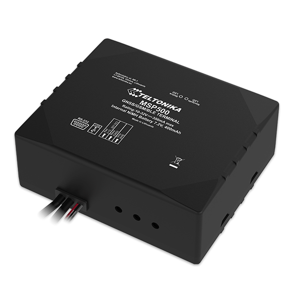

# Teltonika - MSP500

The Teltonika MSP500 is a specialized tracking terminal that offers GNSS/GSM/Bluetooth connectivity, making it a versatile and reliable GPS tracker. With its internal GNSS/GSM antennas and RS232 interface, this device ensures accurate and efficient tracking capabilities. Additionally, it features an internal Ni-Mh battery, providing backup power in case of a power outage or disconnection. 

One of the standout features of the MSP500 is its speed limiting control functionality. It comes equipped with an integrated buzzer and relay, allowing for speed limiting based on either fuel pump power supply switching or accelerator pedal control using an additional electronic throttle controller. This feature is particularly useful for fleet management and ensuring safe driving practices.

The MSP500 also boasts a range of other impressive features. It includes an accelerometer for enhanced sensor capabilities, enabling features such as green driving, over speeding detection with relay control, jamming detection, GNSS fuel counter, excessive idling detection, unplug detection, towing detection, crash detection, auto geofence, manual geofence, trip tracking, and limp mode. These features make the MSP500 a comprehensive and reliable solution for various tracking and monitoring needs.

In terms of configuration and firmware updates, the MSP500 supports FOTA \(Firmware Over-The-Air\) via the web and Teltonika Configurator through USB or Bluetooth connections. It also offers SMS and GPRS commands for configuration, events, and debugging purposes. Time synchronization is made easy with options such as GPS, NITZ, and NTP. The RS232 interface supports various modes, including log mode, NMEA, LLS, TCP ASCII/Binary, LCD, RFID HID/MDF7, Garmin FMI, and POS Printer. Ignition detection is achieved through the accelerometer, external power voltage, and engine RPM \(with an OBDII dongle\).

With its advanced features and reliable performance, the Teltonika MSP500 is an excellent choice for speed limiting control and a wide range of tracking and monitoring applications. Whether you need to track a fleet of vehicles or monitor the driving behavior of individuals, the MSP500 offers the functionality and reliability you need.

