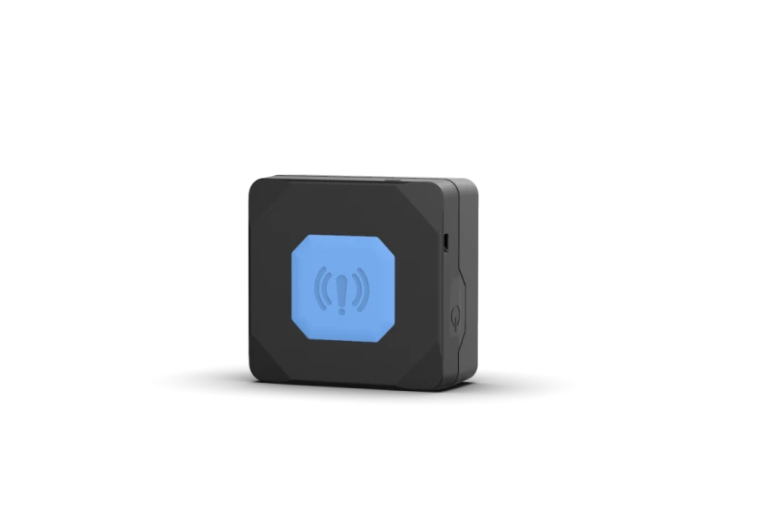

# Teltonika - TMT250

The Teltonika TMT250 is an autonomous 2G mini GPS tracker designed for personal security. It combines a compact form factor with an easy to reach emergency button and built in safety scenarios such as man down and no movement detection. The device also supports wireless connections to external BLE devices, enabling monitoring of environmental parameters and additional sensors while maintaining rugged protection for outdoor use.

As a Plaspy compatible device, the TMT250 can feed location and event data into Plaspy for centralized visibility and alerting. Its focus on personal safety events, emergency alerts, and optional sensor inputs makes it a practical choice for organizations and individuals who want a discreet, durable tracker that integrates with a fleet and asset monitoring platform like Plaspy.

## Key Highlights

- Compact autonomous 2G mini GPS tracker tailored for personal safety
- Easy to reach emergency button for immediate alert messages
- Bluetooth LE based wireless connection for external beacons and sensors
- Built in man down, alarm, and no movement scenarios for lone worker safety
- IP67 rated casing for water and dust resistance in outdoor conditions
- Support for on demand tracking and multiple event driven scenarios

## How It Works with Plaspy

When connected with Plaspy, the TMT250 provides location and event information that Plaspy can present alongside other devices for unified monitoring and incident management. Plaspy can use the device feeds to create notifications, historical tracking, and operational reports to support response and oversight.

- Receive and display location updates and movement history in the Plaspy interface
- Trigger alerts in Plaspy from the emergency button, man down, or no movement events
- Monitor paired external sensor inputs such as temperature or movement through Plaspy dashboards
- Use geofence and zone events to generate notifications and activity summaries in Plaspy
- Include TMT250 devices in fleet level reporting and operational summaries for oversight

## Typical Use Cases

- Personal safety for lone workers and field staff requiring instant alert capability
- Protection and monitoring of vulnerable individuals who need emergency notification
- Portable asset monitoring in outdoor environments where water and dust resistance matters
- Environmental condition checks for mobile shipments or equipment when paired with external sensors
- Situations requiring discreet, compact trackers that integrate into a broader monitoring platform

## Why Choose This Tracker with Plaspy

The TMT250 is a practical option for organizations that need a small, rugged personal tracker with focused safety features. Its emergency button and built in scenarios such as man down and no movement provide straightforward event triggers that map well into Plaspy workflows for alerting and response. Bluetooth LE connectivity adds flexibility by allowing optional external sensors to enhance monitoring when needed.

If you are evaluating devices for personal safety or portable asset monitoring and want integration with a central tracking platform, the Teltonika TMT250 is a relevant candidate to consider with Plaspy. Learn more about Plaspy on the main website https://www.plaspy.com and verify current product specifications and availability with the manufacturer at https://www.teltonika-gps.com/. Product details and manufacturer information can change over time, so please consult official documentation for the latest specifications.
