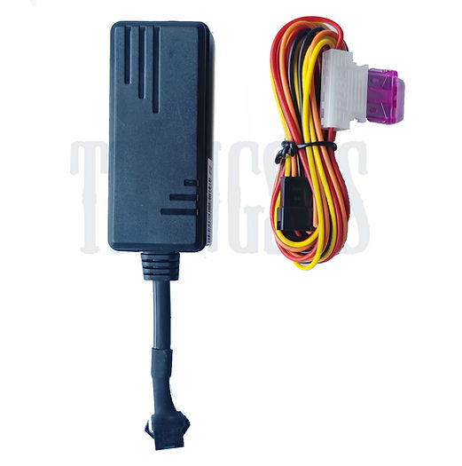

# ThingSys - J16

The J16 is a compact vehicle GPS tracker from ThingSys designed for fleet management, anti theft monitoring, and general vehicle telematics. Built around a SIMCOM 7670SA module, the device provides 4G LTE CAT1 connectivity with 2G fallback and includes features such as internal backup battery, motion G sensor, blind area message storage and two variant options that add ACC detection, relay control, microphone and SOS functionality.

As a Plaspy compatible device, the J16 can report position and telemetry into Plaspy for live tracking, alerts and historical reporting. Its support for common messaging modes and TCP IP communications makes integration straightforward, allowing fleet operators to use the J16 within Plaspy dashboards for visibility, event handling and operational oversight across mixed vehicle fleets.

## Key Highlights

- Plaspy compatible 4G LTE CAT1 tracker with 2G fallback for broad cellular reach and continuous tracking.
- Two variants available J16A with ACC detection and relay control and J16B adding relay, microphone and SOS for emergency signaling.
- Compact and lightweight design with an internal backup battery and motion G sensor for anti theft and short power loss scenarios.
- Blind area message storage capable of holding thousands of messages while out of coverage and forwarding them when connectivity resumes.
- Wide operating voltage range suitable for cars buses trucks and motorcycles making it a flexible choice for mixed fleets.
- Default protocol profiles supported with optional protocol profiles configurable where needed to match server requirements.

## How It Works with Plaspy

When connected to Plaspy the J16 delivers continuous positional and telemetry packets so the platform can display live location data, generate alerts and maintain event history for reporting. Plaspy is configured to accept the J16 message formats and process incoming data for operational use.

- Live location updates and telemetry shown on Plaspy maps for real time fleet visibility.
- Ignition and ACC events reported to Plaspy enabling run time rules such as driver hours and ignition based alerts.
- Blind area logging forwarded to Plaspy after reconnection so historical records remain complete.
- Relay commands can be issued from Plaspy to perform remote immobilizer actions when a relay accessory is installed.
- SOS and microphone events from J16B variant are surfaced in Plaspy for incident response and event investigation.
- Plaspy can combine J16 location feeds with external sensor data such as Bluetooth sensor inputs to provide richer telematics insights.

## Typical Use Cases

- Fleet management and route monitoring for cars buses and trucks requiring live tracking and event history.
- Anti theft monitoring with backup battery motion detection and remote immobilizer support.
- Emergency response and incident handling using SOS and audio features on the J16B variant.
- Mixed vehicle deployments where a wide input voltage range and compact device size are required.
- Offline logging and later data forwarding to preserve continuity of historical tracking records.

## Why Choose This Tracker with Plaspy

The ThingSys J16 is a practical choice for organizations that need a compact tracker with reliable cellular coverage and hardware options for ignition sensing and emergency signaling. Its blind area buffering and internal backup battery help maintain continuity in real world deployments where coverage or power can be intermittent.

Paired with Plaspy the J16 becomes part of a scalable fleet management solution where location data, ignition events, alerts and stored messages feed into dashboards and reports that support operational decisions. Learn more about Plaspy on the main website https://www.plaspy.com and verify current specifications and availability with the manufacturer at https://www.thingsys.com/ since product details and options can change over time.
