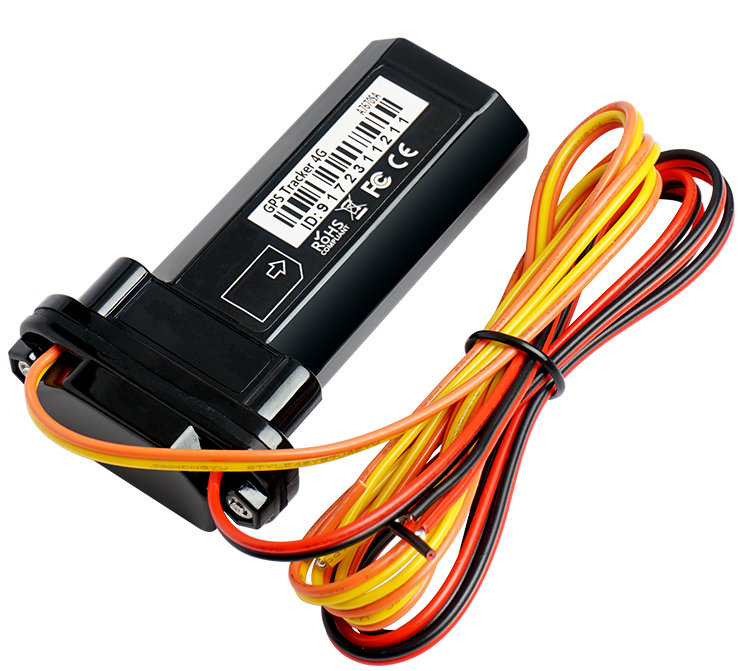

# ThingSys - TS-G17W

The TS-G17W is a compact, IP67 waterproof vehicle GPS tracker designed for reliable, real time tracking in demanding environments. Built for worldwide deployment with 4G LTE‑FDD and 2G GSM fallback where applicable, the device targets fleet management, anti theft protection and remote telemetry use cases. Its small form factor and rugged housing make it suitable for discreet installation on cars, trucks, buses and exposed assets that need weather protection and durable performance.

As a Plaspy compatible device, the TS-G17W integrates into Plaspy monitoring workflows to provide live location, alarm reporting and remote command capability. With a high sensitivity GNSS chipset and a built in backup battery for brief power interruptions, the tracker supplies the continuous location and event data that Plaspy uses for dashboards, geofences, alerts and historical reporting.

## Key Highlights

- Plaspy compatible for straightforward integration into real time monitoring and fleet management workflows.
- 4G LTE with 2G GSM fallback for broad regional connectivity depending on country banding.
- High sensitivity GNSS with typical positioning accuracy around 5 meters and strong weak signal performance.
- Vehicle oriented inputs including ignition detection and optional external relay for immobilizer style control.
- IP67 waterproof rating and wide voltage tolerance suited to harsh environments and varied vehicle systems.
- Built in backup battery for short reporting continuity during brief power loss and generally low power consumption.
- Support for configurable alerts such as over speed and vibration to feed automated rules in Plaspy.

## How It Works with Plaspy

When paired with Plaspy the TS-G17W acts as a reliable data source for live location, alarms and basic vehicle telemetry. Plaspy ingests the device reports and presents them as live points, alert notifications and historical tracks so operators can monitor fleets and respond to events quickly.

- Real time location updates and telemetry fed into Plaspy for live map views and location history.
- Ignition detection and alarm events such as over speed or vibration reported to Plaspy for automated alerts and workflows.
- Telemetry and status reporting used in Plaspy dashboards for route replay, trip summaries and basic sensor correlation.
- Remote immobilizer style commands sent via Plaspy when an external relay is fitted to the device.
- Flexible reporting modes allow Plaspy to reconcile data during limited coverage using alternative trace or polling approaches.

## Typical Use Cases

- Fleet management with live vehicle tracking, route monitoring and driver event notifications through Plaspy.
- Vehicle anti theft and recovery workflows using alarm reporting and optional remote cut off routed via Plaspy.
- Rental car monitoring for ignition status, location history and discreet rugged installation.
- Logistics and asset tracking for trailers, refrigerated units or other exposed equipment requiring IP67 protection.
- Remote or low coverage operations where flexible reporting modes and SMS polling can complement GPRS telemetry.

## Why Choose This Tracker with Plaspy

The TS-G17W offers a practical balance of ruggedness and vehicle centric features that fit many Plaspy deployments. Its global oriented cellular support with fallback, high sensitivity GNSS and fast time to first fix help maintain reliable position reporting in varied conditions. The compact, waterproof housing and wide voltage tolerance make it suitable across diverse fleets and exposed assets while the built in backup battery preserves short term continuity of reporting.

For Plaspy users the TS-G17W supplies consistent location points and alarm events that integrate into Plaspy rules, geofencing and reporting to support operational oversight and theft mitigation. If you want to learn more about how Plaspy can use compatible trackers like the TS-G17W visit https://www.plaspy.com. Product specifications, availability and manufacturer details can change over time, so verify current device specifications and compatibility on the manufacturer site https://www.thingsys.com/.
