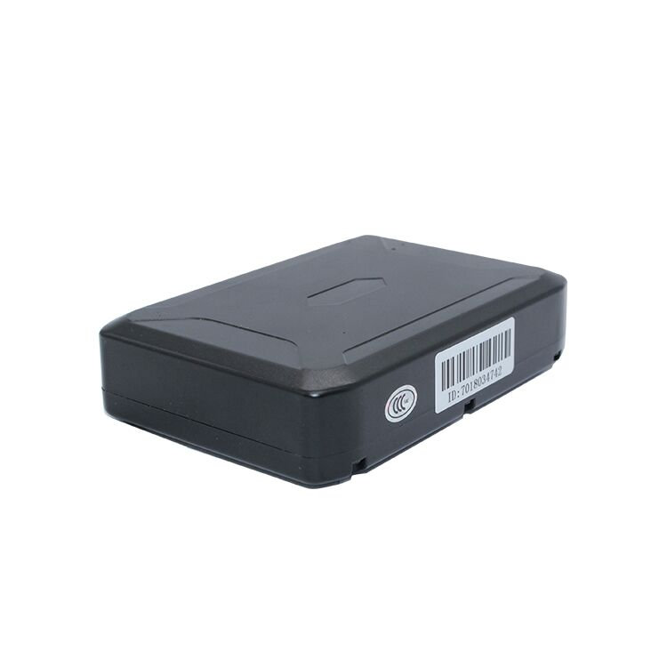

# ThingSys - TS-P4B

# TS-P4B Magnetic GPS Tracker — Plaspy Compatible

The TS-P4B is a magnetic, big-battery GPS tracker built for long-duration, discreet vehicle and asset tracking where battery life and secure mounting matter. With a high-capacity rechargeable 3.7V 10000mAh battery \(also available in a 5000mAh option\), u-blox satellite positioning and energy-saving sleep modes, the TS-P4B is a robust choice for Plaspy compatible deployments that need reliable location, motion detection and remote monitoring.

Designed for covert or long-term installations on cars, buses, trucks, containers and heavy equipment, this Plaspy compatible GPS tracker delivers dependable real-time tracking and telemetry via 2G quad-band networks, combined with accelerometer-based motion sensing, low-battery alerts and remote voice monitoring for added situational awareness.

## Key Highlights

- Long-life battery options: 10000mAh standard \(5000mAh variant\) for prolonged standby and reduced maintenance intervals.
- Plaspy compatible: integrates with Plaspy for real-time tracking, alerts and reporting across fleets and assets.
- Accurate GPS from u-blox chipset with A‑GPS assistance — typical positioning up to ~10 meters and fast time-to-first-fix.
- Magnetic mounting and IP-rated waterproofing for secure, discreet installation on vehicles and containers.
- 3D accelerometer and light sensor enable motion-triggered updates, power-saving sleep modes and tamper awareness.
- Remote monitoring via SMS and online platform plus remote voice monitoring capability for immediate situational checks.
- Low standby current \(\<30mA\) and wide operating temperature range support demanding fleet management and asset tracking environments.

## How It Works with Plaspy

When paired with Plaspy, the TS-P4B provides continuous location and telemetry feeds that feed Plaspy’s real-time tracking and alerting engine. The tracker reports GNSS fixes, battery and motion status through 2G connectivity so fleet managers and operators can see live position, historical routes and receive automated notifications for predefined events.

- Real-time location and telemetry updates \(GNSS position, battery level, motion status\) to Plaspy for live tracking and playback.
- Motion and tamper detection via the 3D accelerometer — Plaspy can use motion events for virtual ignition or movement alerts.
- Battery monitoring and low-battery alarms route directly into Plaspy workflows so maintenance can be scheduled before service interruptions.
- Light-sensor and remote voice monitoring add extra context for anti-theft checks and security verification within Plaspy dashboards.
- SMS and online platform alerts complement Plaspy notifications; fuel monitoring, ignition or immobilizer control can be incorporated in Plaspy where external telemetry or vehicle interfaces are available.

## Technical Overview

| Model | TS-P4B |
| --- | --- |
| Connectivity | 2G quad-band GSM \(worldwide 2G network support\) |
| Bands | 850 / 900 / 1800 / 1900 MHz \(standard quad-band 2G\) |
| Power & Battery | Rechargeable 3.7V 10000mAh \(also available: 5000mAh\); working voltage DC 3.7–4.5V; standby current &lt; 30mA |
| GNSS | u-blox GPS chipset with A‑GPS assistance; sensitivity approx. -159 dBm; positioning accuracy up to ~10 m |
| Time-to-First-Fix \(typical\) | Hot ~1s; Warm ~35s; Cold ~45s; Reacquisition ~0.1s |
| Sensors & Features | 3D accelerometer \(motion detection\), light sensor, low-battery alarm, remote voice monitoring |
| Environmental | Operating: -20°C to +70°C; Storage: -40°C to +85°C; Humidity: 5%–95% non-condensing; IP-rated for waterproofing |
| Physical | Approx. 73.8 × 69 × 35.5 mm; weight ~0.35 kg; strong internal magnets for secure attachment |
| Remote Management | Remote monitoring and alerts via SMS and online platform; remote voice monitoring supported |
| Interfaces | Magnetic mount and internal sensors; no external I/O or Bluetooth sensors specified in product description |

## Use Cases

- Fleet management for rental cars, buses and trucks where discreet, long-duration tracking reduces downtime and improves asset utilization.
- Asset and container tracking in logistics — strong magnets and waterproofing make it suitable for harsh outdoor environments.
- Anti-theft monitoring and recovery: motion detection, low-battery alerts and remote voice monitoring provide multiple security touchpoints.
- Long-term covert tracking and surveillance where infrequent maintenance and long standby are required.
- Remote equipment monitoring on sites without wired power — battery-backed operation and energy-saving modes extend deployment life.

## Why Choose This Tracker with Plaspy

For operations that need a Plaspy compatible GPS tracker focused on long battery life, secure mounting and reliable GNSS performance, the TS-P4B offers a balanced mix of endurance and practical telemetry. Its large battery options and low standby consumption reduce service visits and total cost of ownership, while u-blox positioning and A‑GPS ensure fast and consistent fixes for real-time tracking and historical reporting. Integrated motion detection, low-battery alarms and remote voice monitoring provide layered security and situational awareness that Plaspy can translate into actionable alerts and fleet management insights.

Choose the TS-P4B with Plaspy for dependable long-term tracking, simplified maintenance, and scalable telemetry that supports fleet management, anti-theft workflows and asset monitoring. Where fuel monitoring, ignition/immobilizer control or Bluetooth sensor integration are required, Plaspy can extend the solution through additional vehicle interfaces or external sensors to create a comprehensive telemetry and control platform.

