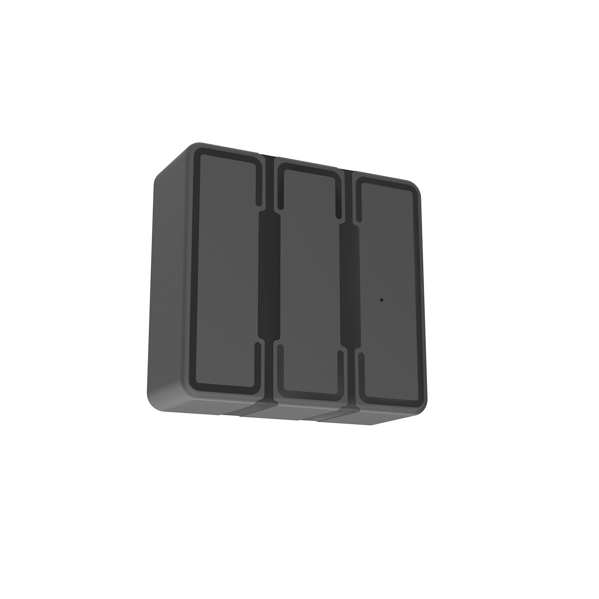

# ThingSys - TS-P4D

# TS-P4D GPS Tracker — Plaspy compatible

The TS-P4D is a rugged magnetic GPS tracker designed for long-term vehicle and asset monitoring and is fully Plaspy compatible for seamless integration into your fleet management workflow. Built for covert or semi-permanent installations where wired power is not available, the TS-P4D couples strong magnetic mounting with high-capacity rechargeable batteries to deliver reliable real-time tracking and telemetry for fleets, rentals and logistics operations.

With a Ublox-7 GNSS core and 3G/4G cellular support \(regional banding\), the TS-P4D brings fast position fixes, adaptive power management and a compact, weather-tolerant form factor. When paired with Plaspy, the unit feeds real-time tracking, geofence events, movement alarms and battery state into a single web and mobile dashboard, making it simple to manage anti-theft measures, historical routes and operational reports.

## Key Highlights

- Plaspy compatible for real-time tracking and centralized fleet management.
- Rugged magnetic mount for quick attachment to vehicles, containers and metallic assets.
- Choice of long-life batteries — 4000 mAh or 8000 mAh rechargeable cells for extended deployments.
- Ublox-7 GPS chipset with high sensitivity \(-159 dBm\) and typical position accuracy around 10 m.
- Fast TTFF performance \(0.1 s reacquisition, hot 1 s, warm ~35 s, cold ~45 s\) and A‑GPS support.
- Embedded 3D accelerometer for movement detection, smart sleep and power-saving modes.
- Telematics features include geofencing, hijack alarm, SOS presets, remote voice monitoring and low-battery alerts.

## How It Works with Plaspy

Once installed, the TS-P4D streams location and telemetry data to Plaspy using cellular connectivity. Plaspy ingests the device’s GNSS position, movement events and status alerts, then normalizes them into real-time maps, historical tracks and rule-driven notifications. Integration requires minimal configuration: register the device on Plaspy, confirm the reporting profile, and enable desired alerts such as geofence breaches or low-battery warnings.

- Real-time location and telemetry updates delivered to Plaspy’s web and mobile interfaces.
- Geofencing and hijack alarm events appear as instant alerts for rapid response.
- Battery state and low-battery alerts help schedule maintenance and prevent downtime.
- Movement detection from the 3D accelerometer enables anti-theft and automated sleep/wake reporting.
- Remote SMS-based location query and configurable reporting intervals for flexible telemetry profiles.
- Historical tracking and reporting for route analysis and operational insights in Plaspy.

## Technical Overview

| Connectivity | 4G / 3G \(cellular bands depend on the customer’s country/region\) |
| --- | --- |
| Bands | Cellular banding varies by region; supports bands available in the customer’s country |
| Power & Battery | Operating voltage DC 3.7–4.5 V; rechargeable 3.7 V batteries available in 4000 mAh and 8000 mAh versions; standby current &lt;30 mA |
| Interfaces & Sensors | Strong magnetic mount; embedded 3D accelerometer for movement detection; remote SMS-based location query; configurable reporting intervals; audible/voice monitoring feature |
| GNSS | Ublox-7 chipset; sensitivity -159 dBm; typical position accuracy ~10 m; A-GPS supported; reacquisition 0.1 s, hot 1 s, warm ~35 s, cold ~45 s \(typical\) |
| Bluetooth | Not specified for this model |
| Remote Management | Online web platform tracking \(historical & real-time\); configurable upload profiles; SMS command support |
| Form Factor & Environmental | Dimensions: 73.8 × 69 × 26.6 mm \(or 73.8 × 69 × 35.5 mm depending on version\). Weight: ~0.2 kg \(or 0.3 kg\). Operating temperature -20°C to +70°C; storage -40°C to +85°C; humidity 5%–95% non‑condensing. |
| Battery Life Estimates | In sleep mode: ~15 days \(4000 mAh\) or ~30 days \(8000 mAh\) under low-frequency reporting; ~48 hours under a 30-second update profile \(typical\) |

## Use Cases

- Fleet management — monitor cars, buses and trucks with Plaspy for route history and operational telemetry.
- Rental vehicle protection — discreet magnetic mounting and SOS/hijack alarms help protect rental assets.
- Container and logistics tracking — attach to containers for long-duration location and movement reporting.
- Portable asset tracking — ideal for equipment that must be tracked without permanent wiring or power.
- Temporary deployments — short- to mid-term covert installs where battery life and ease of removal are priorities.

## Why Choose This Tracker with Plaspy

Combining the TS-P4D’s rugged magnetic form and long-life battery options with Plaspy’s real-time platform gives fleet managers and logistics teams a practical, low-footprint solution for telemetry and anti-theft monitoring. The TS-P4D provides dependable GNSS performance and flexible reporting modes, while Plaspy centralizes those inputs into maps, alerts and reports used for daily operations. For operations that need real-time tracking, geofence enforcement, and low-maintenance asset monitoring without wiring, the TS-P4D with Plaspy is a dependable choice that balances battery endurance, fast reacquisition and the telematics features required for modern fleet management.

