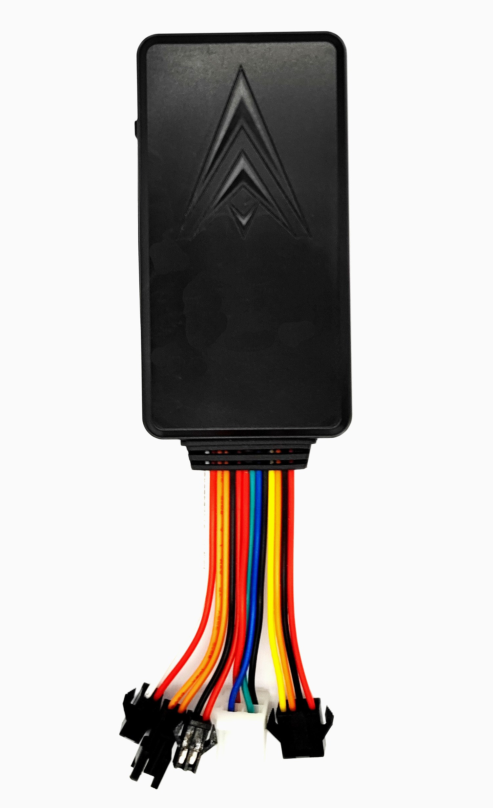

# ThingSys - TS-V6W

The TS-V6W 4G Vehicle GPS Tracker is a compact, high-sensitivity GPS tracker designed for worldwide vehicle monitoring and fleet management. Plaspy compatible out of the box, the TS-V6W offers reliable real-time tracking over 4G LTE and 2G GSM networks and fast position fixes even in weak-signal environments, making it a practical choice for anti-theft protection, telemetry collection, and continuous vehicle oversight.

The small form factor and low power consumption suit the TS-V6W to discreet installation on cars, vans, and light trucks. Configurable via SMS and GPRS and able to feed location, alarms, and basic telemetry into common tracking platforms, this Plaspy compatible tracker supports workflow features fleet managers and security teams rely on: ignition detection, overspeed alerts, vibration alarms, backup battery operation, and optional peripherals for fuel monitoring and remote immobilization.

## Key Highlights

- Plaspy compatible for seamless integration with fleet management dashboards and reporting tools.
- 4G LTE and 2G GSM connectivity for worldwide real-time tracking and SMS polling fallback.
- High-sensitivity SIRF3 GPS chipset \(–159 dBm\) with typical accuracy around 5 meters for reliable position data.
- Multiple built-in alarms: overspeed, vibration, and ACC ignition detection to support anti-theft and safety workflows.
- Compact, easy-to-hide form factor with low energy consumption and a built-in backup battery for uninterrupted monitoring.
- Expandable with optional accessories \(SOS button, relay for fuel cut/immobilizer, external mic, fuel and temperature sensors, external camera\) for advanced telemetry and security.
- Configurable via SMS and GPRS for flexible deployment and remote setup across fleets.

## How It Works with Plaspy

When paired with Plaspy, the TS-V6W supplies continuous location and alarm data to your monitoring platform so you can visualize routes, set geofences, and receive real-time alerts. Plaspy consumes the tracker’s GPRS trace tracking or SMS polling messages and translates raw GPS and event data into live maps, historical playback, and automated reports for fleet management and security operations.

- Real-time location and telemetry updates delivered to Plaspy via 4G LTE \(primary\) or 2G GSM \(fallback\) connectivity.
- ACC ignition status and overspeed/vibration alarms for fleet safety, driver behavior monitoring, and anti-theft alerts.
- Fuel monitoring support through compatible fuel level sensors; telemetry forwarded to Plaspy for consumption and anomaly reporting.
- Remote immobilizer / fuel cut capability when used with a relay accessory, enabling remote vehicle disable via Plaspy workflows.
- External accessories such as SOS buttons, voice remote monitoring \(external microphone\), temperature sensors and external cameras can be integrated and their events forwarded into Plaspy for consolidated incident handling.
- Plaspy can also correlate tracker telemetry with external sensor feeds \(for example, Bluetooth sensors or beacons\) when those sensors are available through compatible accessory modules, enabling richer situational data without changing core device behavior.

## Technical Overview

| Model | TS-V6W |
| --- | --- |
| Connectivity | 4G LTE and 2G GSM \(GPRS trace tracking and SMS polling modes\) |
| GNSS | SIRF3 GPS chipset; sensitivity –159 dBm; typical accuracy ~5 meters |
| Time To First Fix \(TTFF\) | Cold 35–80 s; Warm ~35 s; Hot ~1 s |
| Power & Battery | Power input 9–95 V DC; internal 3.7 V 180 mAh Li‑ion backup battery |
| Interfaces & I/O | ACC ignition detection, overspeed and vibration alarms; supports optional peripherals \(SOS button, relay for fuel cut/immobilizer, external microphone, fuel level and temperature sensors, external camera\) |
| Dimensions & Weight | 93 mm × 35 mm × 145 mm; approx. 75 g |
| Environmental | Operating −20 °C to +55 °C; Storage −40 °C to +85 °C; Humidity 5%–95% non‑condensing |
| Configuration & Integration | Configurable via SMS and GPRS; integrates into common tracking platforms for monitoring, alerts, and historical route playback |
| Form Factor | Compact vehicle GPS tracker designed for discreet installation and fleet applications |

## Use Cases

- Fleet management: continuous real-time tracking, route playback, and telemetry reporting to optimize asset utilization and scheduling.
- Anti-theft & remote immobilization: overspeed and vibration alarms combined with remote fuel cut \(relay required\) to prevent unauthorized use.
- Driver safety and compliance: ACC ignition detection and overspeed alerts help enforce safe driving policies and capture events for review.
- Fuel monitoring and diagnostics: use with fuel level sensors to track consumption, detect fuel loss, and improve operating efficiency.
- Video-assisted and voice monitoring: attach optional external camera and microphone for incident verification and richer situational awareness in Plaspy.

## Why Choose This Tracker with Plaspy

The TS-V6W delivers the core capabilities fleets and security operations need: accurate GPS positioning with a high-sensitivity SIRF3 chip, dual-network connectivity for reliable data transport, and low-power operation with a backup battery for resilience. As a Plaspy compatible GPS tracker, it integrates easily into existing workflows to provide real-time tracking, telemetry, and alarm forwarding—helping teams respond faster to theft, improve fuel monitoring, and streamline fleet diagnostics.

Choose the TS-V6W when you need a compact, discreet vehicle GPS tracker that scales across single vehicles and larger fleets, supports ignition and anti-theft features, and expands with optional peripherals for fuel monitoring, immobilizer control, and video or voice monitoring. Its configuration flexibility \(SMS/GPRS\) and Plaspy compatibility make deployment and ongoing management straightforward, so your operation benefits from reliable location intelligence and actionable telemetry without long integration cycles.

