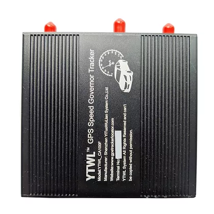

# ThingSys - YTWL_CA100F

The ThingSys YTWL_CA100F is an intelligent terminal designed primarily as a vehicle speed limiter for Ethiopia while also functioning as a professional multifunctional GPS tracker. Built around an ARM intelligent CPU and featuring a U blox GPS module and SIM800C cellular module, the unit is intended to provide precise speed limiting without interfering with vehicle throttle start or power torque. The device is described to allow free pedal movement within a defined speed range and offers enhanced anti jamming and a range of interfaces for external equipment.

As a Plaspy compatible device, the YTWL_CA100F can feed vehicle location, speed, and status information into Plaspy for live monitoring and historical analysis. Its role as both a speed limiter and a tracker makes it relevant for fleets and operators that need to combine speed control with visibility and reporting. Plaspy can present data from the device alongside other fleet assets to support operational oversight and compliance workflows.

## Key Highlights

- Integrated speed limiter capability designed to restrict maximum vehicle speed while maintaining stable engine start and torque behavior.
- Multifunctional GPS tracking with a U blox module and reported GPS accuracy around 5 meters for reliable location data.
- ARM based CPU and strengthened anti jamming for consistent performance in demanding environments.
- High compatibility with external equipment through multiple interfaces for flexible fleet use.
- Wide working voltage range suitable for a variety of vehicle types and a compact form factor for discreet installation.
- Rechargeable internal battery option and low standby current for continued reporting during temporary power interruptions.

## How It Works with Plaspy

When connected with Plaspy, the YTWL_CA100F supplies tracking and status data that Plaspy uses to provide visibility, alerts, and reports tailored for fleet managers. Plaspy processes incoming data streams from the unit and displays them alongside other fleet assets so teams can monitor operations and respond to events.

- Real time location display and speed readouts in Plaspy dashboards for live fleet oversight.
- Event alerts and notifications for speed limit incidents so operators can review and act on violations.
- Historical route playback and reporting to support compliance checks and operational analysis.
- Aggregated fleet views and performance summaries that include devices with speed limiting capabilities.
- Integration of device status and diagnostics into Plaspy reporting for maintenance and operational planning.

## Typical Use Cases

- Commercial fleets in need of enforced speed control alongside positional tracking.
- Public transport and passenger services where consistent speed management improves safety and compliance.
- Logistics and cargo fleets that require location visibility and speed incident reporting.
- Municipal or government vehicle fleets operating under local speed regulations.
- Mixed vehicle fleets that benefit from a combined speed limiter and tracking device for oversight.

## Why Choose This Tracker with Plaspy

The YTWL_CA100F is a practical option for organizations that want to combine deliberate speed control with reliable tracking data. Its design emphasis on precise speed limiting without compromising throttle response, together with a proven GPS module, makes it a match for fleet environments where safety and operational consistency matter. Connecting the device to Plaspy gives fleet managers a unified view of speed events and location information, enabling clearer decision making and more structured reporting.

Because product details and compatibility requirements can evolve, verify current specifications and configuration options before purchase. To learn more about how Plaspy can work with devices like the ThingSys YTWL_CA100F visit https://www.plaspy.com. For the most up to date technical specifications and manufacturer information consult the ThingSys website at https://www.thingsys.com/ .
