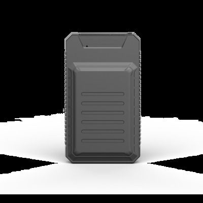

# ThinkRace - AT15

The ThinkRace AT15 is a compact smart luggage tracker designed to help travelers keep tabs on bags, backpacks, suitcases, and briefcases. It provides real time location updates and a retrievable location history so users can review a bag's journey. The device is intended for everyday travel use where discrete, portable tracking of personal belongings is desired.

As a device compatible with Plaspy, the AT15 can be incorporated into a broader tracking workflow for visibility and oversight. Using Plaspy as the platform for device management and monitoring lets you view location data alongside other assets, produce location reports, and configure notifications that fit operational needs. This makes the AT15 a practical option when you want luggage level tracking to appear in the same system used for other tracked items.

## Key Highlights

- Compact form factor that fits into backpacks, suitcases, and briefcases
- Real time location updates to monitor present position during travel
- Location history for reviewing movement and past positions
- Mobile app and web platform access for direct device control and viewing
- Portable design aimed at personal and organizational travel use
- Works with third party tracking platforms such as Plaspy for consolidated oversight

## How It Works with Plaspy

When used with Plaspy, the AT15 becomes part of a consolidated tracking environment where location data and history are available alongside other tracked assets. Plaspy can surface the device's position, timeline, and status in dashboards and reports to support operational visibility.

- Centralized map view in Plaspy to see AT15 locations alongside other devices
- Location history and movement timelines available within Plaspy reporting
- Alerts and notifications configured in Plaspy to notify teams of position changes
- Grouping and device organization for travel sets or corporate deployments
- Exportable location data and reports to support audits or post trip review

## Typical Use Cases

- Tracking checked luggage during business or leisure travel
- Monitoring bags for frequent travelers and company employees
- Managing equipment or small parcels in transit for short trips
- Providing peace of mind for remote bag retrieval and recovery
- Adding portable asset tracking to an organization without specialized hardware

## Why Choose This Tracker with Plaspy

The AT15 is a straightforward choice for anyone seeking a compact tracker focused on luggage and personal items. Its design and feature set make it suitable for travelers and organizations that need simple, portable location visibility. Paired with Plaspy, the device benefits from centralized monitoring, reporting, and notification capabilities that help teams maintain oversight without juggling multiple platforms.

If your priorities are ease of use, discrete placement in luggage, and integrating luggage tracking into a larger monitoring platform, the ThinkRace AT15 used with Plaspy can be an effective combination. For more information about Plaspy and how it can manage compatible devices like the AT15, learn more at https://www.plaspy.com. Product specifications and availability can change over time, so please verify current details on the manufacturer site https://www.thinkrace.com/.
