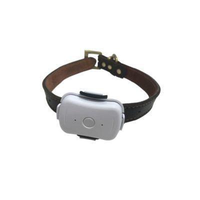

# ThinkRace - PT590

The ThinkRace PT590 is a dedicated GPS pet tracker built for monitoring cats and dogs. Described as a compact device for pet safety, it provides real time location updates, remote monitoring capabilities, and a two mode positioning system to help owners locate animals more accurately during outdoor activities or when pets roam beyond expected areas.

As a Plaspy compatible device, the PT590 can be used with the Plaspy platform to centralize location data and monitoring workflows. When paired with Plaspy, the PT590's live tracking and remote monitoring features become part of a broader visibility and alerting environment, making it easier to oversee pets alongside other tracked assets within the same platform.

## Key Highlights

- Purpose built for pet tracking with support for both cats and dogs
- Two mode positioning to improve location accuracy in varied environments
- IP67 waterproof rating for protection against dust and temporary immersion
- Real time tracking to help locate a pet quickly when needed
- Remote monitoring capability to keep an eye on surroundings and movements
- Compact form factor suitable for attaching to collars or harnesses

## How It Works with Plaspy

Plaspy ingests the location and status information provided by compatible devices like the PT590 and presents that data through maps, alerts, and history views. The platform gives pet owners and managers a single place to view live positions and review recent movements.

- Display live location on Plaspy maps for quick visual tracking
- Configure alerts for boundary exits or unexpected movements using Plaspy alerting tools
- Review movement history and recent locations for situational context and reporting
- Use remote monitoring features within Plaspy to check a pet's recent environment when needed
- Manage multiple pet trackers from a single Plaspy account for households with more than one animal

## Typical Use Cases

- Keeping track of a pet that roams a yard or neighborhood
- Monitoring pets during walks, hikes, or outdoor adventures
- Checking on pets while away from home for peace of mind
- Overseeing animals in boarding or pet care scenarios
- Locating a lost or escaped pet quickly with real time updates

## Why Choose This Tracker with Plaspy

Pairing the ThinkRace PT590 with Plaspy provides a straightforward way to combine a pet focused hardware design with a full tracking platform. The PT590 brings pet oriented features such as two mode positioning and IP67 durability, while Plaspy adds centralized visibility, notification options, and historical location playback that help turn raw location data into actionable information.

For pet owners and small organizations that need reliable location visibility without complex setup, the PT590 and Plaspy offer a practical combination. If your priorities include waterproof durability, consistent real time updates, and unified monitoring alongside other tracked assets, this pairing is an appropriate option to consider.

To learn more about Plaspy and how it can be used with compatible trackers like the ThinkRace PT590 visit https://www.plaspy.com. Product specifications and availability can change over time, so please verify current details on the manufacturer site https://www.thinkrace.com/ before making purchasing or deployment decisions.
