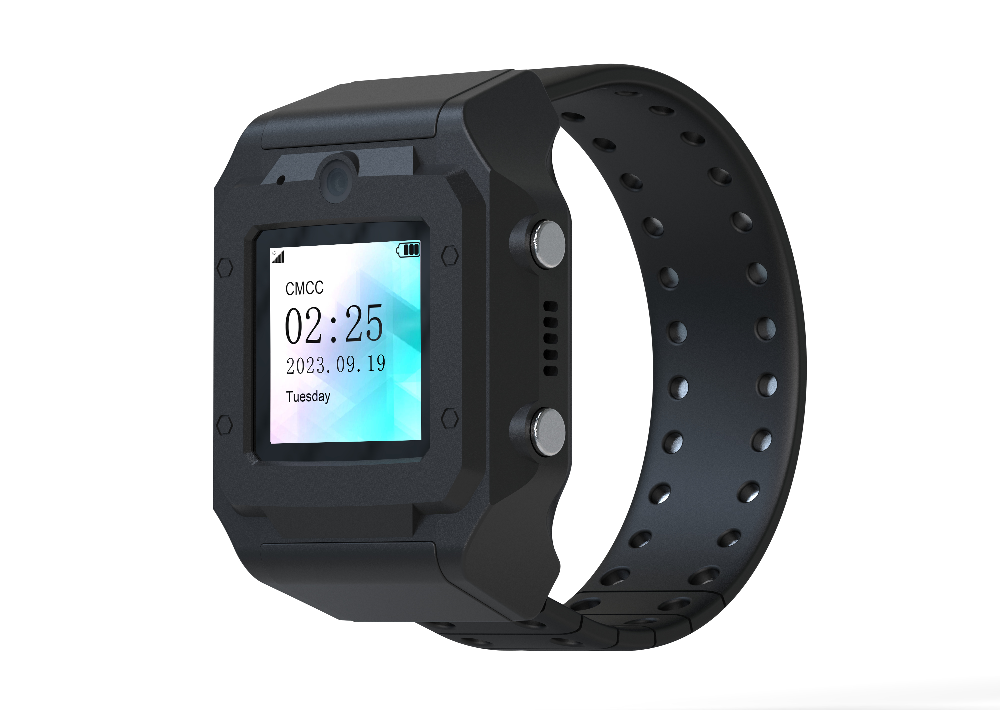

# ThinkRace - PT880

The ThinkRace Traxbean Bracelet PT880 is a wrist worn GPS tracker built for continuous electronic monitoring and person centric supervision. Designed to be rugged and comfortable for daily wear, the PT880 combines GPS positioning with assisted Wi Fi, cellular triangulation and RF based indoor positioning to provide reliable location data along with tamper alarms, one press SOS and two way voice for immediate incident handling.

As a Plaspy compatible device, the PT880 integrates its location and event streams into Plaspy workflows for real time supervision, alerting and reporting. Its wearable form factor, tamper protections and multi mode positioning make it a practical choice for programs that require continuous visibility and straightforward integration into Plaspy’s monitoring and case management features.

## Key Highlights

- Wrist mounted design intended for continuous person centric monitoring and offender management.
- Multi mode positioning using GPS with assisted Wi Fi, cellular triangulation and RF indoor fixes to improve location availability.
- Tamper protection with a cut resistant strap and tamper alarms to notify supervisors of removal attempts.
- One press SOS panic with two way voice capability and prioritized emergency signaling.
- Portable recharging and water resistant, rugged construction to support field use and reduce downtime.
- Multiple alert modalities including push notifications, audible siren and vibration for clear event signaling.
- SDK and open API support to enable system integration and custom workflows with back office platforms.

## How It Works with Plaspy

The PT880 streams location, tamper and emergency events into Plaspy so supervisors can view live position traces, receive prioritized alerts and maintain a searchable event history. Plaspy ingests the tracker telemetry and exposes it through dashboards, reporting tools and mobile workflows to support round the clock supervision and auditability.

- Real time location and telemetry updates displayed in Plaspy for live monitoring and historical review.
- Tamper and removal alerts routed into Plaspy notifications and audit logs for rapid supervisor action.
- SOS activations and two way voice events prioritized in Plaspy incident workflows for emergency response.
- Geo fence events forwarded to Plaspy to trigger inclusion and exclusion alerts and automated follow up.
- Indoor positioning and assisted fixes increase location coverage in challenging environments and feed improved traces into Plaspy reporting.

## Typical Use Cases

- Community corrections electronic monitoring with continuous location reporting and tamper alerts.
- Offender supervision and welfare checks using SOS panic and two way voice for rapid intervention.
- Workforce oversight for staff in remote or distributed roles requiring discreet wearables and emergency signaling.
- Programs requiring auditable location histories and configurable alerts for case management and compliance.

## Why Choose This Tracker with Plaspy

The PT880 pairs a wearer friendly, tamper resistant bracelet with multi mode positioning and built in emergency features, making it well suited to person centric supervision programs. When combined with Plaspy, the device’s event streams become part of a unified monitoring environment where supervisors can act on tamper alarms, SOS events and geo fence breaches while keeping searchable records for oversight and reporting.

To learn more about Plaspy and how it supports compatible devices like the ThinkRace PT880 visit https://www.plaspy.com. Product specifications, availability and manufacturer details can change over time; please verify current technical information and regional variants on the ThinkRace website https://www.thinkrace.com/.
