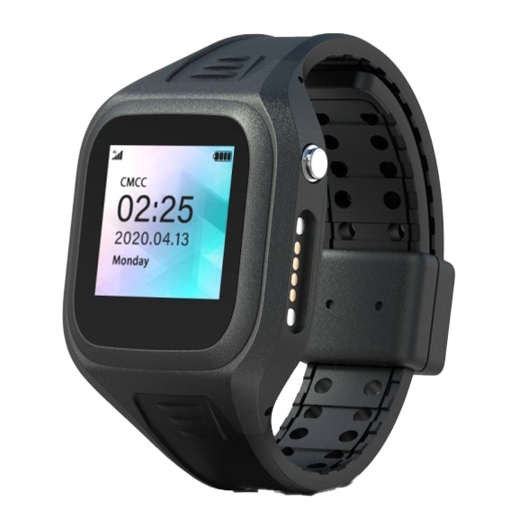

# ThinkRace - Traxbean Bracelet

The Traxbean Bracelet is a compact GPS tracker designed for community corrections and offender monitoring, now fully Plaspy compatible for seamless real-time tracking and event management. Built for daily wear with a fashion-oriented small form factor, the bracelet combines precise satellite positioning with assisted locating \(Wi‑Fi and cellular triangulation\) and RF‑based indoor positioning to provide reliable situational awareness for supervising agencies and service providers.

As a Plaspy compatible device, the Traxbean Bracelet delivers tamper-resistant hardware and a complete software ecosystem — Web and mobile apps plus an SDK/Open API — so agencies can deploy anti-theft and compliance monitoring workflows, send push notifications, and integrate telemetry and event streams into existing justice, corrections, or public safety platforms.

## Key Highlights

- Plaspy compatible GPS tracker optimized for community corrections with real-time tracking and configurable alerts.
- Multi-mode positioning: precise satellite GPS plus Wi‑Fi/cellular triangulation and RF indoor locating for better coverage indoors and urban canyons.
- Robust tamper protection: cut‑resistant strap and tamper/strap‑cut detection with automatic notification to monitoring services.
- On-device safety and communication: SOS button, two‑way voice calling, loud siren and vibration alerts for immediate response and verification.
- Durable, water‑resistant design \(IP67\) and small form factor for comfortable, discreet continuous wear to improve compliance.
- Delivered with Web, Android and iOS apps, integrated push notifications, and an SDK/Open API for custom integration and telemetry consumption.
- Operational simplicity: portable charger included, low setup fee, and manufacturer support for redevelopment and system integration.

## How It Works with Plaspy

When paired with Plaspy, the Traxbean Bracelet streams location and event data to the Plaspy platform in near real time. Geofencing, tamper alerts, SOS events and two‑way voice sessions are surfaced in the Plaspy dashboard and mobile apps, enabling supervisors to act quickly on violations or emergencies. The included SDK/Open API lets integrators map device telemetry into case management, reporting or escalation systems.

- Real-time location and telemetry updates via 4G/LTE and assisted locating \(Wi‑Fi and cellular triangulation\).
- Geofence inclusion/exclusion alerts: configurable zones trigger entry/exit notifications in Plaspy.
- Tamper and strap‑cut event reporting with automatic alerts to monitoring centers and Plaspy workflows.
- SOS button and two‑way voice calls routed through Plaspy for incident verification and response coordination.
- Push notifications and mobile alerts for supervisors; SDK/Open API for custom integrations and telemetry ingestion.

## Technical Overview

| Connectivity | 4G/LTE cellular with integrated push notifications; assisted locating via Wi‑Fi and cellular triangulation |
| --- | --- |
| Bands | 4G/LTE \(specific bands vary by model/region — consult manufacturer\) |
| Power & Battery | Rechargeable wrist unit; portable charger included for convenient recharging |
| Interfaces | SOS button, two‑way voice calling, siren, vibration alerts, tamper detection and cut‑resistant strap monitoring |
| GNSS | Precise satellite positioning \(GPS\) with assisted locating methods for improved fix rates |
| Indoor Positioning | RF‑based indoor positioning and Wi‑Fi/cellular assistance to enhance coverage in buildings |
| Remote Management | Web and mobile \(Android & iOS\) applications, SDK / Open API for integrators, and manufacturer integration support |
| Form Factor | Compact wrist bracelet; IP67 water resistance; tamper‑proof, cut‑resistant strap; designed for continuous wear |

## Use Cases

- Electronic monitoring for community corrections, parole and probation programs requiring reliable GPS tracking and tamper alerts.
- Alternative sentencing and bail monitoring where discreet, comfortable wear and real‑time supervision improve compliance.
- Workforce or special‑person tracking for protective services and programs that need non‑intrusive location supervision.
- Public safety and emergency response: SOS button and two‑way voice facilitate immediate communication and incident management.

## Why Choose This Tracker with Plaspy

Choosing the Traxbean Bracelet as a Plaspy compatible GPS tracker brings a balance of reliability, user comfort, and integration flexibility. Its small form factor and IP67 rating encourage continuous use and reduce the likelihood of removal, supporting anti-theft and compliance goals. Built‑in tamper detection, SOS, and two‑way voice give supervisors multiple confirmation channels to validate events before escalation.

From an operational perspective, the bundled Web/mobile apps and the SDK/Open API make it straightforward to incorporate device telemetry into Plaspy workflows, whether you need basic geofence alerts or full telemetry feeds for case management. While the Traxbean Bracelet focuses on person-centric monitoring rather than vehicle telemetry, Plaspy’s platform also supports broader telemetry capabilities — including fleet management, ignition and immobilizer integration, fuel monitoring and Bluetooth sensors — enabling organizations that require mixed deployments to consolidate data under one platform.

With a low setup fee, portable charger for ease of use, and manufacturer support for redevelopment and system integration, the Traxbean Bracelet offers a practical, cost-conscious option for agencies and integrators deploying Plaspy compatible solutions for offender monitoring, alternative sentencing and other community supervision programs.

