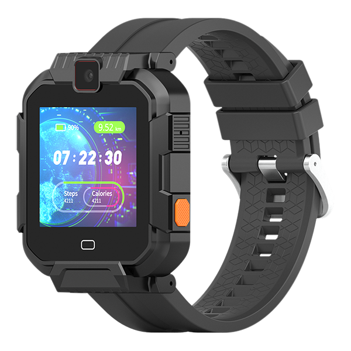

# ThinkRace - Traxbean MT2

The Traxbean MT2 is a rugged, military‑grade GPS smartwatch engineered for commanders, security teams, field workers and other demanding users. Plaspy compatible out of the box, the MT2 delivers reliable location, voice communications and situational awareness for real‑time tracking and rapid incident response across outdoor and indoor environments.

The MT2 combines high‑accuracy GPS positioning with assisted Wi‑Fi and cellular triangulation plus RF‑based indoor positioning to maintain continuity of location data where GPS alone may falter. With an SOS panic button, integrated camera streaming, two‑way voice and programmable geo‑fencing, the device is designed to integrate into Plaspy for centralized monitoring, alerts and reporting that scale from single users to larger workforce and public‑safety deployments.

## Key Highlights

- Plaspy compatible for straightforward integration into your existing monitoring and dispatch workflows.
- Rugged, military‑grade smartwatch form factor designed for harsh and industrial environments.
- Multi‑mode positioning: GPS plus Wi‑Fi, cellular triangulation and RF indoor positioning for continuous real‑time tracking.
- SOS panic button with instant alerting and optional automatic camera activation for visual context during incidents.
- Integrated high‑resolution camera capable of capturing and streaming images or video to a control center.
- Two‑way voice, audio alerts, siren and vibration alarms to support remote voice assistance and fast response.
- Developer‑friendly: SDKs, Open API, web platform and native Android/iOS apps simplify integration and administration.

## How It Works with Plaspy

When paired with Plaspy, the Traxbean MT2 becomes a complete safety and telemetry endpoint. Location, health telemetry, SOS events and live media are transmitted over 4G/LTE and presented in Plaspy’s dashboard and alerting engine. Plaspy ingests the MT2 data stream for real‑time tracking, geo‑fence rules, incident escalation and historical reporting so operators can act quickly and with context.

- Real‑time location and telemetry updates — continuous GPS with assisted Wi‑Fi/cellular and RF indoor positioning ensure position continuity.
- SOS and incident escalation — panic button events trigger immediate Plaspy alerts; camera can be remotely triggered to stream situational video.
- Two‑way voice and audio alarms — voice calls and siren/vibration notifications facilitate direct contact through Plaspy-managed workflows.
- Geo‑fencing — inclusion/exclusion zones and automatic alerts when wearers cross defined boundaries.
- Health and status telemetry — on‑device sensors feed wearer status into Plaspy for lone‑worker safety and medical escalation.
- Vehicle telemetry and ancillary inputs — while the MT2 does not provide vehicle ignition, immobilizer or fuel sensors itself, Plaspy can combine MT2 wearer data with vehicle trackers that report ignition, immobilizer and fuel monitoring to support fleet management and anti‑theft workflows.
- Bluetooth sensors/beacons — RF‑based indoor positioning is supported by the device; use of BLE sensors should be evaluated per your project since Bluetooth specifics are not detailed in the device information.

## Technical Overview

| Connectivity | 4G/LTE cellular, Wi‑Fi and cellular triangulation; RF‑based indoor positioning; two‑way voice over LTE |
| --- | --- |
| Bands | Not specified in available information; regional cellular variants may apply |
| Power & Battery | Internal rechargeable battery \(capacity and runtime not specified\) |
| Interfaces | SOS panic button, two‑way voice, camera remote trigger, audio alerts/siren, vibration alarms; no vehicle ignition or immobilizer interfaces described |
| GNSS | High‑accuracy GPS positioning with assisted location via Wi‑Fi and cellular triangulation; RF indoor positioning for improved indoor accuracy |
| Bluetooth | Bluetooth specifics not detailed; RF positioning capabilities are included |
| Remote Management | SDKs and Open API provided \(ThinkRace\); web platform and native Android/iOS apps for monitoring and administration; warranty and support options available |
| Form Factor | Rugged, military‑grade smartwatch designed for wearable use in security, corrections, field operations and industrial environments |

## Use Cases

- Commander and patrol tracking — real‑time location, voice and video enable command centers to coordinate teams and manage incidents.
- Lone‑worker protection and emergency response — SOS button, health telemetry and automatic camera streaming support rapid medical or security intervention.
- Corrections and community monitoring — wearable visibility for supervised individuals with immediate escalation paths via Plaspy.
- Industrial and mining operations — rugged design supports harsh environments where continuous tracking and situational awareness are required.
- Elderly care and special‑needs monitoring — wearable alerts and remote voice support provide safer, connected care options.

## Why Choose This Tracker with Plaspy

Combining the Traxbean MT2 with Plaspy provides a powerful, integrated solution for organizations that need reliable wearable tracking and incident management. The MT2’s multi‑mode positioning and built‑in communications deliver real‑time tracking and situational media that Plaspy converts into actionable alerts, geo‑fence rules and historical reports. For fleet management or asset‑centric deployments, Plaspy’s ability to ingest MT2 wearer telemetry alongside vehicle trackers \(fuel monitoring, ignition and immobilizer data\) enables a unified view of people and assets without requiring the wearable to provide every vehicle sensor itself.

The MT2 emphasizes ease of integration: vendor SDKs, an Open API and native apps reduce development time and lower setup cost, while warranty and support options simplify large deployments. Whether you need robust anti‑theft and security controls, telemetry for health and safety, or seamless real‑time tracking across challenging environments, the Traxbean MT2 paired with Plaspy offers a scalable, reliable platform for monitoring people and missions.

