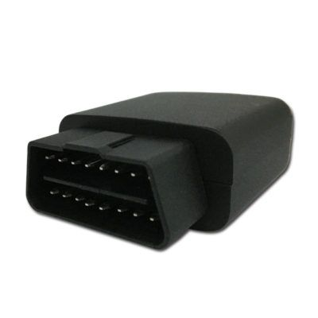

# ThinkRace - VT200B

The ThinkRace VT200B is an advanced OBD2 GPS tracker designed to provide comprehensive vehicle diagnostics and ensure a smart and safe driving experience. With its powerful features and reliable performance, it has quickly become one of the best OBD2 vehicle trackers in the market.

One of the standout features of the VT200B is its ability to provide a complete report of your vehicle's diagnosis. It can track and monitor various parameters such as fuel consumption, engine health, and overall vehicle performance. This information is invaluable for maintaining your vehicle's health and optimizing its efficiency.

In addition to diagnostics, the VT200B also offers a range of other useful features. It can send over-speed alerts, allowing you to monitor and control your vehicle's speed to ensure safety on the road. The tracker also supports real-time tracking, allowing you to keep an eye on your vehicle's location at all times.

The VT200B is easy to install and use, thanks to its OBD2 interface. Simply plug it into your vehicle's OBD2 port, and you're ready to go. The tracker is compatible with most vehicles manufactured after 1996, making it a versatile option for a wide range of users.

With its advanced features, reliable performance, and user-friendly interface, the ThinkRace VT200B is an excellent choice for anyone looking to enhance their vehicle's safety and efficiency. Whether you're a fleet manager or a concerned vehicle owner, this OBD2 GPS tracker is sure to meet your needs and exceed your expectations.

### Key Features:

- Complete vehicle diagnostics
- Fuel consumption tracking
- Engine health monitoring
- Over-speed alerts
- Real-time tracking
- Easy installation and use
- Compatible with most vehicles manufactured after 1996

