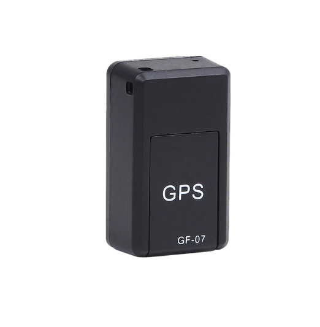

# TK-Star - GF 07

The TK-Star GF 07 is a compact and portable GPS tracker designed for easy tracking and monitoring. With its mini size and lightweight design, it can be easily placed in a variety of objects or carried in your pocket. Whether you want to keep an eye on your loved ones, track your valuable belongings, or monitor your fleet vehicles, this GPS tracker is a reliable and convenient solution.

The GF 07 utilizes GSM positioning mode, which allows you to track its location using a SIM card. Simply insert a compatible SIM card into the tracker, and you'll be able to view its real-time location on your smartphone or computer. This makes it easy to keep track of your assets or loved ones, no matter where they are.

Outstanding Features:

- Compact and portable design
- GSM positioning mode for accurate tracking
- Real-time location tracking via SIM card
- Easy to use and set up
- Durable ABS material construction
- Wide range of applications, including personal tracking, asset tracking, and vehicle monitoring

Technical Specifications:

- Type: Mini
- Placement: Portable
- Positioning Mode: GSM
- Track View: SIM card
- Function: Tracking
- Data Storage: Other
- Warranty: 1 Year
- Place of Origin: China, Guangdong
- Model Number: Topsource GF 07
- Product Size: 42\*25\*20mm
- Material: ABS
- GPS positioning accuracy: About 100m
- Telecom card cannot be used: Not support

